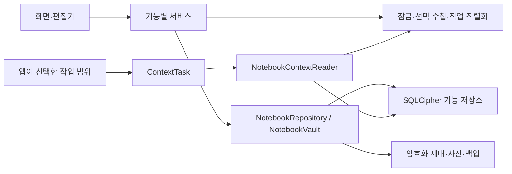

# 모듈화·캡슐화 개선 결과 — 2026-09-10

제품 원본인 `caregiving_notebook_requirements.md`, 이전 `architecture_review_2026-09-10.md`의 8개 지적, 구현 전 작성한 `architecture_refactor_safety_plan.md`의 ARCH-01~11을 기준으로 개선했다. 기록 앱을 다시 작성하거나 상태관리 프레임워크를 추가하지 않고 기존 저장 형식과 화면 흐름 위에서 경계를 정리했다.

## 지적 사항과 해결 근거

| 이전 지적 | 적용한 변경 | 확인 방법 |
|---|---|---|
| 1. 비동기 저장 콜백과 초안 삭제가 섞임 | 공개 `mutate`와 `completeDraft` 콜백을 제거했다. `DraftSession.complete()`는 저장된 typed payload를 확정하며 기록 쓰기와 초안 삭제를 한 동기 SQL 트랜잭션으로 실행한다. | 초안 DELETE 단계에 실패를 주입해 앞서 수행한 기록 쓰기까지 롤백되는지 확인했다. 실패 후 초안 보존, 재시도 1회 저장, 잠금·재시작 복구를 검증했다. |
| 2. 세션·DB·Vault·키 저장소 공개 | 컨트롤러의 잠금·선택·작업 상태는 private 필드와 getter로 제공한다. 화면은 기능별 서비스를 사용한다. 저장소·플랫폼 구현은 컨트롤러와 구현 모듈 내부에 두며 원시 SecretStore를 공개하지 않는다. | 화면의 infrastructure import 및 db/vault/secrets/mutate 접근을 구조 검사한다. 잠금 중 읽기·설정 변경·사진·백업 요청과 지연 응답 차단 시험을 유지했다. |
| 3. 무버전 Map 초안 | 기록·약·복약·일정·진료 준비·간병인 상태에 각각 payload 타입과 v1 codec을 적용했다. 기존 무버전 초안은 호환 경로로 읽는다. 잘못된 형식은 원문을 보존하는 별도 타입으로 격리한다. | 작성 중 빈 필드, 기존 초안, 알 수 없는 버전·기록 종류·필드 타입, 변경된 처방, 만료를 확인했다. 잘못된 초안이 섞인 실제 목록과 원문 확인창도 widget 시험했다. |
| 4. 백업과 DB 버전 결합 | 선택 백업 format 3/document_version 1과 고정 필드 계약을 도입했다. 기존 format 2/schema 3 adapter를 유지한다. SQL 전체 컬럼을 그대로 내보내지 않고 문서 필드만 투영하며, 복원도 고정 문서 컬럼을 사용한다. 화면에는 `BackupCategory`별 개수만 제공한다. | 변경 전에 생성한 합성 암호화 백업을 보관했다. DB에 내부 컬럼을 추가한 상태에서도 기존 백업 복원과 재백업이 성공하며 내부 컬럼은 내보내지 않는다. 알 수 없는 문서 버전은 변경 없이 거부한다. 기존 사진·이력·참조·중복·잘못된 비밀번호·취소 시험도 유지했다. |
| 5. 파일별 책임 혼합·전체 갱신 | 기능별 서비스와 SQL 저장소, 스키마 이전, Vault 세대·사진·백업을 독립 클래스로 분리했다. 기존 Dart `part`를 제거했다. 편집기 7개와 오늘·약·진료 탭 구성을 별도 파일로 옮겼다. 변경 영향을 기능별로 전달한다. | 메모·대화 저장 후 알림 예약뿐 아니라 시간대 조회도 다시 실행되지 않는지 확인했다. 저장·충돌·처방 이력·원본 연결·UI 회귀시험을 통과했다. |
| 6. final 모델의 가변 컬렉션 | 기록 필드·복약 시각·초안·백업 미리보기·작업 문맥에서 입력 컬렉션을 복사하고 수정 불가능하게 보관한다. 기록 직렬화 결과도 원본 필드를 공유하지 않는다. | 생성자 입력, 중첩 컬렉션, 직렬화 결과를 수정해 기존 조회 스냅샷이 바뀌지 않는지 확인했다. |
| 7. 빈 성공 플랫폼·문장 기반 오류 | 필수 플랫폼 메서드를 추상화하고 시험 fake에만 명시적인 동작을 둔다. `CareErrorCode`와 `DraftStatus`를 도입했으며 표시 문장은 번역 계층에서 결정한다. 오류 문자열 표현에는 사용자 원문 대신 코드가 나온다. | 모든 오류 코드의 표시 문구가 5개 카탈로그에 존재하는지 검사한다. 기존 번역·자리표시자·원문·큰 글자·잠금 시험을 유지했다. |
| 8. Python 실행·채점 혼합과 중복 직렬화 | 모델 계약·호출·투영·단계 실행·backend를 분리했다. component 평가도 artifact·rendering·validation·backend·execution·grading 모듈로 나눴다. 기존 진입점은 명시적 import를 재공개해 호출자 호환성을 유지한다. 동일했던 DS-AGENT 직렬화 3곳만 공통화했다. | 기존 96개 시험에 호환성 3개를 추가했다. 수정 전에 고정한 T1/T2/T3의 정상·의료 근거 부족·범위 위반·형식 수정·재작성·안전 중단 18개 합성 시나리오의 요청·출력·trace 해시와 프롬프트/스키마 해시를 대조했다. |

## 현재 모듈 경계

- `application/care_controller.dart`: 세션 수명·환자 선택·서비스 조립·변경 영향 조정. 약 572줄에서 414줄로 줄었으며 사진·백업·대화·초안·알림 구현은 서비스로 옮겼다.
- `application/services/`: 화면에 제공하는 기능별 조회와 저장 명령. 조회 캐시는 최대 64개이며 해당 기능 변경·환자 전환·잠금 시 비운다. 일 단위 조회의 캐시 키도 날짜까지만 사용한다. 실제 기기에서의 프레임 속도 개선 수치를 측정한 것은 아니다.
- `application/notebook_repository.dart`, `ports.dart`: 조립과 구현 사이의 내부 계약. 화면이나 모델 어댑터에 전체 저장소를 전달하지 않는다.
- `infrastructure/care_database.dart`: 하나의 암호화 연결과 검증을 조정하는 약 398줄의 facade. SQL은 `repositories/`, 이전은 `schema_migrations.dart`, 트랜잭션 조정은 `sqlite_session.dart`가 담당한다.
- `infrastructure/vault_store.dart`: 약 75줄의 port 구현. 세대·키는 `vault_state.dart`, 사진은 `vault_photos.dart`, 백업은 `vault_backups.dart`에서 처리한다. 내부 상태 객체는 구현 모듈 사이의 조정을 위해 공유한다.
- `infrastructure/backup_document.dart`: 고정된 외부 백업 문서 계약과 기존 버전 adapter. SQL 컬럼의 이름이 바뀌면 저장소의 변환 코드를 수정하며, 기존 문서 정의를 새 DB 모양으로 덮어쓰지 않는다.
- `domain/`: 화면·SQL 구현과 독립적인 기록, 초안, 작업 문맥, 오류 코드. `draft_types.dart`로 타입 선언을 분리해 payload와 초안 모델의 순환 import도 제거했다.
- `presentation/editors/`, `presentation/sections/`: 편집기·주요 탭별 구성. shell은 약 692줄에서 377줄로 줄었다. 화면의 원시 DB 호출은 0곳이다.
- `scripts/ds_agent_episode.py`: 기존 516줄 실행 함수를 105줄의 조정 함수로 줄였다. `ds_agent_episode_stages.py`의 계획·기록·근거·후보·검증·출력 함수는 각각 35~112줄이며 명시적인 단계 결과 타입을 주고받는다.

코드 줄 수 자체를 품질 점수로 삼지는 않는다. 계약·타입·adapter·회귀시험이 추가되어 전체 파일과 코드량은 늘었다. 기능 수정 위치를 좁히고 외부 호출자와 내부 저장 형태가 함께 바뀌는 경우를 줄이는 데 목적이 있다.

## AI 연결 경계

`ContextSelection`에서 호스트가 수첩, 정확한 기록·약 ID, 기록 필드, 메모 포함 여부, 기간과 문자 한도를 정한다. 기본값은 기록·약·메모를 포함하지 않는다. 선택 기록 최대 50개, 약 최대 20개, 본문 최대 20,000자로 제한한다. 초과하면 조용히 일부 내용만 넘기지 않고 실패한다.

어댑터가 받는 `NotebookContextReader`에는 범위를 바꾸거나 쓰는 메서드가 없다. 별칭·연락처·사진 키·초안·다른 수첩을 포함하지 않는 불변 문맥만 읽는다. 선택된 자유 입력 자체에 사용자가 적은 식별정보가 있을 수 있으므로 이를 완전 비식별화라고 부르지 않는다.

작업은 앱의 쓰기 잠금 밖에서 실행한다. 수첩 전환·잠금·원본 변경/삭제·복원/전체 갱신·폐기 또는 명시적 취소 시 기다리는 작업을 취소하고 지연 결과를 반환하지 않는다. 실제 추론 엔진이 연결되면 `cancelled`를 확인해 계산도 중단하도록 연결해야 한다. 이 변경은 실행 중인 임의의 외부 라이브러리 계산을 강제로 종료하는 구현은 아니다.

의료 질문에 답하는 모델이나 OCR·음성 모델은 연결하지 않았다. 향후 결과도 현재의 초안·사용자 확인 경로를 거쳐야 하며, 이 읽기 인터페이스만으로 확정 기록을 만들 수 없다. 승인 근거·규칙 엔진·의료 회귀시험 요구사항도 그대로 유지한다.

## 호환성과 유지보수 규칙

1. 새 화면은 해당 기능 서비스를 호출한다. 원시 DB·키·범용 저장 콜백을 다시 노출하지 않는다.
2. 새 입력 필드는 domain 검증, typed draft codec, 확정 명령, 필요한 backup adapter를 함께 확인한다. 작성 중 빈 값과 잘못된 타입을 구분한다.
3. DB schemaVersion과 백업 document_version을 독립적으로 관리한다. SQL 변경 때 기존 `legacy_selective_v2.carebackup` fixture를 다시 생성하지 말고 복원 시험에 계속 사용한다. 새 백업은 구버전 앱에서 열리지 않으므로 최신 앱으로 복원한다. 전체 백업 format 1 읽기도 유지한다.
4. 오류 분기는 `CareErrorCode`를 사용한다. 표시 문구 변경은 `l10n/error_messages.dart`와 카탈로그에서 처리한다.
5. 변경 영향에 맞춰 조회 캐시와 알림을 갱신한다. 오랫동안 실행하는 작업을 `_exclusive`나 SQL 트랜잭션 안에 넣지 않는다.
6. Python의 strict DS-AGENT 직렬화와 component 평가의 기존 NaN 허용 직렬화를 임의로 합치지 않는다. 이번에 요청·trace·프롬프트 값은 유지했다. 소스 파일 자체는 바뀌므로 체크포인트의 실행 코드 해시는 바뀌며, 새 구현 모듈도 해시 목록에 포함했다. 이전 실행 코드의 체크포인트를 새 코드로 무검증 재개하지 않는다.

## 검증 범위

- `flutter analyze --no-pub`: 오류·경고 없음.
- `flutter test --no-pub --reporter expanded`: 65개 통과. 실제 SQLCipher, 실패 주입, 암호화 백업, 초안 UI, 언어·원문·잠금, 제한된 문맥 작업 시험 포함.
- `python -m unittest discover -s tests -q`: 99개 통과. fixture/replay 기반이며 실제 모델의 의료 성능 측정은 아니다.
- Python 모델/파일럿 CLI `--help`: 직접 실행 import 정상.
- 번역은 5개 카탈로그의 533개 문구를 관리한다.
- Android release APK: 빌드 성공, 77,384,304바이트(Flutter 표시 73.8MB). `mobile/build/app/outputs/flutter-apk/app-release.apk`. 생성된 APK의 manifest에도 INTERNET 권한이 없는 것을 확인했다.
- APK SHA-256: `ee9022ca31c63139ae50b62c1f1dd8a55c0553a9d459ef81c7af27059e9e7cd0`.
- 번역 생성물 `--check`, `git diff --check`: 통과.

이번 변경 후 APK를 휴대전화에 자동 설치하거나 실제 사용자 데이터를 시험하지 않았다. 기존 실기기 검증은 이전 버전의 결과이므로 업데이트 후 기기 인증·카메라 복귀·알림·백업 저장창 동작을 다시 확인할 필요가 있다. iOS 컴파일·실행은 Mac/Xcode가 없어 검증하지 않았다. 개발 서명을 사용하는 현재 APK는 설치 시험용이며 정식 배포 서명은 별도 작업이다.

이전 검토의 구조 개선 항목을 해결한 결과이며, 모든 잠재적 버그가 없다는 보증이나 침투시험·임상 검증의 완료를 뜻하지 않는다. 사용자가 보류한 UI/UX 개선과 실제 AI 활성화는 이번 변경과 별도 범위다.
