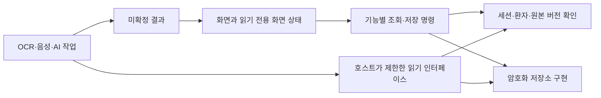

# 모듈화·캡슐화·유지보수성 검토 — 2026-09-10

> 이 문서는 수정 전 상태의 검토 기록이다. 이후 구현한 변경과 항목별 해결·검증 근거는 [구조 개선 결과](architecture_refactor_2026-09-10.md)를 따른다. 아래 파일 경로·줄 수·시험 결과는 검토 당시 기준이다.

## 판단과 범위

기록 앱의 기본 계층 분리와 저장소 내부 방어는 갖춰져 있다. 다만 **화면과 새 기능이 지켜야 할 경계가 API로 충분히 강제되지 않는다.** 현재 규모의 수동 기록 앱을 유지하는 것은 가능하지만, 동일한 컨트롤러에 OCR·음성 전사·AI 대화를 계속 추가하면 잠금, 저장, 환자 선택, 알림과 화면 상태가 서로 영향을 주기 쉽다. 전체 재작성보다 아래 경계를 먼저 정리하는 것이 적절하다.

제품 원본인 `caregiving_notebook_requirements.md`를 읽고, `caregiving_notebook_use_case_design.md`의 8장과 구현을 대조했다. 해당 설계는 화면의 DB·LLM 직접 호출을 금지하고 유스케이스 계층을 두도록 명시한다. 현재의 화면→DB 접근은 이 설계와 차이가 있다.

검토 대상은 직접 작성한 모바일 Dart 코드, Android/iOS 연결 코드, 테스트, 번역 생성 도구 및 Python 평가·데이터 처리 코드의 구조와 주요 실행 경로다. Python은 함수·의존 관계 전반을 조사하고 모델 실행, 도구 호스트, 데이터 변환·승인 및 결과 처리 경계를 중점적으로 확인했다. SDK, 플러그인 내부, 생성된 번역 Dart, 모델 가중치, 다운로드 데이터와 외부 MedAgentBench 코드는 구조 집계에서 제외했다. UI 개선은 이번 범위에서 보류했다.

이번 변경은 검토 문서뿐이다. 아래 문제를 재현하는 임시 진단 코드는 무시되는 `.tools/`에 두었고, 실제 기기나 사용자 저장소는 열지 않았다. 이번 검토는 침투시험, 성능 벤치마크 또는 의료 정확성 평가를 대체하지 않는다.

## 우선순위

‘먼저’는 AI·OCR 연결 전에 정리할 구조를 의미한다. 현재 사용자에게 모든 문제가 발생하고 있다는 뜻은 아니다.

| 순서 | 항목 | 확인 수준 | 권장 시점 |
|---|---|---|---|
| 1 | 동기 트랜잭션에 비동기 콜백을 전달할 수 있음 | 합성 데이터로 부분 저장·초안 삭제 재현 | 비동기 입력 보조 연결 전 |
| 2 | 컨트롤러가 저장소·비밀 저장소 및 변경 가능한 세션 상태를 노출 | 잠긴 컨트롤러를 통해 하위 저장소를 다시 여는 내부 호출 재현 | AI 데이터 접근 통로 작성 전 |
| 3 | 초안 payload의 타입·버전·실패 격리가 부족 | 잘못된 초안 하나의 목록 제목 생성 실패 재현 | 초안 형식 확장 전 |
| 4 | 선택 백업이 현재 DB 스키마와 직접 결합 | 코드로 확인한 향후 호환성 위험 | 다음 DB 스키마 변경 전 |
| 5 | 기능별 책임과 화면 조회가 하나의 컨트롤러/DB에 집중 | 호출 관계·소스 확인 | 위 항목과 함께 점진적으로 |
| 6 | 도메인 객체의 컬렉션이 외부에서 변경 가능 | 원본 Map 및 직렬화 결과를 통한 변경 재현 | AI에 전달할 데이터 모델 작성 전 |
| 7 | 플랫폼 인터페이스의 빈 구현과 문자열 오류 계약 | 코드로 확인한 변경 누락 위험 | 해당 인터페이스 수정 시 |
| 8 | Python 평가 실행기의 큰 함수와 일부 공통 코드 중복 | AST 구조 집계·주요 흐름 확인 | 다음 평가 기능 확장 시 |

## 1. 저장 완료 API가 비동기 작업을 안전하게 표현하지 못한다

근거: `mobile/lib/application/draft_session.dart:88`, `mobile/lib/application/care_controller.dart:396`, `mobile/lib/infrastructure/database_drafts.dart:202`, `mobile/lib/infrastructure/care_database.dart:79`.

`complete<T>(T Function() action)`, `completeDraft<T>(..., T Function() action)`, `mutate<T>(T Function() action)`은 비동기 콜백도 받을 수 있다. 그러나 DB의 `_transaction`은 콜백이 반환하자마자 COMMIT하며, `completeDraft`도 반환값이 Future인지와 관계없이 초안을 삭제한다. `mutate`는 콜백의 비동기 완료보다 먼저 `_refresh()`를 시작한다.

합성 초안에 대해 다음 순서를 직접 재현했다.

1. `completeDraft`에 비동기 콜백을 전달한다.
2. 콜백이 기록을 하나 쓰고, 완료되지 않은 Future를 기다린다.
3. 기다리는 동안 이미 기록이 확정되고 초안이 삭제된다.
4. 콜백이 오류를 내도 기록과 삭제된 초안이 원복되지 않는다.

현재 `editors.dart`의 여섯 초안 완료 경로는 동기 DB 콜백을 사용한다. 따라서 이 결과는 기존 화면에서 데이터 손실이 발생했다는 증거가 아니다. 다만 OCR 후처리나 다른 비동기 검증을 저장 콜백 안에 추가하는 자연스러운 변경이 트랜잭션 보장을 깨뜨릴 수 있다.

**권장:** 외부에는 검증된 저장 요청 데이터를 받는 명시적인 기능 명령을 제공한다. 비동기 추출·검증은 DB 트랜잭션 밖에서 끝내고, 마지막에 세션·환자·원본 버전을 다시 확인하여 기록 확정과 초안 삭제만 하나의 짧은 동기 트랜잭션으로 처리한다. 범용 콜백 기반 트랜잭션은 저장소 내부로 제한한다. 함수 이름에 `Sync`를 붙이거나 반환형만 `void`로 바꾸는 것으로는 비동기 콜백 오용을 충분히 막지 못한다.

## 2. 세션과 저장소의 캡슐화가 약하다

근거: `mobile/lib/application/care_controller.dart:19`, `:24`, `:176`, `:177`; `mobile/lib/infrastructure/vault_store.dart:24`.

컨트롤러는 `vault`, `platform`을 공개하고, `unlocked`, `busy`, `hasPin`, `externalOperation`, `selectedId`도 외부에서 바꿀 수 있다. `db` getter는 잠금을 확인하지만, 반환하는 것은 전체 `CareDatabase`다. `VaultStore`도 `db`, `secrets`, `open()`을 공개한다.

임시 저장소에서 `c.lock()` 후 `c.db` 접근이 거부되는 것을 확인했다. 같은 상태에서 `await c.vault.open()`을 호출하면 `c.unlocked == false`인데도 `c.vault.db.patients()`가 동작했다. **이는 같은 앱 내부 코드가 하위 객체를 통해 컨트롤러 규칙을 우회할 수 있다는 재현이다. 외부 사용자가 잠금을 뚫는 공격 경로나 현재 UI의 인증 우회가 발견됐다는 의미는 아니다.**

새 화면이나 AI 어댑터가 전체 컨트롤러를 받으면 전체 수첩, 식별정보, 삭제·복원 및 설정 변경 API까지 접근할 수 있다. DB의 환자별 외래키와 `_scoped` 검사는 계속 유효하지만, ‘현재 작업에 필요한 환자와 정보만 제공한다’는 AI 요구사항은 이 객체만 전달해서는 보장되지 않는다.

**권장:** 세션 상태는 private 필드와 읽기 전용 상태로 제공한다. 원시 DB·Vault·SecretStore는 조립 지점과 구현 내부에 두고, 화면에는 조회·저장 명령만 제공한다. AI에는 호스트가 정한 환자·허용 필드·기간·건수로 제한된 읽기 인터페이스와 불변 데이터만 전달한다. 비공개 필드 전환은 유지보수 경계를 강화하는 조치이며 OS의 보안 경계를 대신하지 않는다.

## 3. 초안 데이터의 계약이 화면에 흩어져 있다

근거: `mobile/lib/domain/drafts.dart:24`, `mobile/lib/infrastructure/database_drafts.dart:102`, `mobile/lib/presentation/editors.dart:25`, `mobile/lib/presentation/draft_page.dart:13`.

초안은 `Map<String, dynamic>`이며 별도의 payload 버전이 없다. 저장소는 환자 범위, 보관 정책, 크기, 기존 초안 연결을 확인하지만 유형별 필드 구조는 검사하지 않는다. 화면마다 `kind`, `fields`, `at` 등을 직접 캐스팅한다.

`type=entry`, `values={'kind':'unknown_entry_kind'}`인 초안은 저장되고 다시 읽힌다. 그런데 `draftLabel`의 `EntryKind.values.byName(...)`에서 예외가 발생한다. 목록은 각 항목의 제목을 만들면서 이 함수를 호출하므로, 잘못된 초안 하나가 목록 전체의 정상 렌더링을 방해할 수 있다. 현재 정상 편집기가 이 값을 만드는 경로는 찾지 못했다. 내부 버그나 향후 형식 변경에 대한 복구 경계가 부족한 것이다.

**권장:** 유형별 초안 데이터와 버전이 있는 codec을 둔다. 초안은 작성 중 데이터이므로 필수 입력값이 비어 있는 것은 허용하되, 데이터 타입·연결 정보·버전은 구분해 검사해야 한다. 읽을 수 없는 항목은 원문을 보존하고 개별적으로 복구/삭제 안내를 제공하여 다른 초안까지 막지 않는다. OCR 결과도 검증되지 않은 Map을 이 경로에 바로 넣지 않는다.

## 4. 선택 백업 형식이 내부 DB 구조를 그대로 따른다

근거: `mobile/lib/domain/backup.dart:33`, `mobile/lib/infrastructure/selective_backup.dart:41`, `:78`, `mobile/lib/infrastructure/database_backup.dart:84`.

선택 백업은 SQL 테이블 이름과 행을 저장하며 `schema`에 현재 `CareDatabase.schemaVersion`을 기록한다. 복원은 이 값이 현재 버전과 정확히 같아야 진행된다. 행의 컬럼도 현재 DB의 `PRAGMA table_info` 결과와 정확히 일치해야 한다.

현재 버전의 선택 백업·복원은 테스트를 통과한다. 그러나 다음 버전에서 DB 스키마를 올리고 이 코드를 그대로 두면, 지금 만든 선택 백업도 버전 불일치로 거부된다. 기존 전체 백업(format 1)의 DB 마이그레이션 경로가 선택 백업(format 2)까지 해결해 주지는 않는다.

**권장:** 백업 문서 버전과 저장소 스키마 버전을 분리하고, 기존 선택 백업을 새 입력 구조로 변환하는 adapter를 둔다. 현재 형식의 합성 백업 fixture를 보관하여 다음 스키마에서도 복원되는지 시험한다. 암호화 컨테이너, 참조 검증, 중복 복원 방지와 원자적 교체는 유지한다. 호환성을 위해 기존 검증을 제거하는 방식은 피한다.

## 5. 파일 분리는 되어 있지만 기능별 책임 분리는 부족하다

구조 집계: 생성 코드를 제외한 `mobile/lib`의 Dart 파일은 26개, 주석·공백 포함 7,760줄이다. 화면 8개 파일에서 `c.db` 직접 접근 표현을 51곳 확인했다. 이것은 실행 횟수나 성능 측정값이 아니다.

| 현재 파일 | 줄 수 | 함께 들어 있는 책임 |
|---|---:|---|
| `infrastructure/care_database.dart` | 1,095 | 스키마·마이그레이션·여러 기록 유형 CRUD·수정 이력·복약·진료 준비·채팅 |
| `presentation/shell.dart` | 692 | 여러 탭의 구성·필터·조회·집계·일부 변경 명령 |
| `presentation/editors.dart` | 670 | 여러 편집기의 입력 상태·초안 직렬화·저장 호출 |
| `application/care_controller.dart` | 572 | 인증·잠금·선택 환자·대화·초안·언어·사진·백업·알림·전체 갱신 |

줄 수 자체를 결함으로 보지는 않는다. 문제는 기록 저장 하나를 바꿀 때 화면, 범용 컨트롤러, DB, 백업, 초안의 가정을 함께 확인해야 한다는 것이다. `database_drafts.dart`, `database_backup.dart`, `selective_backup.dart`는 Dart의 `part`여서 각각 부모와 같은 라이브러리의 private 상태를 공유한다. 가독성에는 도움이 되지만 독립적인 모듈 계약이 생기는 것은 아니다.

`mutate()` 후 `_refresh()`는 대화·초안 정리, 환자 조회, 첨부 정리와 알림 계산을 함께 수행한다. 화면의 `build`에서도 동기 SQL 조회와 집계를 수행한다. 앱 전체가 같은 `ChangeNotifier`를 구독하고 `busy`이면 입력을 막는다. 알림 재예약을 줄이는 signature 캐시는 이미 있지만, 모든 변경에 전체 갱신을 연결하는 구조는 남아 있다.

**권장:** 기존 컨트롤러를 얇은 조정자로 유지하면서 세션, 기록 편집, 백업, 알림의 책임부터 분리한다. 화면은 필요한 조회 결과와 기능 명령을 받도록 옮긴다. 갱신도 실제 영향받은 기능 단위로 제한한다. 트랜잭션과 Vault 세대 교체의 조정자는 하나로 유지해야 한다. 모든 테이블에 별도 저장소 클래스를 만들거나 새 상태관리 프레임워크를 도입할 필요는 없다.

현재 기기에서 느리다는 결론은 내리지 않았다. SQL 실행 시간·데이터량·화면 프레임을 측정하기 전에는 캐시나 isolate를 무조건 추가하지 않는다. 다만 오래 걸리는 AI 추론을 기존 `_exclusive` 안에 넣으면 앱 전체의 `busy` 정책과 충돌하므로 별도 작업 상태와 취소 경로가 필요하다.

## 6. `final` 객체도 내부 컬렉션은 변경할 수 있다

근거: `mobile/lib/domain/records.dart:181`, `:196`, `:205`, `:215`; `mobile/lib/domain/drafts.dart:38`; `mobile/lib/domain/backup.dart:36`.

`CareEntry.fields`, `Medication.times`, `CareDraft.values`, `BackupPreview.counts`는 컬렉션을 그대로 노출한다. `CareEntry.toJson()`도 내부 `fields`를 공유한다. `final`은 컬렉션 참조의 재할당만 막는다.

생성자에 넘긴 원본 Map과 `toJson()`에서 받은 Map을 수정하자 기존 `CareEntry` 내용이 바뀌는 것을 재현했다. `version`은 그대로였다. 이는 메모리 객체의 변경이며, DB 내용까지 자동으로 변경된다는 의미는 아니다. 비동기 AI 작업에 ‘조회 당시의 기록’을 전달하려면 이 차이가 중요해진다.

**권장:** 생성 시 복사하여 수정 불가능한 컬렉션으로 보관하고, 중첩 초안은 내부까지 불변인 타입으로 표현한다. 직렬화 결과를 수정해도 원본 객체가 바뀌지 않도록 한다. 이미 `BackupSelection.patientIds`에 적용한 방식을 작은 데이터 모델부터 일관되게 적용할 수 있다.

## 7. 플랫폼과 오류 계약에서 누락을 조기에 발견하기 어렵다

근거: `mobile/lib/infrastructure/platform_services.dart:38`, `mobile/lib/domain/records.dart:135`, `mobile/lib/application/draft_session.dart:43`, `mobile/lib/l10n/app_strings.dart:65`.

`PlatformServices`의 `schedule`, `saveBackup`, `dial`은 기본 구현이 빈 성공이다. 새 어댑터가 구현을 빠뜨려도 컴파일되고, 파일 저장 등의 호출이 정상 완료된 것처럼 보일 수 있다. 현재 `DevicePlatformServices`는 해당 기능을 구현하고 있으므로 실제 기기의 백업이 빈 동작이었다는 뜻은 아니다.

`CareError`는 오류 원인 코드 대신 표시 문장을 보관한다. 번역도 그 문장으로 조회하며 등록되지 않은 문장은 일반 오류로 바뀐다. 초안 상태 역시 `ValueNotifier<String>`으로 노출한다. 자동화 기능이 재시도, 사용자 확인, 잠금, 취소 등을 구분해야 할 때 표시 문장을 해석하는 계약으로 발전하기 쉽다.

**권장:** 플랫폼의 필수 작업은 추상 메서드로 만들고 테스트용 no-op은 fake 내부에서 명시한다. 분리가 필요한 시점에 인증·알림·파일 기능 인터페이스를 나눈다. 오류와 작업 상태는 안정된 enum/code 및 필요한 인자를 사용하고, 표시 문장은 UI에서 결정한다. 일반 UI 번역 키 전체를 지금 다시 작성할 필요는 없다. 현재 번역 원본 분리와 생성 검사 방식은 유지할 수 있다.

## 8. Python 평가 코드는 분리할 지점이 보이지만 모바일에 그대로 옮길 대상은 아니다

`scripts/`의 Python은 19개 파일, 14,044줄이다. `ds_agent_model_runner.py`는 2,186줄이며 `run_model_episode` 하나가 516줄이다. 입력 검증, 역할 호출, 도구 실행, 토폴로지별 분기, 검증·재작성 및 trace 처리가 한 함수에 모여 있다. `role_evaluation_harness.py`도 요청 변환·모델 backend·채점을 함께 포함한다.

장점도 있다. 모델 backend에 Protocol이 있고, 결정적 도구 호스트가 별도 파일로 분리돼 있으며, 모델 대신 호스트가 환자 범위·역할별 도구·호출 예산을 제한한다. 승인 자료 처리와 평가용 데이터 경계도 검증한다. 이 분리는 유지해야 한다.

**권장:** 다음 평가 확장 시 에피소드 실행 단계를 명시적인 결과 타입으로 나누고, runtime backend와 채점 코드를 분리한다. AST 비교에서 동일한 `_canonical_bytes` 구현이 모델 runner, 도구 호스트, pilot runner에 중복되어 있었다. 이런 안정된 직렬화 규약은 테스트와 함께 공유할 수 있다. 단, 공통화 시 기존 해시·trace·manifest 결과를 바꾸지 않아야 하며 비슷하게 보이는 승인 검증까지 무조건 합치지 않는다.

현재 Python 실행기는 `InMemoryPilotRepository`, 합성·평가 episode와 trace를 사용하는 데스크톱 평가 도구다. Flutter의 실제 환자 저장소와 연결하는 제품 API가 아니다. 제품 연결에는 별도의 최소 데이터 변환, 세션 취소, 보관 정책 및 로그 경계가 필요하다. 의료 Q&A 활성화에는 요구사항의 승인 지식·임상 검수 조건도 별도로 남아 있다.

## 유지할 부분

- `domain`은 Flutter UI나 모델 SDK를 직접 import하지 않는다. 기록 유형별 공통 필드 정의로 비슷한 입력 코드를 줄인 점은 적절하다.
- DB 내부의 환자 범위 확인, 복합 외래키, 수정 버전 확인, 과거 처방 보존과 진료 준비 원본 연결은 중요한 방어다. 화면 분리 과정에서 없애면 안 된다.
- 암호화·키 저장·Vault 수명 관리가 UI보다 아래에 있다. 복원은 별도 세대에서 검증한 뒤 전환하며, 실패 시 기존 저장소를 유지하도록 설계돼 있다.
- 초안과 확정 기록을 구분하고, 잠금 시 초안을 저장하고 비공개 화면을 폐기하는 수명 관리가 있다.
- 테스트는 단순 화면 존재 여부만 보지 않는다. 실패 주입, 수정 충돌, 잠금 중 완료, 잘못된 백업, 사진 연결, 다국어 원문 보존 등을 확인한다.
- Android/iOS의 자체 연결 코드는 OS 기능 전달에 집중한다. 여기에 기록 저장이나 AI 판단을 추가할 이유는 없다. iOS 실행 검증은 Mac/Xcode가 없어 이번에도 수행하지 않았다.

## 권장 작업 순서와 완료 조건

아래는 후속 리팩터링의 제안이며 이번에 구현한 내용은 아니다. 요구사항에 따라 구현 전에 실패 시나리오와 테스트를 먼저 확정한다.

1. **저장·세션 경계:** 범용 저장 콜백을 기능 명령으로 치환하고 세션 상태·Vault 접근을 비공개로 만든다. 동기 저장과 초안 삭제의 원자성이 유지되고, 비동기 실패 후에는 미확정 초안이 남아야 한다.
2. **데이터 계약:** 초안 타입·버전, 읽기 실패 격리, 불변 모델을 도입한다. 이전 초안, 잘못된 초안, 빈 필수 항목을 가진 작성 중 초안, 수정 충돌과 만료를 각각 검증한다. 컬렉션 변경으로 기존 조회 결과가 바뀌면 안 된다.
3. **백업 호환성:** 현재 선택 백업 fixture를 기준으로 다음 스키마의 복원을 검증한다. ID 재연결, 선택 범위, 사진, 중복 차단, 실패 시 현재 기록 보존을 함께 확인한다.
4. **기능별 분리:** 기록 편집·백업·알림 서비스를 추출하고 화면의 DB 호출을 옮긴다. 잠금·환자 선택·언어 변경의 기존 동작을 유지하고, 관계없는 변경으로 알림·전체 조회가 불필요하게 다시 실행되지 않는지 확인한다.
5. **AI 연결용 좁은 인터페이스:** 호스트가 환자와 조회 범위를 고정한다. A 수첩에서 시작한 작업 중 B 수첩으로 전환하거나 잠그면 늦게 도착한 결과가 표시·확정되지 않아야 한다. 추론은 기록 쓰기 트랜잭션 밖에서 실행하고, OCR/음성 결과는 사용자 확인 전 확정 기록으로 저장하지 않는다. 원문·식별정보·키를 평가 trace나 외부 로그에 넘기지 않는다.

저장소 인터페이스를 기능 단위로 두고 `main.dart`에서 구현을 조립하면 충분하다. 별도 서버, 클라우드 동기화, 범용 플러그인 시스템이나 대규모 상태관리 전환은 이번 구조 문제를 해결하는 데 필요하지 않다.

## 검증 결과

2026-09-10 현재 작업 트리에서 실행했다.

| 검증 | 결과 | 해석 |
|---|---|---|
| `flutter analyze --no-pub` | 오류·경고 없음 | 기존 분석 규칙 통과. 계층 경계까지 검증하는 것은 아님 |
| `flutter test --no-pub --reporter expanded` | 기존 58개 통과 | 현재 모바일 동작의 회귀 기준선 |
| `python -m unittest discover -s tests -q` | 96개 통과 | fixture·replay 기반 Python 검증. 실제 모델 의료 성능 평가 아님 |
| 임시 구조 진단 4개 | 네 가지 현상 재현 | 비동기 부분 저장, 잘못된 초안 제목, 내부 Vault 접근, 컬렉션 별칭 변경 |

진단 파일은 `.tools/architecture_review_probe_test.dart`, 집계 파일은 `.tools/architecture_inventory.json`이다. 진단 테스트는 현재의 취약한 계약을 관찰하도록 작성했으므로 ‘4개 통과’를 문제가 해결됐다는 뜻으로 해석하면 안 된다. 후속 수정 시에는 위 완료 조건을 보장하는 정식 회귀시험으로 대체해야 한다.

현재 프로젝트에는 일반 Flutter lint와 기능 테스트는 있으나 화면→저장소 의존을 차단하는 별도의 검사 규칙은 확인되지 않았다. 경계를 정리한 뒤 해당 import/API 재노출을 검출하는 소수의 구조 검사와 위 실패 시나리오를 추가하는 것이 적절하다.
