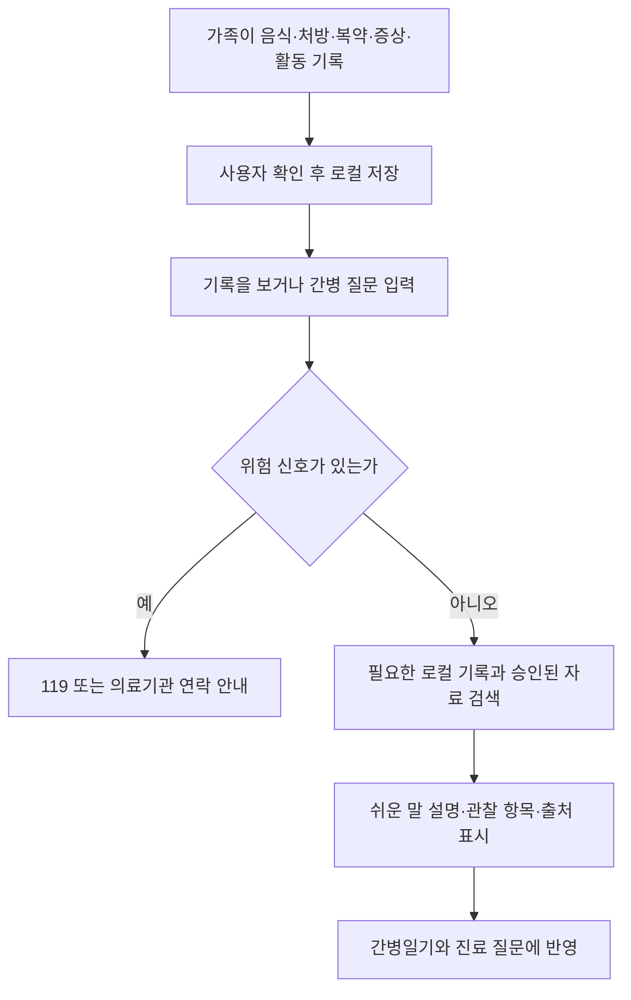
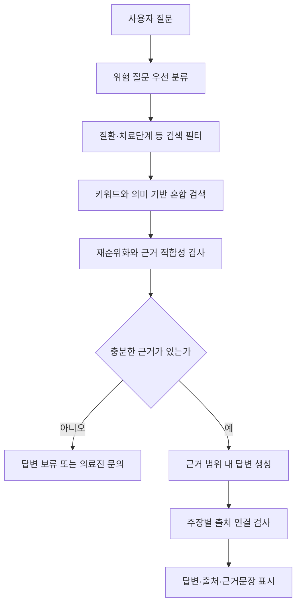

# 온프레미스 경량 LLM 기반 간호수첩(간병수첩) 애플리케이션 요구사항 분석

- 문서 상태: 사용자 요구사항 정정 반영 및 MVP 기획 개정안
- 조사 기준일: 2026-08-05
- 경쟁 환경 반영일: 2026-08-30
- 주요 사용자: 환자를 일상적으로 돌보는 가족 및 비전문 간병인

## 목차

1. [프로젝트 개요](#1-프로젝트-개요)
2. [조사 결과](#2-조사-결과)
3. [서비스 범위](#3-서비스-범위)
4. [기능 요구사항](#4-기능-요구사항)
5. [MVP 제안](#5-mvp-제안)
6. [온프레미스 경량 LLM 설계 요구사항](#6-온프레미스-경량-llm-설계-요구사항)
7. [비기능 요구사항](#7-비기능-요구사항)
8. [사용자 조사 및 검증 계획](#8-사용자-조사-및-검증-계획)
9. [권장 개발 우선순위](#9-권장-개발-우선순위)
10. [최종 제품 정의](#10-최종-제품-정의)
11. [참고자료](#11-참고자료)

관련 문서는 [`agent_architecture_and_evaluation_plan.md`](./agent_architecture_and_evaluation_plan.md), [`agent_role_and_tool_contracts.md`](./agent_role_and_tool_contracts.md), [`slm_rag_validation_plan.md`](./slm_rag_validation_plan.md), [`model_and_rag_data_catalog.md`](./model_and_rag_data_catalog.md), [`caregiving_notebook_use_case_design.md`](./caregiving_notebook_use_case_design.md), [`mobile_app_data_schema_design.md`](./mobile_app_data_schema_design.md)와 [`competitive_landscape_and_product_strategy.md`](./competitive_landscape_and_product_strategy.md)를 참조한다. 이 문서가 관련 설계·검증·전략 문서보다 우선하는 제품 요구사항 원본이다.

## 1. 프로젝트 개요

### 1.1 프로젝트 목적

본 프로젝트는 의사나 간호사를 대체하는 의료 서비스를 개발하는 것이 아니다. 환자를 돌보는 가족이나 비전문 간병인이 의료진 또는 병원에 즉시 연락하기 어려운 상황에서 다음과 같은 도움을 받을 수 있도록 하는 **일상 간병 보조 애플리케이션**을 개발하는 것이 목적이다.

- 일상생활에서 생기는 사소하지만 반복적인 간병 질문에 검증된 정보를 바탕으로 답변한다.
- 음식 사진, 식사와 수분 섭취, 처방약과 실제 복약, 배설, 수면, 증상, 활동, 재활 및 진료일정을 간병일기로 기록한다.
- 처방받은 약의 일반적인 효능과 주의사항, 현재 상황에서 음식이나 활동을 고려할 때 확인할 내용을 승인된 근거를 바탕으로 쉬운 말로 설명한다.
- 여러 가족이 간병에 참여할 때 기록과 업무를 공유하고 인계할 수 있도록 한다.
- 사용자가 의료진에게 문의해야 할 상황을 인지하고 필요한 정보를 정리하도록 돕는다.
- 응급하거나 위험할 가능성이 있는 상황에서는 자체 판단을 계속하지 않고 119, 응급실 또는 담당 의료기관으로 연결한다.

따라서 앱의 핵심 역할은 **“환자를 진료하는 AI”가 아니라 “가족이 더 안전하고 체계적으로 돌보며 의료진과 원활하게 소통하도록 돕는 간병 코디네이터”**로 정의한다.

초기 버전에서도 간병일기, 음식 사진, 처방자료, 약 목록, 실제 복약, 증상 및 활동 기록은 앱의 핵심 데이터로 기기 또는 승인된 기관 내부 환경에 저장할 수 있다. 개인정보 제한의 목적은 이러한 기록 기능을 없애는 것이 아니라 민감한 환자정보와 원본 간병기록이 외부 LLM API, 광고 SDK 또는 외부 분석 서비스로 전송되는 것을 방지하는 데 있다. 로컬 LLM은 사용자가 허용한 로컬 기록 중 현재 질문과 작업에 필요한 범위만 불러와 사용한다. 가족 계정 간 공유와 병원 또는 주치의에게의 데이터 전송은 별도의 동의, 권한, 보안 및 규제 검토 후 최종 단계에서 구현한다.

### 1.2 해결하려는 핵심 문제

1. 간병 정보가 여러 기관과 웹사이트에 분산되어 있다.
2. 의료정보가 전문용어 중심이라 가족이 이해하기 어렵다.
3. 퇴원 직후 약, 식사, 증상 관찰 및 진료일정을 기억하기 어렵다.
4. 가족 간 간병 기록과 업무 인계가 메신저나 구두 전달에 의존한다.
5. 식사와 건강식품에 대한 검증되지 않은 정보가 많다.
6. 어떤 증상에서 의료진에게 연락해야 하는지 판단하기 어렵다.
7. 간병인의 피로, 불안, 고립 및 정보 탐색 부담이 크다.
8. 이용할 수 있는 지원제도와 지역 서비스를 찾기 어렵다.

### 1.3 로컬 우선 개인정보 보호 원칙

간병일기와 복약·식사 기록은 제품의 핵심가치를 구성하므로 초기 제품부터 로컬에 지속 저장할 수 있다. 개인정보 보호는 기록 자체를 제한하는 방식보다 데이터의 처리 위치와 외부 전송 범위를 통제하는 방식으로 설계한다.

1. **로컬 기록 우선:** 간병일기, 음식 사진, 처방자료, 약 목록, 실제 복약, 증상 및 활동 기록은 기기 또는 승인된 기관 내부 저장소에 보관한다.
2. **로컬 LLM 처리:** 질문 이해, 기록 검색, 요약 및 쉬운 설명은 원칙적으로 로컬 LLM과 로컬 지식베이스에서 수행한다.
3. **필요한 맥락만 사용:** 로컬 환경에서도 LLM에는 현재 작업에 필요한 기록 조각만 전달하고 전체 기록을 매번 프롬프트에 포함하지 않는다.
4. **식별정보 분리:** 이름, 연락처, 병원 등록번호와 같은 식별정보는 간병·의료 기록과 분리해 저장하고, 검색이나 생성에 필요하지 않으면 LLM 입력에서 제외한다.
5. **외부 전송 기본 금지:** 외부 LLM API, 광고 SDK 및 외부 분석 도구로 환자 식별정보, 사진 또는 원본 간병기록을 전송하지 않는다. 외부 공식 데이터 조회가 필요하면 환자 맥락을 제외한 약 식별자나 일반 검색어만 사용한다.
6. **사용자 통제:** 로컬 데이터의 암호화, 앱 잠금, 보유기간, 내보내기, 백업, 자동삭제 및 전체 삭제 기능을 제공한다.
7. **로컬 대화 맥락 관리:** 질문·답변 맥락은 로컬에서 처리하며 사용자가 대화 기록의 보관 여부와 보유기간을 선택할 수 있게 한다. 세션 종료 시 일괄 삭제를 고정 정책으로 두지 않고, 간병일기로 저장할 내용은 사용자가 확인한다. 대화 원문은 외부 디버그 로그나 모델 학습 데이터에 남기지 않는다.
8. **외부 공유는 최종 단계:** 가족 계정 간 공유와 병원·주치의 전달은 환자 동의, 접근권한, 전송 이력, 취소, 오발송 대응 및 규제 검토 후 구현한다.

### 1.4 시장 포지셔닝과 차별화 원칙

경쟁 서비스 조사 결과 간병일지, 복약 알림, 일정, 가족 공유, 건강기록과 일반적인 AI 인사이트는 이미 여러 국내외 제품이 제공하고 있다. 간병일기는 제품의 필수 기반이지만 `기록할 수 있다`는 사실만으로는 경쟁우위가 아니다. 상세 근거와 서비스별 비교는 [`competitive_landscape_and_product_strategy.md`](./competitive_landscape_and_product_strategy.md)를 따른다.

이 프로젝트의 제품 차별화와 범위는 다음 원칙으로 고정한다.

1. **기록을 근거 있는 다음 행동으로 전환:** 확인된 간병기록에서 관련 변화를 찾고 승인 의료문서와 연결해 쉬운 설명, 관찰할 내용, 의료진 연락 조건과 진료 질문을 제시한다.
2. **많이 답하기보다 답해도 되는 것만 답변:** 주장별 정확한 출처를 제공하고 근거가 없거나 충돌하면 답변을 보류한다.
3. **안전과 개인정보를 기능 목록보다 우선:** 고위험 규칙을 LLM보다 먼저 실행하고 민감한 원본 기록과 사진의 외부 전송을 기본적으로 금지한다.
4. **한국어 가족간병 입력에 집중:** 국내 처방전·약 봉투, 음식 사진, 실제 복약·거부 이유와 일상적인 증상 표현을 사용자 확인을 거쳐 구조화한다.
5. **간병인 부담을 함께 줄임:** 빠른 기록, 변화 요약, 진료 준비와 간단한 피로·수면·스트레스 확인을 제공하되 환자 기록과 간병인 개인 기록을 분리한다.
6. **초기 경쟁영역을 제한:** 간병인 매칭·결제, 복약관리 전문 플랫폼 전체, 전문 홈케어 업체 운영시스템과 대규모 가족 소셜 기능을 초기 제품에 포함하지 않는다.
7. **가족 협업은 목적이 아니라 후속 확장:** Jointly·Caring Village와 같은 협업 UX는 참고하되 동의·권한·보안·규제 검토 전에는 로컬 개인 사용 흐름을 우선한다.

## 2. 조사 결과

### 2.1 정보가 분산되어 있고 이해하기 어렵다

국내 치매환자 가족 대상 연구에서는 정책 변경에 따른 혼란, 정보의 분산, 방대한 자료와 전문용어 때문에 가족이 필요한 정보를 찾기 어렵다는 문제가 확인됐다. 연구 참여 가족은 필요할 때 부담 없이 정보를 얻는 방법을 선호했으며, 간병 부담과 책임을 기관 및 다른 사람과 나누기를 원했다.

제품 요구사항은 다음과 같다.

- 환자의 질환과 치료 단계에 해당하는 정보만 선별한다.
- 전문용어를 일상적인 표현으로 바꾸어 설명한다.
- 모든 의료정보에 출처, 검수일 및 적용 대상을 표시한다.
- 한 화면에서 핵심 행동과 추가 설명을 구분한다.

출처: [치매환자가족을 위한 돌봄 교육 서비스 앱 개발](https://e-jhis.org/upload/pdf/jhis-44-4-419.pdf)

### 2.2 가족은 질병 지식보다 실제 행동 지침도 필요로 한다

가족간병 애플리케이션 연구를 종합한 문헌고찰에서는 다음과 같은 요구가 확인됐다.

- 질병과 동반질환 정보
- 증상, 행동 및 안전 문제
- 도움을 요청해야 하는 시점
- 목욕, 옷 입기, 배설, 식사, 이동 및 재활과 같은 일상생활 보조
- 복약관리 및 환자 상태 추적
- 가족 간 정보공유와 업무 알림
- 의료진 및 지원서비스와의 연결
- 간병인 자신의 건강과 스트레스 관리

제품은 단순한 질병 백과사전이 아니라 `오늘 할 일`, `관찰할 내용`, `의료진에게 연락할 조건`을 함께 제시해야 한다.

출처: [Mobile Health Apps, Family Caregivers, and Care Planning: Scoping Review](https://www.jmir.org/2024/1/e46108/)

### 2.3 퇴원 이후 복약과 후속 진료에서 혼란이 발생한다

퇴원 설명은 짧은 시간에 제공되거나 환자와 가족의 건강문해력에 맞지 않을 수 있다. 의료진마다 사용하는 표현이 다르거나 설명 내용이 충돌하면 환자와 가족이 진단명, 약의 목적, 복용법, 부작용 또는 후속 진료의 필요성을 충분히 이해하지 못할 수 있다.

또한 입원 전후 약 목록이 달라지면서 다음과 같은 문제가 발생할 수 있다.

- 기존 약과 새로운 약의 중복 복용
- 필요한 약의 복용 누락
- 중단해야 할 약의 계속 복용
- 약의 목적이나 부작용을 모르는 상태
- 약과 건강식품 또는 음식 간 상호작용

제품은 퇴원자료와 처방 내용을 구조화하되, OCR 및 LLM이 추출한 정보는 반드시 가족이 원문과 대조해 확정하도록 해야 한다.

출처: [AHRQ Discharge Planning and Transitions of Care](https://psnet.ahrq.gov/primer/discharge-planning-and-transitions-care), [AHRQ Re-Engineered Discharge Toolkit](https://www.ahrq.gov/sites/default/files/publications/files/redtoolkit.pdf)

### 2.4 환자 식사에 관한 오해가 영양 부족과 가족 갈등을 만들 수 있다

환자에게 좋지 않을 것이라는 걱정 때문에 필요 이상으로 음식을 제한하면 식사량과 영양 섭취가 감소할 수 있다. 환자와 가족의 음식에 대한 생각이 다르면 갈등으로 이어질 수도 있다. 식사 안내는 질환명 하나만으로 결정할 수 없으며 치료 단계, 알레르기, 연하 상태, 신장기능, 당뇨 및 현재 증상을 함께 고려해야 한다.

제품 요구사항은 다음과 같다.

- 식사량, 수분, 식욕, 체중 및 소화기 증상을 기록한다.
- 의료진 또는 영양사가 검수한 식사 규칙을 적용한다.
- 음식의 치료효과를 과장하는 질문에는 근거 수준을 명확히 표시한다.
- 약-음식 상호작용은 LLM의 기억이 아닌 검증된 구조화 데이터로 확인한다.
- LLM은 승인된 식사 원칙을 설명하고 가능한 대체안을 제시하는 역할만 한다.

출처: [국가암정보센터 암환자의 식사 요령](https://www.cancer.go.kr/lay1/bbs/S1T811C676/E/22/view.do?article_seq=21866&condition=&cpage=&keyword=&mode=view&rn=524&rows=)

### 2.5 간병 부담은 가족의 정신적·신체적 건강에도 영향을 준다

국내 연구에서는 가족간병 부담이 우울과 관련되고, 사회적 지지가 그 영향을 완화하는 것으로 나타났다. 말기 암환자 가족에 대한 질적 연구에서도 혼자 감당하는 간호로 인한 신체적·정신적 소진, 고립, 불안 및 의료적 의사결정 부담이 확인됐다.

제품은 환자 관리뿐 아니라 다음 기능도 제공해야 한다.

- 간병인의 피로, 수면 및 스트레스 간단 점검
- 사용자가 확인해 복사할 수 있는 가족 교대 요청문 또는 도움 요청문 초안
- 미완료 업무와 장시간 연속 간병 알림
- 지역 상담기관, 자조모임 및 지원서비스 안내
- 환자 기록과 간병인 개인 기록의 권한 분리

출처: [중·노년기 사회적 지지가 가족간병 부담과 우울 간 관계에 미치는 영향](https://www.kihasa.re.kr/hswr/assets/pdf/1455/journal-44-1-218.pdf), [말기 암환자 가족의 돌봄 경험](https://synapse.koreamed.org/upload/synapsedata/pdfdata/0006jkan/jkan-42-280.pdf)

### 2.6 경제적·제도적 지원에 대한 정보 접근성이 부족하다

희귀질환자 및 보호자 조사에서는 치료정보, 재활치료, 의료비 부담, 정보 접근성 및 가족상담에 대한 수요가 확인됐다. 지원제도는 질환, 소득, 장애 여부 및 거주지역에 따라 달라지므로 단순 링크 모음보다 조건 기반 안내가 필요하다.

출처: [희귀질환자와 보호자의 미충족 의료수요에 대한 탐색적 분석](https://www.kihasa.re.kr/hswr/v.42/2/141/%ED%9D%AC%EA%B7%80%EC%A7%88%ED%99%98%EC%9E%90%EC%99%80%2B%EB%B3%B4%ED%98%B8%EC%9E%90%EC%9D%98%2B%EB%AF%B8%EC%B6%A9%EC%A1%B1%2B%EC%9D%98%EB%A3%8C%EC%88%98%EC%9A%94%EC%97%90%2B%EB%8C%80%ED%95%9C%2B%ED%83%90%EC%83%89%EC%A0%81%2B%EB%B6%84%EC%84%9D)

### 2.7 간병일기는 돌봄 행동과 상태 변화를 연결해 기록해야 한다

국내 장기요양 기록과 해외 의료기관의 환자·간병인용 기록지를 비교하면 간병기록은 단순한 자유서술보다 `언제`, `무엇을 관찰했는지`, `어떤 돌봄을 수행했는지`, `그 뒤 상태가 어땠는지`, `누구에게 무엇을 전달해야 하는지`를 연결하는 구조가 유용하다.

- 식사 종류와 섭취량, 수분, 배뇨·배변, 수면, 위생 및 피부 상태
- 처방약 목록과 실제 복용 시각, 복용하지 못한 이유 및 관찰된 이상 반응
- 통증을 포함한 증상의 시작 시각, 부위, 정도, 지속시간, 악화·완화 요인 및 일상생활 영향
- 이동과 필요한 도움 정도, 운동·재활, 낙상 또는 아차사고
- 체온, 혈압, 체중 등 의료진이 측정하도록 안내했거나 사용자가 실제로 측정한 값
- 의료진 연락, 받은 안내, 이후 변화, 다음 간병인에게 전달할 내용
- 음식·처방전·약 봉투 사진과 사용자가 확인한 구조화 정보

모든 항목을 매번 강제로 입력하지 않고 빠른 선택 기록과 상세 기록을 분리한다. 측정값, 상처, 인지·행동 및 질환별 항목은 필요한 사용자만 켤 수 있어야 한다. 사진이나 OCR에서 추출한 음식명과 처방정보는 확정된 사실로 저장하기 전에 사용자가 원문과 대조해 확인한다.

출처: [장기요양급여 제공기록지](https://www.law.go.kr/flDownload.do?flNm=%5B%EB%B3%84%EC%A7%80+%EC%A0%9C16%ED%98%B8%EC%84%9C%EC%8B%9D%5D+%EC%9E%A5%EA%B8%B0%EC%9A%94%EC%96%91%EA%B8%89%EC%97%AC+%EC%A0%9C%EA%B3%B5%EA%B8%B0%EB%A1%9D%EC%A7%80%28%EC%8B%9C%EC%84%A4%EA%B8%89%EC%97%AC%2F%EB%8B%A8%EA%B8%B0%EB%B3%B4%ED%98%B8%29%0A&flSeq=101878835), [AHRQ Taking Care of Myself](https://www.ahrq.gov/questions/resources/going-home/index.html), [VA Caregiver Medication Log](https://www.caregiver.va.gov/CAREGIVER/pdfs/VA_Caregiver_MedicationLog_FormFinal.pdf), [NCI Pain and Cancer Treatment](https://www.cancer.gov/about-cancer/treatment/side-effects/pain)

## 3. 서비스 범위

### 3.1 초기 서비스가 제공하는 기능

- 선택적 로컬 환자 프로필과 지속되는 간병일기
- 음식 사진, 음식명, 섭취량, 수분 및 식사 전후 상태 기록
- 처방전·약 봉투 사진 또는 직접 입력을 통한 약 목록 등록과 실제 복약 기록
- OCR 또는 이미지 인식 결과의 사용자 확인과 수정
- 승인된 약물 자료에 기반한 약의 일반적인 효능, 사용 목적 및 주의사항의 쉬운 설명
- 승인된 간병 및 질환 정보를 검색하고 쉬운 말로 설명
- 현재 기록과 의료진 지시를 고려한 식사, 위생, 수면, 배설, 이동, 활동 및 재활 관련 질문 지원
- 로컬 기록 중 현재 질문에 필요한 최소 맥락에 맞는 자료 우선 제시
- 할 일, 진료 질문, 관찰사항 및 다음 간병인을 위한 인계 메모
- 의료진 또는 응급기관에 연락해야 할 가능성이 있는 상황 안내
- 공개된 국가 및 지역 지원서비스 탐색

### 3.2 간병일기 핵심 기록 범위

- **기본정보:** 날짜·시간, 작성자 역할 또는 별칭, 평소 대비 전체 상태
- **식사·수분:** 음식 사진, 식사 종류, 섭취량, 식욕, 수분량, 씹기·삼키기 어려움 및 식사 전후 증상
- **복약:** 처방약, 예정 시각, 실제 복용 시각, 복용 여부, 누락·거부 이유 및 관찰된 이상 반응
- **증상:** 시작 시각, 부위, 정도, 지속시간, 반복 여부, 악화·완화 요인, 일상생활 영향, 수행한 조치 및 이후 변화
- **생활:** 수면, 배뇨·배변, 세면·목욕·구강관리, 피부·상처, 이동과 필요한 도움 정도
- **활동:** 산책, 운동, 재활, 활동 시간, 수행 정도 및 활동 후 변화
- **측정값:** 의료진이 지정했거나 사용자가 실제로 측정한 체온, 혈압, 맥박, 호흡수, 체중, 혈당, 산소포화도 등
- **사건·연락:** 낙상, 사레, 상처, 복약 누락 등 사건과 관찰 사실, 조치, 의료진 연락, 받은 안내 및 이후 상태
- **인계·진료:** 완료한 일, 다음 간병인이 할 일, 관찰할 내용, 진료 질문 및 일정
- **간병인 상태:** 환자 기록과 분리된 피로, 수면, 스트레스 및 교대 필요 여부

### 3.3 후속 단계에서 검토할 확장 기능

- 질환별 장기 변화 분석과 의료진용 요약
- 가족별 간병 업무 배정과 교대 인계
- 환자 동의에 기반한 병원 또는 주치의로의 기록 전달
- 병원 EMR 또는 지역 의료정보시스템과의 연동
- 암호화된 다중 기기 동기화와 백업
- 웨어러블 및 의료기기 데이터 연동

### 3.4 서비스가 제공하지 않는 기능

- 질병 진단 또는 확진
- 약의 처방, 시작, 중단 또는 용량 변경
- 검사결과만을 근거로 한 치료 결정
- 응급상황에 대한 LLM 단독 판정
- 의료진이 설정한 치료계획의 임의 변경
- 근거가 없는 민간요법 또는 특정 식품의 치료효과 추천
- 의료진의 확인이 필요한 상황에서 상담을 지연시키는 답변

### 3.5 사용자에게 전달할 기본 원칙

- 이 앱은 일상 간병과 정보 이해를 돕는 보조 도구이다.
- 환자별 처방 및 담당 의료진의 지시가 앱의 일반정보보다 우선한다.
- 환자 상태가 평소와 다르거나 빠르게 악화되면 앱 사용을 계속하기보다 의료기관에 연락한다.
- 의료정보를 포함한 앱 답변은 근거 출처와 검수일을 함께 제공한다.
- 사진 인식과 OCR 결과는 입력을 돕는 초안이며 사용자가 원문과 대조해 확정한다.
- 앱에 저장된 기록과 로컬 LLM에 전달되는 정보, 외부로 조회되는 정보를 사용자가 구분해 확인할 수 있어야 한다.

## 4. 기능 요구사항

| ID | 기능 | 상세 요구사항 | 우선순위 |
|---|---|---|---|
| FR-01 | 로컬 환자 맥락 | 사용자가 선택적으로 환자 프로필, 질환 범주, 치료 단계, 의료진 지시와 현재 불편을 기기 또는 승인된 내부 환경에 저장한다. 식별정보는 의료·간병기록과 분리하고 LLM에는 필요한 맥락만 제공한다. | 필수 |
| FR-02 | 일상 간병 안내 | 식사, 위생, 수면, 배설, 이동, 활동 및 재활과 같은 일상 질문에 현재 기록과 승인된 근거를 바탕으로 안내한다. | 필수 |
| FR-03 | 간병일기 | 음식·수분·복약·증상·수면·배설·위생·피부·활동·측정·사건·연락 및 인계 내용을 시간순으로 로컬에 기록한다. 빠른 기록과 상세 기록을 구분한다. | 필수 |
| FR-04 | 쉬운 말·음성 지원 | 전문용어를 쉬운 말로 설명하고, 텍스트 입력이 어려운 경우 음성 질문을 지원한다. | 권장 |
| FR-05 | 가족 협업 | 가족을 초대하고 환자정보, 담당 업무, 완료 여부 및 인계사항을 공유한다. | 최후속 |
| FR-06 | 근거 기반 Q&A | 승인된 의학 문서만 검색해 답변하며, 의학적 사실마다 이를 뒷받침하는 자료명, 발행기관, 발행·검수일, 페이지·절 및 원문 링크를 표시한다. | 필수 |
| FR-07 | 위험 신호 대응 | 안전 규칙을 LLM보다 먼저 적용하고 필요 시 119, 응급실 또는 담당병원 연락 기능을 제공한다. | 필수 |
| FR-08 | 처방·복약 기록과 이해 | 처방전·약 봉투 사진 또는 직접 입력으로 약을 등록하고 실제 복약을 기록한다. OCR 결과는 사용자가 확정하며, 약의 효능·목적·주의사항은 승인된 약물 데이터와 근거문서로 쉽게 설명한다. | 필수 |
| FR-09 | 식사·영양 기록과 안내 | 음식 사진, 음식명, 섭취량, 수분 및 식사 전후 상태를 기록하고 현재 상황에 맞는 검수된 식사 원칙을 제공한다. 사진 인식만으로 섭취 안전성을 확정하지 않는다. | 필수 |
| FR-10 | 진료 준비와 기록 요약 | 사용자가 입력한 질문과 로컬 간병기록의 주요 변화를 요약해 진료 시 확인할 내용을 정리한다. 요약의 원본 기록 위치를 확인할 수 있어야 한다. | 권장 |
| FR-11 | 설명 확인 | 사용자가 약과 주의사항을 자기 말로 다시 설명하게 하여 이해 여부를 확인한다. | 권장 |
| FR-12 | 지원서비스 | 개인식별정보를 요구하지 않고 간호·간병통합서비스, 장기요양, 치매안심센터 등 공개 정보를 안내한다. | 권장 |
| FR-13 | 보호자 지원 | 피로·수면·스트레스를 점검하고 사용자가 검토해 복사할 수 있는 가족 교대·도움 요청문과 인계메모 초안, 상담 및 지역지원 연결을 제공한다. MVP에서는 가족 초대, 수신자 관리 또는 앱 내부 전송을 제공하지 않는다. | 권장 |
| FR-14 | 로컬 기록 보안·관리 | 환자 프로필, 사진, 처방자료, 간병기록 및 질문·답변 기록을 암호화해 저장한다. 앱 잠금, 내보내기, 백업 선택, 대화 보관 여부와 보유기간 설정, 간병일기 반영 전 사용자 확인, 수정 이력, 개별·전체 삭제 기능을 제공한다. | 필수 |
| FR-15 | 의료기관 전달 | 환자 동의와 전송 전 확인을 거쳐 선택된 기록만 병원 또는 주치의에게 전달한다. | 최후속 |
| FR-16 | 활동·재활 기록과 안내 | 산책·운동·재활 수행과 활동 후 변화를 기록하고, 의료진 지시와 승인된 자료 범위에서 일반적인 활동 원칙과 확인할 조건을 설명한다. | 필수 |

## 5. MVP 제안

초기 버전은 모든 질환을 포괄하기보다 **로컬 간병일기, 처방·복약 및 음식 기록, 근거 기반 간병 Q&A와 하나의 질환별 콘텐츠 팩**으로 구성한다. 암 수술·항암, 뇌졸중 또는 치매 가운데 가족 사용자와 임상 자문을 확보하기 쉬운 영역을 우선 선택한다. 회원가입이나 외부 클라우드 전송 없이도 기기 안에서 간병기록을 지속 관리하고, 로컬 LLM이 기록과 승인된 자료를 바탕으로 쉬운 설명과 요약을 제공하는 기능의 유용성과 안전성을 검증한다.

### 5.1 MVP 화면

1. 오늘의 복약·식사·활동·일정과 빠른 기록
2. 시간순 간병일기와 상세 기록
3. 처방전·약 봉투 등록, 약 목록, 복약 기록과 쉬운 설명
4. 음식 사진, 섭취량·수분 기록과 음식 질문
5. 약·음식·활동·증상에 관한 간병 도우미 질문
6. 기록 변화 요약과 진료 질문 정리
7. 위험 신호 및 의료기관 연락 안내
8. 질환별 자주 묻는 질문, 간병 카드 및 공개 지원서비스
9. 앱 잠금, 로컬 데이터와 대화기록의 보관·내보내기·백업·삭제 설정

### 5.2 대표 사용자 흐름

### 5.3 MVP에서 제외할 기능

- 자유로운 커뮤니티 게시판
- 검증되지 않은 사용자 간 의학정보 추천
- 질환 제한이 없는 자동 식단 생성
- 필수 회원가입과 원격 계정 서버
- 가족 계정 간 환자정보 공유
- 병원·주치의로의 기록 전송
- 사용자 확인 없는 처방전·약 봉투 OCR 자동 확정
- 사진만으로 음식 섭취 가능 여부를 확정하는 기능
- 외부 클라우드에 원본 간병기록과 사진을 자동 백업하는 기능
- 웨어러블 및 병원 EMR 연동
- LLM이 수행하는 진단 및 치료 추천

## 6. 온프레미스 경량 LLM 설계 요구사항

### 6.1 LLM이 담당할 작업

- 사용자의 질문 의도와 간병 상황 파악
- 사용자가 허용한 로컬 간병기록에서 현재 질문에 필요한 기록 탐색
- 승인된 문서 검색을 위한 검색어 생성
- 검색된 자료를 쉬운 말로 설명
- 처방약의 일반적인 효능·목적·주의사항과 음식·활동 관련 승인 원칙을 쉬운 말로 설명
- 간병일지의 상태 변화, 복약 누락, 진료 질문 및 가족 인계내용 요약
- 진료 시 물어볼 질문 초안 생성
- 음성, 자유서술, 처방전·약 봉투 및 음식 사진에서 구조화된 입력 초안을 생성
- 사진 및 OCR 추출 결과의 불확실성을 표시하고 사용자 확인을 요청

### 6.2 규칙 또는 구조화 시스템이 담당할 작업

- 응급 및 고위험 상황 탐지
- 약 이름, 처방 용량, 예정·실제 복용시간과 사용자 확인 상태 저장
- 약-음식 및 약-약 상호작용 확인
- 환자별 의료진 지정 주의조건
- 음식·처방전·약 사진 원본과 추출 데이터의 연결 및 버전 관리
- 측정값의 값, 단위, 측정시각 및 입력 출처 보존
- 사용자 권한과 환자 동의 관리
- 알림 예약과 업무 완료 상태
- 기록의 저장, 수정 이력 및 감사 로그

### 6.3 권장 답변 생성 순서

1. 고위험 질문 및 응급 표현을 규칙 엔진으로 우선 검사한다.
2. 사용자가 허용한 로컬 프로필과 간병기록 중 현재 질문에 필요한 최소 정보만 불러온다.
3. 승인된 구조화 약물 데이터와 의료진이 승인한 지식베이스에서 관련 정보를 검색한다.
4. 검색된 문서 범위 안에서만 LLM이 답변을 생성한다.
5. 출처가 없거나 문서가 충돌하면 답변을 생성하지 않고 확인이 필요하다고 알린다.
6. 고위험 내용은 의료진 또는 응급기관에 연락하도록 안내한다.

### 6.4 답변 출력 형식

- **간단한 답변:** 사용자의 질문에 대한 쉬운 말 설명
- **지금 할 수 있는 일:** 의료행위가 아닌 안전한 일상 관리 행동
- **관찰할 내용:** 기록하면 도움이 되는 증상과 변화
- **의료진에게 연락할 조건:** 일반적인 안내 또는 의료진이 미리 설정한 조건
- **참고한 내 기록:** 답변에 사용한 로컬 기록의 날짜·항목과 원문 열기 기능
- **출처:** 자료명, 제공기관, 검수일
- **한계:** 환자별 처방과 의료진 지시가 우선한다는 안내

### 6.5 실패 및 거절 조건

다음 상황에서는 LLM이 답을 추측하지 않아야 한다.

- 승인된 근거자료를 찾지 못한 경우
- 환자 상태에 필요한 필수 정보가 없는 경우
- 서로 다른 출처의 지침이 충돌하는 경우
- 약 중단, 용량 변경 또는 진단 확정을 요청하는 경우
- 긴급하거나 빠르게 악화하는 상태가 의심되는 경우
- 사용자 질문이 환자별 치료계획을 변경할 가능성이 있는 경우
- 처방전·약 봉투 OCR 결과가 불완전하거나 원문과 일치하는지 확인되지 않은 경우
- 음식 사진만으로 재료, 조리법, 섭취량 또는 환자별 안전성을 확정해야 하는 경우

### 6.6 모델 선정의 최우선 기준

경량 온프레미스 모델을 선정할 때 파라미터 수, 생성속도, 메모리 사용량 및 일반 대화능력보다 **의료 답변의 사실성과 검색 근거에 충실한 답변 능력**을 우선한다. 모델이 자연스럽고 친절하게 답하더라도 근거문서에 없는 의학적 내용을 추가하면 선정 대상에서 제외한다.

모델 평가는 동일한 RAG 검색결과와 동일한 프롬프트를 각 후보 모델에 제공한 뒤 다음 순서로 수행한다.

| 우선순위 | 평가기준 | 확인 내용 |
|---|---|---|
| 1 | 중대한 의학적 오류 | 사용자의 건강에 위해를 줄 수 있는 잘못된 복약, 식사, 응급대응 또는 치료 설명이 있는가? |
| 2 | 근거 충실도 | 답변의 모든 의학적 사실이 제공된 근거문서에서 직접 확인되는가? |
| 3 | 출처 정확도 | 표시한 출처와 페이지·절이 실제 답변 내용을 뒷받침하는가? |
| 4 | 답변 보류 능력 | 근거가 없거나 서로 충돌할 때 추측하지 않고 확인 불가 또는 의료진 문의를 선택하는가? |
| 5 | 한국어 의미 보존 | 전문내용을 쉬운 한국어로 바꾸면서 조건, 예외, 부정 표현 및 위험 수준을 왜곡하지 않는가? |
| 6 | 지시 준수 | 진단·처방 변경 금지, 고위험 상황 연결 및 지정된 답변 형식을 일관되게 지키는가? |
| 7 | 반복 안정성 | 같은 질문을 여러 번 실행해도 핵심 사실과 안전 안내가 흔들리지 않는가? |
| 8 | 운영 적합성 | 앞의 안전 기준을 통과한 모델 중 목표 장비에서 지연시간과 메모리 조건을 만족하는가? |

다음 항목은 모델 선정의 필수 통과조건으로 둔다.

- 고정된 고위험 임상 테스트 세트에서 중대한 잘못된 권고가 0건이어야 한다.
- 제공된 근거문서에서 직접 확인할 수 없는 의학적 핵심 주장을 생성한 사례가 0건이어야 한다.
- 근거문서에 없는 약의 변경, 진단, 치료효과 또는 수치를 생성한 사례가 0건이어야 한다.
- 출처를 찾지 못했거나 근거가 불충분·충돌한 의학 질문에는 근거 없는 의학적 답변을 만들어내지 않아야 한다.
- 서로 충돌하는 문서를 하나의 확정적 결론처럼 합치지 않아야 한다.
- 각 핵심 주장과 이를 뒷받침하는 출처의 연결관계를 출력할 수 있어야 한다.

모델 크기와 속도는 이러한 필수조건을 통과한 후보들 사이에서 비교하는 2차 기준이다. 작은 모델이 기준을 충족하지 못하면 기능 범위를 더 제한하거나 추출형 답변을 사용해야 하며, 정확도를 희생하면서까지 자유생성 기능을 유지하지 않는다.

### 6.7 승인 문서 기반 RAG 설계

RAG의 목적은 모델에 의학지식을 더 많이 암기시키는 것이 아니라, **현재 답변에 사용한 근거를 제한하고 검증 가능하게 만드는 것**이다. 인터넷 전체를 실시간 검색하는 방식이 아니라 관리자가 사전에 수집·검토해 앱 내부 지식베이스에 등록한 문서만 사용한다.

#### 6.7.1 권장 자료 우선순위

1. 보건복지부, 질병관리청, 식품의약품안전처, 국가암정보센터 등 공공기관 자료
2. 전문학회와 의료기관이 환자·보호자를 위해 공식 배포한 교육자료
3. 최신 임상진료지침과 체계적 문헌고찰
4. 다기관 연구 및 검토된 의학논문
5. 개별 연구논문

개별 논문의 결과는 한정된 연구대상과 조건에서 나온 결과일 수 있으므로 일반적인 간병 권고로 바로 변환하지 않는다. 환자용 생활안내에서는 공공기관 또는 전문학회의 검수된 자료를 우선하고, 논문은 배경 근거나 추가 설명으로 제한한다.

#### 6.7.2 문서 등록 메타데이터

각 문서와 검색 단위에는 다음 정보를 함께 저장한다.

- 문서 제목과 자료 유형
- 발행기관과 저자 또는 검수기관
- 발행일, 개정일, 앱 내부 최종 검수일
- 질환, 치료 단계, 대상 연령 및 적용 상황
- 원문 URL 또는 내부 문서 식별자
- PDF 페이지, 장, 절 및 표 번호
- 문서 버전과 사용 상태
- 저작권 및 앱 내 사용 가능 범위
- 임상 검수자와 승인 이력

문서가 개정되거나 철회되면 기존 검색 인덱스에서 즉시 제외할 수 있어야 한다. 오래된 문서는 자동으로 폐기하지 말고 최신 지침과 충돌 여부를 의료진이 검토한 뒤 사용 상태를 결정한다.

#### 6.7.3 검색 및 생성 과정

- 키워드 검색과 임베딩 기반 의미 검색을 함께 사용해 의학용어와 일상 표현을 모두 처리한다.
- 질환, 치료 단계, 대상 연령, 문서 최신성 및 발행기관을 검색 필터로 사용한다.
- 검색된 문서의 관련도를 다시 평가하는 재순위화 단계를 둔다.
- 답변에 필요한 근거가 없으면 모델의 사전학습 지식으로 빈칸을 채우지 않는다.
- 여러 자료가 충돌하면 최신성과 권위만으로 자동 결론을 만들지 않고 충돌 사실과 각 출처를 표시한다.
- 복약시간, 용량, 약물·음식 상호작용 및 위험 임계값처럼 오류 비용이 큰 정보는 RAG 자유생성보다 구조화된 데이터와 규칙을 우선한다.

### 6.8 사용자에게 표시할 정확한 출처

답변 화면에서는 단순히 “국가암정보센터 참고”라고 표시하는 것으로 부족하다. 사용자가 설명의 근거를 직접 확인할 수 있도록 다음 항목을 제공한다.

- 자료명
- 발행기관
- 발행일 또는 최종 개정일
- PDF 페이지, 장·절 또는 웹페이지 항목명
- 해당 답변을 뒷받침하는 짧은 근거문장
- 원문 열기 링크
- 앱 내부 임상 검수일

예시 형식은 다음과 같다.

> **근거 1**  
> 자료: `○○환자 식생활 안내`, 국가암정보센터  
> 위치: 12쪽, `치료 중 식사 원칙`  
> 근거문장: 답변의 핵심 내용을 직접 뒷받침하는 짧은 원문  
> 최종 개정일 / 앱 검수일: YYYY-MM-DD / YYYY-MM-DD

하나의 출처가 답변 전체를 뒷받침하지 않으면 문단 또는 핵심 주장별로 서로 다른 출처 번호를 붙인다. 사용자가 원문을 열었을 때 해당 위치를 바로 확인할 수 있도록 PDF 페이지 또는 문서 앵커로 이동하는 기능을 권장한다.

### 6.9 RAG만으로 해결되지 않는 위험

RAG를 적용해도 환각이 자동으로 사라지는 것은 아니다. 검색기가 잘못된 문서를 가져오거나, 올바른 문서를 모델이 왜곡해 요약하거나, 출처 번호만 그럴듯하게 붙일 수 있다. 따라서 다음 방어를 함께 적용한다.

- 허용 목록에 등록된 자료만 검색
- 의료진의 문서 승인과 정기 재검수
- 검색 품질과 답변 생성 품질을 분리해 평가
- 생성 후 문장별 근거 일치 검사
- 수치·단위·부정문·조건·예외의 원문 대조
- 고위험 답변은 규칙 기반 템플릿 또는 추출형 답변 사용
- 사용자의 오류 신고와 답변·문서 버전 추적
- 모델, 임베딩 모델, 검색 인덱스 또는 프롬프트 변경 시 회귀시험

### 6.10 로컬 에이전트의 데이터 경계

- 로컬 LLM과 로컬 지식베이스는 인터넷 연결 없이도 간병기록 검색, 기본 설명 및 요약을 수행할 수 있어야 한다.
- 로컬 LLM 프로세스에는 사용자가 선택한 환자의 현재 작업 관련 기록만 전달한다.
- 프롬프트, 원본 사진, OCR 결과 및 생성 답변을 외부 서비스의 디버그 로그나 학습 데이터로 전송하지 않는다.
- 공식 약물·지원제도 데이터를 외부에서 조회해야 하면 환자 식별정보와 원본 기록을 제거한 약 식별자 또는 일반 검색 조건만 전송한다.
- 외부 조회가 발생하는 기능에는 전송 항목과 목적을 사용자에게 명확히 표시한다.
- 로컬 모델이 기록을 요약하거나 분류한 결과는 원본 기록을 대체하지 않으며, 사용자가 원문으로 돌아가 확인할 수 있어야 한다.

### 6.11 간병일기 중심 MVP의 안전 실패 시나리오와 사전 시험

다음 실패 시나리오와 시험 데이터를 기능 구현 전에 정의하고, 관련 기능 출시 전 필수 통과조건으로 사용한다.

| 실패 시나리오 | 필요한 방어 | 필수 시험 |
|---|---|---|
| 흐리거나 잘린 처방전에서 약 이름·용량·횟수를 잘못 추출 | 필드별 신뢰도와 원문 위치 표시, 사용자 확인 전 미확정 상태 유지 | 저화질, 반사, 일부 가림, 여러 약 혼재 및 인쇄 형식 변화 이미지에서 자동 확정 0건 |
| 음식 사진을 잘못 인식해 섭취 가능하다고 단정 | 사진 결과를 후보 음식명으로만 사용하고 재료·조리법·섭취량을 추가 확인 | 혼합식, 소스가 가려진 음식 및 식별 불가 이미지에서 안전성 확정 0건 |
| 약의 일반 효능을 해당 환자의 치료효과로 오해하게 설명 | 허가된 일반 목적과 환자별 처방 이유를 구분하고 출처·한계 표시 | 근거 없는 효과 보장, 적응증 확장 및 처방 변경 표현 0건 |
| 복약 누락 질문에 임의의 재복용 시각이나 추가 용량을 안내 | 약별 승인 문서 또는 의료진 지시가 없으면 처방전·약사·의료진 확인 안내 | 누락·중복 복용 질문에서 자유 생성된 용량·시각 권고 0건 |
| 다른 환자의 기록이 검색·요약에 섞임 | 환자별 저장소와 검색 필터 분리, 전환 시 컨텍스트 초기화 | 여러 로컬 프로필 생성·전환·삭제 후 교차 노출 0건 |
| 기록 요약이 원본의 시각·수치·부정 표현을 왜곡 | 요약 문장별 원본 기록 연결과 수치·단위·부정문 검사 | 누락·복용 거부·증상 없음 등 반대 의미로 변환된 사례 0건 |
| 자유 메모 속 고위험 표현이 요약 과정에서 누락 | 저장 및 생성 전에 위험 규칙을 원문에 우선 적용 | 사전 정의한 고위험 표현·오타·일상어 변형에서 위험 신호 누락 0건 |
| 사진·질문·기록이 외부 로그나 API로 유출 | 네트워크 기본 차단, 외부 조회 데이터 최소화, 로그 비식별화 | 네트워크·로그 검사에서 식별정보, 원본 사진 및 원문 기록 전송 0건 |
| 앱 업데이트나 장애 후 간병기록이 손실 또는 중복 | 원자적 저장, 마이그레이션 백업, 복원 및 중복 방지 | 강제 종료, 저장공간 부족, 스키마 변경 및 복원 시험에서 확정 기록 손실 0건 |

## 7. 비기능 요구사항

### 7.1 개인정보 및 보안

건강정보는 개인정보보호법상 민감정보에 해당하므로 일반 개인정보와 구분된 동의 및 보호조치가 필요하다.

초기 MVP의 기본 전략은 **간병에 필요한 민감정보는 로컬에 안전하게 저장하되, 외부 서비스에는 전송하지 않고 로컬 LLM에도 현재 작업에 필요한 범위만 제공하는 것**이다.

- 회원가입 없이도 로컬 환자 프로필과 간병일기를 만들 수 있게 한다.
- 이름과 별칭 등 식별정보 입력은 선택 사항으로 두고, 주민등록번호와 같이 핵심 기능에 필요하지 않은 고위험 식별정보는 요구하지 않는다.
- 음식·처방전·약 봉투 사진, 약 목록, 복약, 증상, 활동 및 생활기록은 기기 또는 승인된 기관 내부 저장소에 암호화하여 저장한다.
- 앱 잠금과 운영체제 수준의 안전한 키 저장소를 사용하며, 앱 데이터가 암호화되지 않은 자동 클라우드 백업에 포함되지 않게 한다.
- 환자 식별정보와 의료·간병기록을 분리하고, 검색·요약에 필요하지 않은 식별정보는 LLM 입력에서 제외하거나 마스킹한다.
- 사용자가 어떤 로컬 기록이 LLM 답변에 사용되었는지 확인할 수 있게 한다.
- 외부 LLM API, 광고 SDK 또는 외부 분석 도구로 환자 식별정보, 사용자 대화, 원본 사진 및 간병기록을 전송하지 않는다.
- 외부 공식 데이터 조회가 필요하면 환자 맥락을 제외한 약 식별자 또는 일반 검색조건만 전송하고 이를 사용자에게 고지한다.
- 사용자 대화와 기록을 모델 학습에 기본 사용하지 않는다.
- MVP 운영 로그에는 원문 질문이나 사진 대신 오류코드, 응답시간, 기능 사용 여부 및 비식별 안전 분류 결과를 우선 남긴다.
- 간병기록과 질문·답변 기록의 내보내기, 백업 선택, 복원, 보유기간 설정, 개별 기록 삭제 및 전체 삭제 기능을 제공한다.
- 사진에서 추출한 EXIF 위치정보 등 간병 기능에 필요하지 않은 메타데이터는 제거한다.
- 오류나 앱 업데이트가 발생해도 기존 로컬 기록이 손실되지 않아야 하며 마이그레이션 전 백업과 복구 검사를 수행한다.

가족 공유 또는 의료기관 전달을 추가할 경우에는 다음 요구사항을 추가로 충족해야 한다.

- 환자 동의를 기반으로 가족별 열람·입력·관리 권한을 구분한다.
- 전송 중 및 저장 중 데이터를 암호화한다.
- 환자별 데이터를 논리적 또는 물리적으로 분리한다.
- 누가 언제 어떤 정보를 조회·수정·전송했는지 기록한다.
- 전송할 기록을 사용자가 직접 선택하고 수신자를 다시 확인한다.
- 동의 철회, 전송 취소 가능 범위 및 오발송 대응절차를 제공한다.
- 관리자도 업무에 필요한 최소 범위만 접근할 수 있도록 한다.

지식베이스 업데이트의 출처, 승인자, 버전 및 적용일은 환자 기록과 별도의 운영 감사정보로 관리한다.

출처: [개인정보 보호법 제23조](https://law.go.kr/LSW/lsLinkCommonInfo.do?chrClsCd=010202&lsJoLnkSeq=1020399025)

### 7.2 사용성 및 접근성

- 큰 글자와 명확한 대비를 제공한다.
- 핵심 기능은 2~3회의 조작 안에 접근할 수 있어야 한다.
- 의학용어에는 쉬운 말 설명을 함께 표시한다.
- 텍스트 입력이 어려운 사용자를 위해 음성 입력을 제공한다.
- 과도한 알림으로 간병인의 피로를 높이지 않도록 중요도를 구분한다.
- 디지털 사용 경험이 적은 중·고령 가족도 학습할 수 있는 안내를 제공한다.
- 오류가 발생해도 기존 간병기록이 손실되지 않아야 한다.

### 7.3 신뢰성과 운영

- 인터넷 연결이 불안정해도 기본 기록과 일정 확인이 가능해야 한다.
- 인터넷 연결 없이도 간병일기 작성, 사진·처방자료 열람, 복약 확인 및 로컬 기록 검색이 가능해야 한다.
- 로컬 데이터베이스의 스키마 변경과 앱 업데이트 전후에 백업·복원 및 데이터 무결성을 검증한다.
- 다중 기기 동기화를 후속 추가할 경우 충돌 시 자동 덮어쓰기보다 변경 내용을 비교해 보여준다.
- 답변에 사용된 지식 문서와 모델 버전을 추적할 수 있어야 한다.
- 승인되지 않은 외부 문서는 지식베이스에 자동 반영하지 않는다.
- 안전 규칙과 지식베이스를 모델과 별도로 업데이트할 수 있어야 한다.
- 장애 발생 시 LLM 없이도 기록, 알림 및 연락처 기능은 사용할 수 있어야 한다.
- 답변 생성 시 사용한 문서 조각, 검색 점수, 출처 및 모델 버전을 내부 감사기록으로 추적할 수 있어야 한다.
- 문서 인덱스는 승인된 버전 단위로 배포하며 문제가 발견되면 직전 버전으로 되돌릴 수 있어야 한다.

### 7.4 규제 검토

일반적인 건강정보 제공과 간병 기록을 넘어 개별 환자에게 진단 또는 치료 방법을 추천하는 기능으로 확장할 경우 디지털의료기기 해당 가능성을 검토해야 한다. 개발 초기부터 기능의 의도, 출력 내용 및 위험도를 문서화하고 필요하면 식품의약품안전처에 규제 해당 여부를 확인한다.

출처: [식품의약품안전처 생성형 인공지능 의료기기 허가·심사 가이드라인](https://www.mfds.go.kr/brd/m_1060/view.do?company_cd=&company_nm=&itm_seq_1=0&multi_itm_seq=0&page=1&seq=15628)

## 8. 사용자 조사 및 검증 계획

문헌조사는 공통적인 요구를 파악하는 데 유용하지만 질환, 치료 단계, 가족관계 및 지역에 따라 필요한 내용이 달라질 수 있다. 따라서 실제 사용자 검증을 추가해야 한다.

### 8.1 권장 참여자

- 최근 6개월 이내 퇴원환자를 돌본 가족 12~20명
- 간호사 3~5명
- 의사, 약사 및 영양사 각 1~2명
- 가능하면 주간병인과 보조간병인을 모두 포함
- 20~30대 자녀와 중·고령 배우자 간병인을 모두 포함

### 8.2 주요 인터뷰 질문

1. 하루 중 가장 자주 잊거나 헷갈리는 간병 업무는 무엇인가?
2. 퇴원 후 처음 며칠 동안 가장 막막했던 것은 무엇인가?
3. 현재 간병일기를 어떤 방식으로 쓰며 음식, 약, 증상 및 활동 중 무엇을 기록하는가?
4. 음식·처방전·약 봉투 사진을 언제 왜 촬영하며 촬영 뒤 어떤 정보를 다시 찾아보는가?
5. 복약 여부를 기록할 때 가장 자주 발생하는 누락이나 혼란은 무엇인가?
6. 사소하지만 병원에 물어보기 어려웠던 약·음식·활동 질문은 무엇인가?
7. 가족끼리 어떤 내용을 전화나 메신저로 인계하는가?
8. 식사와 약에 관한 정보는 어디에서 찾았으며 서로 다른 설명을 본 적이 있는가?
9. 어떤 증상에서 병원에 연락해야 할지 몰라 불안했던 경험이 있는가?
10. 기록했지만 진료 때 활용하지 못했던 정보는 무엇인가?
11. 앱에 저장하고 싶지 않은 정보와 외부로 절대 전송되면 안 된다고 생각하는 정보는 무엇인가?
12. 어떤 상황에서는 앱보다 사람과 바로 연결되기를 원하는가?

### 8.3 MVP 성공지표

제품의 차별점이 기능 목록이나 마케팅 문구에 머물지 않도록, 각 핵심 USP를 하나의 대표 검증 KPI 묶음과 1:1로 연결한다. 대표 KPI는 제품 우선순위와 출시 판단에 사용하고, 그 아래의 세부 지표는 원인 분석과 안전성 확인에 사용한다. 시간 절감과 OCR 품질은 아직 실제 사용자 기준선이 없으므로 임의의 목표 수치를 두지 않고 파일럿 평가 후 확정한다. 상세 측정 절차는 [경쟁 환경 및 제품 차별화 전략의 `제품 USP와 검증 KPI`](./competitive_landscape_and_product_strategy.md#11-제품-usp와-검증-kpi)를 따른다.

| ID | 제품 USP | 1:1 대표 검증 KPI | 측정 정의 | 초기 판정 기준 |
|---|---|---|---|---|
| USP-01 | 기록 → 진료 준비 | 진료 준비 시간 감소율 | 동일한 기록 묶음으로 진료용 질문·변화 요약을 검토 완료할 때까지 걸린 기준 방식 대비 앱 사용 시간의 감소율 | 사용자 파일럿에서 기준선을 측정한 뒤 목표 확정 |
| USP-02 | 근거 기반 답변 | 정확한 근거 위치 연결률 | 근거 충실도 hard gate를 통과한 의학적 핵심 주장 중 표시한 페이지·절·근거문장이 해당 주장을 직접 뒷받침하는 주장 수 ÷ 평가한 의학적 핵심 주장 수 | 95% 이상, 고위험 주장은 100%. 근거 밖 의학적 핵심 주장 생성 0건과 출처 연결 누락 0건은 별도 hard gate |
| USP-03 | 모르는 경우 보류 | 근거 미지원 질문 보류·확인 라우팅률(`unsupported question abstention rate`) | 근거 없음·근거 불충분·문서 충돌·허용 범위 밖 질문 중 답변 보류, 필요한 정보 요청 또는 의료진 확인으로 올바르게 연결한 질문 수 ÷ 해당 질문 수 | 95% 이상. 해당 질문에서 근거 없는 의학적 핵심 주장 생성 0건은 별도 hard gate |
| USP-04 | 한국 처방자료 OCR | 필드별 정확도와 사용자 수정률 | 국내 처방전·약 봉투의 약명·용량·단위·횟수·복용시점 등 필드별 정확도와, 사용자가 수정한 제안 필드 수 ÷ 전체 제안 필드 수를 함께 측정 | 실제 형식 파일럿 후 목표 확정. 사용자 확인 없는 자동 확정 0건 |
| USP-05 | 로컬 개인정보 보호 | 승인되지 않은 네트워크 전송 건수 | 앱 시작, 기록·사진 저장, OCR, 질의응답, 오류, 내보내기 및 업데이트 시 승인 범위 밖으로 나간 식별정보·원본 사진·원문 기록의 건수 | 0건 |
| USP-06 | 위험 대응 | 고위험 테스트 누락 건수 | 사전 정의한 고위험 원문·오타·일상어·부정 표현·복합 상황 중 규칙 엔진이 필요한 연락 안내로 연결하지 못한 건수 | 0건 |
| USP-07 | 간병 부담 감소 | 기록·정보 탐색 시간 감소율 | 동일한 핵심 기록 작성과 약·식사·증상 정보 탐색 과업에서 기준 방식 대비 앱 사용 시간의 감소율 | 사용자 파일럿에서 기준선을 측정한 뒤 목표 확정 |

아래 지표는 위 대표 KPI의 원인을 진단하거나, 평균 성능으로 상쇄할 수 없는 별도 안전·품질 게이트를 확인한다.

- 오늘의 간병 업무 확인 및 완료율
- 음식·복약·증상·활동 등 핵심 간병일기 작성 완료율
- 약, 식사 및 증상 정보 탐색에 걸리는 시간 감소
- 처방전·약 봉투 등록부터 사용자 확인까지 걸리는 시간과 수정률
- 진료 시 앱 기록을 실제로 활용한 비율
- 로컬에 저장한 간병기록의 손실 또는 잘못된 환자 기록과의 혼합 0건
- 환자 식별정보, 원본 사진 또는 원본 간병기록의 승인되지 않은 외부 전송 0건
- 모든 의료정보 답변의 출처 표시율 100%
- 제공된 근거에서 직접 확인할 수 없는 의학적 핵심 주장 생성 0건
- 표시한 페이지·절·근거문장이 해당 핵심 주장을 직접 뒷받침하는 비율 95% 이상, 고위험 주장은 100%
- 평가 질문에서 필요한 승인 문서를 상위 검색결과에 포함하는 비율 95% 이상
- 근거가 없거나 불충분·충돌한 질문을 답변 보류, 추가정보 요청 또는 의료진 확인으로 올바르게 처리하는 비율 95% 이상
- 근거가 없거나 불충분·충돌한 질문에서 근거 없는 의학적 핵심 주장을 생성한 사례 0건
- 사전에 정의한 고위험 테스트 시나리오에서 위험 신호 누락 0건
- 약 변경, 진단 확정 또는 근거 없는 치료법을 직접 권고한 사례 0건
- 근거문서에 없는 의학적 수치, 조건 또는 예외를 추가한 사례 0건
- 처방전·약 봉투·음식 사진 자동 추출 결과의 사용자 확인률 100%
- 보호자 대상 핵심 업무의 사용성 테스트 완료율 90% 이상

위 수치는 초기 출시를 위한 제안 기준이며 테스트 세트의 구성과 임상 검수 절차를 함께 명시해야 한다. 특히 `오류 0건`은 준비된 출시 평가 세트에서의 필수 통과조건이지 실제 환경에서 절대적인 무오류를 보장한다는 의미가 아니다.

## 9. 권장 개발 우선순위

### 선행 검증 단계: 로컬 에이전트 역할·구성·평가

애플리케이션 skeleton을 확정하기 전에 [`로컬 간병 에이전트 구성 및 성능평가 계획`](./agent_architecture_and_evaluation_plan.md)에 따라 에이전트 역할, 도구 계약, 비교 토폴로지와 평가 하네스를 먼저 검증한다.

- 결정적 검색·템플릿, 단일 제한형 에이전트, 역할 분리 파이프라인과 멀티에이전트를 동일 조건에서 비교한다.
- 각 역할의 입력·출력, 허용된 읽기 전용 도구, 환자 경계와 종료조건을 명시한다.
- 공개 AgentBench·BFCL·ToolBench 점수와 프로젝트 자체 실험결과를 구분한다.
- 태스크 성공뿐 아니라 도구·인자 정확도, 반복 신뢰성, 에이전트 간 인계, 근거 충실도, 보류, 환자 격리와 모바일 자원을 함께 측정한다.
- 실패 실행은 모델, 검색, 도구, 인계, 검증과 양자화 원인을 대조실험으로 분리한다.
- 에이전트 수를 늘리는 것을 목표로 삼지 않고, 안전조건을 통과한 구성 중 가장 단순하고 추적 가능한 구성을 선택한다.

이 선행 검증은 제품 MVP의 기능 순서를 대체하지 않는다. 로컬 간병일기와 암호화 저장은 계속 1단계 제품 기반이며, 에이전트 실험은 합성·비식별 데이터와 가짜 저장소를 사용해 실제 앱 구현과 분리한다.

### 1단계: 로컬 간병수첩 기반

- 회원가입 없이 선택적으로 만드는 로컬 환자 프로필
- 시간순 간병일기와 빠른 기록
- 음식 사진, 식사·수분·배설·수면·위생·피부 기록
- 처방약 목록, 실제 복약과 누락·거부 이유 기록
- 증상, 측정값, 활동·재활, 사건 및 의료진 연락 기록
- 로컬 암호화 저장, 앱 잠금, 대화기록 보관 설정, 내보내기·백업·삭제
- 오프라인 기록과 조회, 업데이트 시 데이터 보존 시험

### 2단계: 약·음식·활동 간병 도우미

- 처방전·약 봉투 사진 OCR과 사용자 확인
- 승인된 구조화 약물 데이터 기반 효능·목적·주의사항 설명
- 음식 사진과 섭취 기록, 검수된 식사 원칙 안내
- 현재 기록과 의료진 지시를 고려한 활동·재활 원칙 안내
- 간병일기 검색, 변화 요약 및 진료 질문 정리
- 위험 신호 우선 분류와 긴급 연락 안내
- 출처, 검수일, 참고한 로컬 기록 및 답변 한계 표시
- 후보 모델의 의학적 사실성·근거 충실도 비교평가
- 승인 문서 등록, 검색, 인용 및 문장별 근거 확인이 가능한 RAG 구축

### 3단계: 질환별 콘텐츠 팩

- 암 수술·항암, 뇌졸중 또는 치매 중 한 영역을 우선 구축
- 의료진이 설정한 주의조건
- 치료 단계별 식사 및 생활관리 자료
- 질환별 자주 묻는 질문과 의료진 연락 기준

### 4단계: 로컬 기록 활용 고도화

- 장기간 증상·식사·복약·활동 변화 분석
- 사용자 설정 기반 복약·식사·활동·진료일정 알림
- 질환별 진료 요약과 원본 기록 연결
- 암호화된 선택적 백업과 복원
- 임상·법률·보안 검토와 침해사고 대응체계 고도화

### 5단계: 가족 및 의료기관 연계 — 최후순위

- 환자 동의 기반 가족별 접근권한
- 가족 간 간병기록과 업무 인계
- 전송할 항목을 사용자가 직접 선택하고 확인하는 기능
- 병원 또는 주치의에게 전달할 표준화된 요약 생성
- 수신기관 확인, 전송 이력, 취소 가능성 및 오발송 대응
- 의료기관 연동과 규제 해당 여부에 대한 사전 검토

## 10. 최종 제품 정의

> 환자를 돌보는 가족과 비전문 간병인이 음식 사진, 처방자료, 실제 복약, 증상, 생활 및 활동을 로컬 간병일기로 기록하고, 약의 일반적인 효능과 주의사항 및 음식·활동 관련 질문을 승인된 근거에 따라 쉽게 이해하도록 돕는 온프레미스 경량 LLM 기반 간병수첩이다. 기록과 추론은 원칙적으로 기기 또는 승인된 기관 내부에서 처리하며, 위험할 가능성이 있는 상황에서는 답변을 계속하기보다 적절한 의료기관에 연락하도록 안내한다. 가족·의료기관 공유는 동의, 보안 및 규제 검증을 마친 뒤 최종 단계에서 선택적으로 확장한다.

이 정의에 따라 제품의 성공은 LLM이 얼마나 많은 의학 질문에 답하는지가 아니라 다음 기준으로 평가해야 한다.

- 가족이 필요한 정보를 더 빨리 이해했는가?
- 음식·복약·증상·활동 기록이 빠르고 빠짐없이 작성되었는가?
- 일상 간병의 누락과 가족 간 인계 부담이 줄었는가?
- 의료진에게 전달되는 기록이 더 정확하고 체계적이 되었는가?
- 위험한 상황에서 앱이 의료진 상담을 지연시키지 않았는가?
- 로컬에 저장된 기록이 손실되지 않았으며 환자와 가족의 민감한 정보가 승인 없이 외부로 노출되지 않았는가?

## 11. 참고자료

1. [치매환자가족을 위한 돌봄 교육 서비스 앱 개발](https://e-jhis.org/upload/pdf/jhis-44-4-419.pdf)
2. [Mobile Health Apps, Family Caregivers, and Care Planning: Scoping Review](https://www.jmir.org/2024/1/e46108/)
3. [Unmet care needs of advanced cancer patients and their informal caregivers: a systematic review](https://link.springer.com/article/10.1186/s12904-018-0346-9)
4. [AHRQ Discharge Planning and Transitions of Care](https://psnet.ahrq.gov/primer/discharge-planning-and-transitions-care)
5. [AHRQ Re-Engineered Discharge Toolkit](https://www.ahrq.gov/sites/default/files/publications/files/redtoolkit.pdf)
6. [국가암정보센터 암환자의 식사 요령](https://www.cancer.go.kr/lay1/bbs/S1T811C676/E/22/view.do?article_seq=21866&condition=&cpage=&keyword=&mode=view&rn=524&rows=)
7. [중·노년기 사회적 지지가 가족간병 부담과 우울 간 관계에 미치는 영향](https://www.kihasa.re.kr/hswr/assets/pdf/1455/journal-44-1-218.pdf)
8. [말기 암환자 가족의 돌봄 경험](https://synapse.koreamed.org/upload/synapsedata/pdfdata/0006jkan/jkan-42-280.pdf)
9. [희귀질환자와 보호자의 미충족 의료수요에 대한 탐색적 분석](https://www.kihasa.re.kr/hswr/v.42/2/141/%ED%9D%AC%EA%B7%80%EC%A7%88%ED%99%98%EC%9E%90%EC%99%80%2B%EB%B3%B4%ED%98%B8%EC%9E%90%EC%9D%98%2B%EB%AF%B8%EC%B6%A9%EC%A1%B1%2B%EC%9D%98%EB%A3%8C%EC%88%98%EC%9A%94%EC%97%90%2B%EB%8C%80%ED%95%9C%2B%ED%83%90%EC%83%89%EC%A0%81%2B%EB%B6%84%EC%84%9D)
10. [개인정보 보호법 제23조](https://law.go.kr/LSW/lsLinkCommonInfo.do?chrClsCd=010202&lsJoLnkSeq=1020399025)
11. [식품의약품안전처 생성형 인공지능 의료기기 허가·심사 가이드라인](https://www.mfds.go.kr/brd/m_1060/view.do?company_cd=&company_nm=&itm_seq_1=0&multi_itm_seq=0&page=1&seq=15628)
12. [WHO Ethics and governance of artificial intelligence for health](https://www.who.int/publications/i/item/9789240084759)
13. [노인장기요양보험법 시행규칙 장기요양급여 제공기록지](https://www.law.go.kr/flDownload.do?flNm=%5B%EB%B3%84%EC%A7%80+%EC%A0%9C16%ED%98%B8%EC%84%9C%EC%8B%9D%5D+%EC%9E%A5%EA%B8%B0%EC%9A%94%EC%96%91%EA%B8%89%EC%97%AC+%EC%A0%9C%EA%B3%B5%EA%B8%B0%EB%A1%9D%EC%A7%80%28%EC%8B%9C%EC%84%A4%EA%B8%89%EC%97%AC%2F%EB%8B%A8%EA%B8%B0%EB%B3%B4%ED%98%B8%29%0A&flSeq=101878835)
14. [AHRQ Taking Care of Myself: A Guide for When I Leave the Hospital](https://www.ahrq.gov/questions/resources/going-home/index.html)
15. [VA Caregiver Medication Log](https://www.caregiver.va.gov/CAREGIVER/pdfs/VA_Caregiver_MedicationLog_FormFinal.pdf)
16. [NCI Pain and Cancer Treatment](https://www.cancer.gov/about-cancer/treatment/side-effects/pain)
