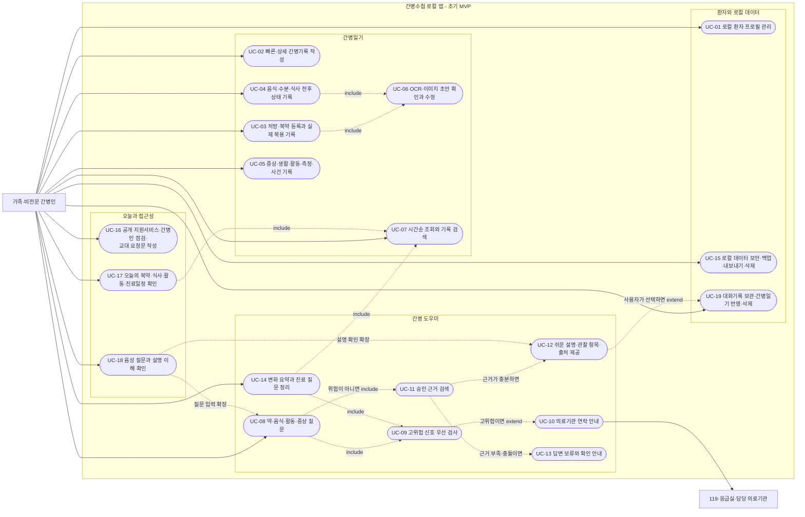
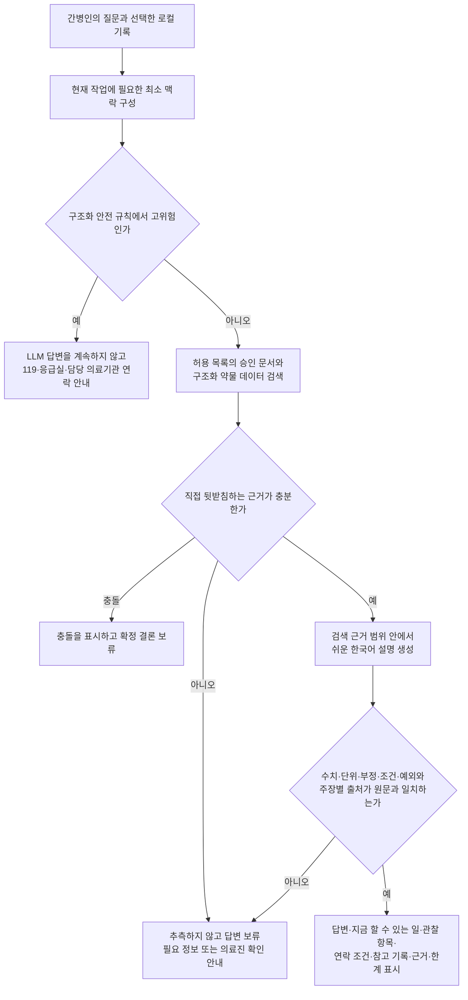
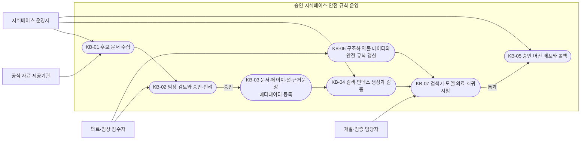
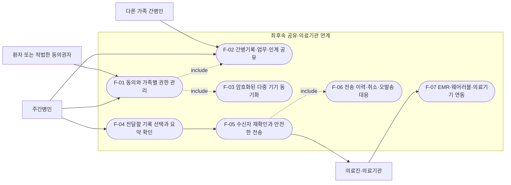
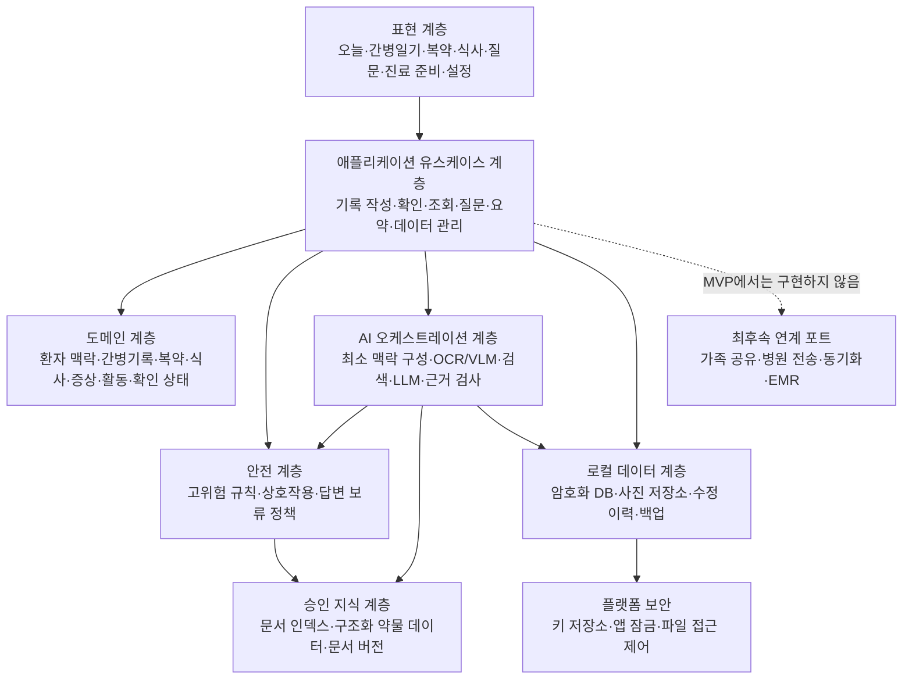

# 간병수첩 프로그램 구조 및 유스케이스 설계

- 문서 상태: 초기 구조 제안
- 기준 문서: [`caregiving_notebook_requirements.md`](./caregiving_notebook_requirements.md)
- 적용 범위: 로컬 우선 MVP와 이후 확장 경계

이 문서는 제품 요구사항을 구현 가능한 프로그램 경계와 유스케이스로 나눈 설계 초안이다. 요구사항 원본과 충돌할 경우 요구사항 원본을 우선한다.

## 목차

1. [설계 원칙](#1-설계-원칙)
2. [액터](#2-액터)
3. [초기 MVP 유스케이스 다이어그램](#3-초기-mvp-유스케이스-다이어그램)
4. [의료 질문 처리 유스케이스](#4-의료-질문-처리-유스케이스)
5. [지식베이스 운영 유스케이스](#5-지식베이스-운영-유스케이스)
6. [최후속 연계 유스케이스](#6-최후속-연계-유스케이스)
7. [유스케이스 목록과 요구사항 연결](#7-유스케이스-목록과-요구사항-연결)
8. [유스케이스에서 도출한 프로그램 구조](#8-유스케이스에서-도출한-프로그램-구조)
9. [구현 순서](#9-구현-순서)
10. [구현 전에 결정할 사항](#10-구현-전에-결정할-사항)

## 1. 설계 원칙

1. 간병일기 작성과 조회는 LLM 장애나 인터넷 단절과 관계없이 동작한다.
2. 사진·OCR·LLM 결과는 초안일 뿐이며 사용자가 확인하기 전에는 확정 기록으로 취급하지 않는다.
3. 고위험 검사는 검색과 LLM 호출보다 먼저 실행한다.
4. 약물 용량, 상호작용, 위험 임계값은 LLM이 생성하지 않고 구조화 데이터와 규칙이 처리한다.
5. 의료 답변은 승인된 지식베이스의 근거 범위 안에서만 생성한다.
6. 충분한 근거가 없거나 근거가 충돌하면 답변을 보류한다.
7. 환자 식별정보와 간병·의료 기록을 분리하고 현재 작업에 필요한 최소 기록만 로컬 LLM에 전달한다.
8. 가족 공유, 병원 전송, 원격 동기화 및 EMR 연동은 초기 MVP에서 분리한다. MVP의 교대 요청은 사용자가 검토해 복사하는 요청문·인계메모 초안으로 제한한다.
9. 질문·답변 기록은 사용자 보관 설정과 보유기간에 따라 로컬에서 관리하고, 간병일기로 옮길 내용은 사용자가 별도로 확인한다.

## 2. 액터

| 액터 | 역할 | MVP에서의 데이터 경계 |
|---|---|---|
| 가족·비전문 간병인 | 기록 작성, OCR 결과 확인, 질문, 기록 조회, 진료 준비 및 로컬 데이터 관리 | 선택한 로컬 환자의 기록만 사용 |
| 의료·임상 검수자 | 지식 문서와 안전 규칙을 검토하고 승인 또는 반려 | 환자 원본 기록이 아니라 지식 문서와 시험 사례를 검수 |
| 지식베이스 운영자 | 승인 문서 등록, 메타데이터 관리, 인덱스 배포와 롤백 | 승인된 버전만 런타임에 배포 |
| 개발·검증 담당자 | 검색기·모델·규칙·프롬프트에 대한 의료 회귀시험 수행 | 비식별 평가 세트와 승인된 시험 자료 사용 |
| 119·응급실·담당 의료기관 | 고위험 상황에서 사용자가 직접 연락할 외부 주체 | MVP에서 앱이 환자 기록을 자동 전송하지 않음 |
| 공식 자료 제공기관 | 일반 약물·질환·지원제도 자료 제공 | 외부 조회 시 환자 맥락 없이 일반 식별자만 사용 |
| 다른 가족·의료진 | 공유 기록 확인, 인계 또는 선택 기록 수신 | 최후속 기능이며 MVP 범위 밖 |

## 3. 초기 MVP 유스케이스 다이어그램

실선은 액터가 직접 실행하는 기능, 점선은 포함 또는 조건부 확장 관계를 뜻한다.

### 3.1 기록 기능의 공통 규칙

- 사용자가 직접 입력하고 저장한 값은 확정 기록으로 처리하되, OCR·이미지·LLM이 제안한 값은 `임시 초안 → 사용자 확인 → 확정 또는 반려` 상태를 구분한다.
- 직접 입력한 값과 자동 추출·생성된 값을 기록의 출처로 구분한다.
- 확정 기록을 수정하면 기존 값을 덮어쓰기만 하지 않고 수정 이력을 남긴다.
- 사진 원본, 추출 필드, 신뢰도, 원문 위치와 사용자 확인 상태를 연결한다.
- 요약에서 원본 기록의 날짜와 항목으로 돌아갈 수 있어야 한다.
- 기록 저장소는 환자별로 분리하고 환자 전환 시 검색·LLM 컨텍스트를 초기화한다.
- 보관한 질문·답변은 환자별 대화기록으로 분리하고, 답변을 간병일기에 반영할 때는 사용자가 저장할 내용을 확인한다.

## 4. 의료 질문 처리 유스케이스

다음 다이어그램은 UC-08부터 UC-13까지의 필수 실행 순서를 구체화한다. 고위험 규칙과 근거 검사는 LLM보다 앞에 위치한다.

### 4.1 책임 분리

| 책임 | 담당 구성요소 | LLM 사용 여부 |
|---|---|---|
| 응급·고위험 신호 탐지 | 안전 규칙 엔진 | 사용하지 않음 |
| 약 이름·용량·복용시각·확인 상태 보존 | 복약 도메인과 로컬 저장소 | 사용하지 않음 |
| 약-약·약-음식 상호작용 확인 | 승인된 구조화 데이터와 규칙 | 자유생성에 사용하지 않음 |
| 질문 의도 파악과 검색어 초안 | AI 오케스트레이터 | 사용 가능 |
| 승인 문서 검색·필터·재순위화 | RAG 검색기 | 생성 모델과 분리 평가 |
| 쉬운 말 설명과 기록 요약 | 로컬 LLM | 검색된 근거 범위로 제한 |
| 주장별 근거·수치·조건 검사 | 근거 검증기 | 원문 대조를 우선 |
| 근거 부족·충돌 시 보류 | 답변 정책 | LLM의 임의 판단에만 의존하지 않음 |

### 4.2 대화기록 관리 경계

- 질문·답변의 보관 여부와 보유기간은 사용자의 로컬 설정을 따른다. 세션 종료 시 일괄 삭제를 고정 동작으로 두지 않는다.
- 현재 생성 작업의 임시 컨텍스트와 보존된 대화기록을 구분한다. 환자를 전환하면 임시 컨텍스트는 초기화하고, 보존된 대화기록은 해당 환자의 저장소에서만 다시 불러온다.
- 답변을 간병일기로 옮길 때는 원문 전체를 자동 저장하지 않고 사용자가 반영할 내용과 연결할 환자를 확인한다.
- 대화 삭제와 그 대화에서 별도로 생성한 간병기록 삭제는 같은 동작으로 묶지 않는다. 삭제 화면에서 대상과 영향을 구분해 보여준다.
- 대화 원문은 외부 로그, 분석 서비스 또는 모델 학습 데이터로 전송하지 않는다.

## 5. 지식베이스 운영 유스케이스

지식베이스 운영은 환자가 사용하는 로컬 앱과 별도의 관리 경계로 둔다. 인터넷 검색 결과는 후보 자료가 될 수 있지만 자동으로 운영 지식베이스에 포함하지 않는다.

배포 단위에는 문서 버전, 발행·개정일, 앱 검수일, 사용 상태, 임상 승인 이력과 저작권 범위를 포함한다. 모델, 임베딩, 인덱스, 프롬프트 또는 안전 규칙이 바뀌면 KB-07을 다시 수행한다.

## 6. 최후속 연계 유스케이스

다음 기능은 MVP에 구현하지 않는다. 초기 코드에는 필요 이상으로 서버나 계정 시스템을 만들지 말고, 나중에 연결할 수 있는 인터페이스 경계만 고려한다.

이 범위는 환자 동의, 권한, 암호화, 전송 이력, 동의 철회, 취소 가능 범위, 오발송 대응과 규제 검토가 끝난 뒤에만 시작한다.

## 7. 유스케이스 목록과 요구사항 연결

| ID | 유스케이스 | 범위 | 관련 요구사항 |
|---|---|---|---|
| UC-01 | 로컬 환자 프로필 관리 | MVP 필수 | FR-01, FR-14 |
| UC-02 | 빠른·상세 간병기록 작성 | MVP 필수 | FR-03 |
| UC-03 | 처방·복약 등록과 실제 복용 기록 | MVP 필수 | FR-03, FR-08 |
| UC-04 | 음식·수분·식사 전후 상태 기록 | MVP 필수 | FR-03, FR-09 |
| UC-05 | 증상·생활·활동·측정·사건 기록 | MVP 필수 | FR-03, FR-16 |
| UC-06 | OCR·이미지 추출 초안 확인과 수정 | MVP 필수 | FR-08, FR-09 |
| UC-07 | 시간순 조회와 기록 검색 | MVP 필수 | FR-03, FR-10 |
| UC-08 | 약·음식·활동·증상 질문 | MVP 필수 | FR-02, FR-06, FR-08, FR-09, FR-16 |
| UC-09 | 고위험 신호 우선 검사 | MVP 필수 | FR-07 |
| UC-10 | 의료기관 연락 안내 | MVP 필수 | FR-07 |
| UC-11 | 승인된 근거 검색 | MVP 필수 | FR-06 |
| UC-12 | 쉬운 설명·관찰 항목·출처 제공 | MVP 필수 | FR-02, FR-06 |
| UC-13 | 근거 부족·충돌·고위험 시 답변 보류 | MVP 필수 | FR-06, FR-07 |
| UC-14 | 기록 변화 요약과 진료 질문 정리 | MVP 권장 | FR-10 |
| UC-15 | 로컬 데이터 보안·백업·내보내기·삭제 | MVP 필수 | FR-14 |
| UC-16 | 공개 지원서비스·간병인 점검·복사 가능한 교대 요청문 작성 | MVP 권장 | FR-12, FR-13 |
| UC-17 | 오늘의 복약·식사·활동·진료일정 확인 | MVP 필수 | MVP 화면 1, FR-03, FR-08, FR-16 |
| UC-18 | 음성 질문과 설명 이해 확인 | MVP 권장 | FR-04, FR-11 |
| UC-19 | 대화기록 보관 설정·조회·간병일기 반영·개별/전체 삭제 | MVP 필수 | FR-14 |
| F-01~F-07 | 가족 공유·병원 전송·외부 연동 | 최후속 | FR-05, FR-15 |

## 8. 유스케이스에서 도출한 프로그램 구조

초기 프로그램은 기능별 화면을 직접 데이터베이스나 LLM에 연결하지 않고, 유스케이스 계층을 통해 도메인·안전·AI·저장소를 조정하는 구조가 적합하다.

### 8.1 권장 모듈 경계

| 모듈 | 주요 책임 | 금지할 결합 |
|---|---|---|
| `presentation` | 화면, 접근성, 입력 검증, 사용자 확인 UI | DB·LLM 직접 호출 |
| `application` | UC-01~UC-19 실행 순서와 트랜잭션 조정 | 의료 규칙을 화면 코드에 작성 |
| `domain` | 간병기록, 복약, 식사, 증상, 활동, 측정값, 확인 상태와 불변조건 | UI·모델 SDK 의존 |
| `safety` | 고위험 규칙, 구조화 상호작용 확인, 답변 보류 정책 | LLM 응답만으로 위험 확정 |
| `ai_orchestration` | 최소 맥락, OCR/VLM 초안, RAG 검색, 제한 생성, 근거 검사 | 승인되지 않은 인터넷 문서를 자동 사용 |
| `knowledge` | 승인 문서, 약물 데이터, 인덱스와 버전 조회 | 환자 원본 기록 저장 |
| `persistence` | 암호화 DB, 사진, 수정 이력, 내보내기, 백업·복원 | 식별정보와 전체 의료기록의 무분별한 결합 |
| `security` | 키 관리, 앱 잠금, 접근 통제, 로그 비식별화 | 평문 비밀키·원본 기록 로그 |
| `knowledge_ops` | 문서 검수, 메타데이터, 배포·롤백, 회귀시험 | 런타임 환자 데이터 접근 |
| `integrations` | 가족 공유·병원 전송·동기화용 후속 어댑터 | 명시적 승인 전 실제 외부 전송 구현 |

### 8.2 핵심 도메인 객체 초안

| 객체 | 보존해야 할 핵심 정보 |
|---|---|
| `PatientContext` | 로컬 환자 ID, 선택적 프로필, 질환 범주, 치료 단계, 의료진 지시; 식별정보는 별도 저장 |
| `CareEntry` | 기록 시각, 작성자 역할·별칭, 기록 유형, 관찰 사실, 수행한 돌봄, 이후 변화 |
| `MedicationPlan` | 확인된 약 식별자, 처방 내용, 예정 시각, 원본 자료 연결 |
| `MedicationIntake` | 실제 복용 시각, 복용 여부, 누락·거부 이유, 관찰된 이상 반응 |
| `CareTaskSchedule` | 복약·식사·활동·진료 예정 시각, 완료 상태와 연결된 원본 기록 |
| `MealEntry` | 음식 사진, 확인된 음식명·재료, 섭취량, 수분, 식욕, 삼킴 상태와 전후 증상 |
| `Observation` | 증상·수면·배설·위생·피부·활동·측정값·사건의 유형별 구조화 값 |
| `AttachmentExtraction` | 원본 사진, 추출 필드, 신뢰도, 원문 위치, `draft/confirmed/rejected` 상태 |
| `EvidenceDocument` | 자료명, 기관, 발행·개정일, 페이지·절, 근거문장, 링크, 앱 검수일과 버전 |
| `GroundedAnswer` | 질문, 참고한 기록, 핵심 주장, 연결된 근거, 한계, 보류·연락 상태 |
| `ConversationThread` | 환자별 대화 ID, 생성·최근 사용 시각, 보관 여부, 보유기간, 자동삭제 예정일과 삭제 상태 |
| `ConversationMessage` | 역할, 원문, 생성 시각, 연결된 `GroundedAnswer`, 간병일기 반영 여부와 연결된 `CareEntry` ID |
| `AuditEvent` | 생성·수정·확인·삭제·내보내기와 사용한 모델·문서·규칙 버전 |

## 9. 구현 순서

요구사항에 따라 기능 구현 전에 관련 안전 실패 시나리오와 시험을 먼저 정의한다.

1. **안전 시험 기반:** 환자 혼합, 기록 손실, OCR 자동 확정, 외부 유출, 위험 신호 누락 시험을 먼저 작성한다.
2. **로컬 데이터 기반:** 암호화 저장, 환자 분리, 앱 잠금, 대화 보관 설정, 수정 이력, 백업·복원과 삭제를 구현한다.
3. **간병일기:** UC-02~UC-05와 UC-07을 LLM 없이 완성한다.
4. **사진·OCR 확인:** UC-06의 초안·원문 대조·사용자 확정 흐름을 추가한다.
5. **안전 엔진:** UC-09~UC-10과 구조화 약물·상호작용 규칙을 추가한다.
6. **승인 지식 운영:** KB-01~KB-07과 검색기 평가 체계를 구축한다.
7. **간병 도우미:** UC-08, UC-11~UC-13과 UC-19를 로컬 RAG, 제한 생성 및 대화기록 관리로 연결한다.
8. **오늘·요약·지원:** UC-14와 UC-16~UC-18을 추가하고 원본 기록 연결과 접근성을 검증한다.
9. **최후속 연계:** 별도 동의·보안·규제 검토 이후 F-01~F-07을 검토한다.

## 10. 구현 전에 결정할 사항

| 결정 항목 | 결정이 필요한 이유 |
|---|---|
| 첫 실행 플랫폼과 최소 장비 사양 | 저장소, 암호화 키, OCR/VLM 및 로컬 LLM 실행 방식을 결정함 |
| MVP가 지원할 로컬 환자 수 | 환자별 저장소 분리와 교차 노출 시험 범위를 결정함 |
| 첫 질환별 콘텐츠 팩 | 지식 문서, 안전 규칙, 평가 질문과 임상 검수 범위를 제한함 |
| 처방자료 OCR의 입력 범위 | 처방전, 약 봉투, 약 상자 중 지원 형식과 사용자 확인 UI가 달라짐 |
| 로컬 백업·복원 방식 | 암호화 키 복구와 기록 손실 방지 정책을 결정함 |
| 대화기록 기본 보관값과 선택 가능한 기간 | 첫 실행 기본값, 자동삭제 시점, 내보내기 범위와 대화·파생 간병기록의 삭제 관계를 결정함 |
| 안전 규칙의 작성·승인 책임자 | 위험 문구와 임계값의 출처, 변경 승인 및 회귀시험 책임을 정함 |
| 지식베이스 관리 도구의 형태 | 별도 데스크톱 도구, 내부 웹 도구 또는 빌드 파이프라인 중 운영 경계를 정함 |
| 진료용 내보내기 형식 | PDF, 인쇄용 요약 또는 구조화 파일의 최소 필드와 개인정보 범위를 정함 |
