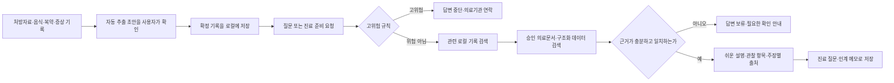

# 경쟁 환경 분석 및 제품 차별화 전략

- 문서 상태: 공식 공개자료 확인을 반영한 제품 전략 초안
- 확인 기준일: 2026-08-30
- 제품 요구사항 원본: [`caregiving_notebook_requirements.md`](./caregiving_notebook_requirements.md)
- 관련 구조 문서: [`caregiving_notebook_use_case_design.md`](./caregiving_notebook_use_case_design.md)

이 문서는 경쟁 서비스를 그대로 모방하기 위한 자료가 아니라, 이미 일반화된 기능과 이 프로젝트가 집중해야 할 차별화 영역을 구분하기 위한 자료다. 제품 범위와 의료 안전 요구사항은 항상 제품 요구사항 원본을 우선한다.

## 목차

1. [조사 방법과 해석상 주의사항](#1-조사-방법과-해석상-주의사항)
2. [핵심 결론](#2-핵심-결론)
3. [국내 경쟁·인접 서비스](#3-국내-경쟁인접-서비스)
4. [해외 경쟁·인접 서비스](#4-해외-경쟁인접-서비스)
5. [경쟁 구도](#5-경쟁-구도)
6. [기능 비교](#6-기능-비교)
7. [프로젝트의 차별화 전략](#7-프로젝트의-차별화-전략)
8. [만들어야 할 앱](#8-만들어야-할-앱)
9. [경쟁하지 않을 영역](#9-경쟁하지-않을-영역)
10. [개발 우선순위에 미치는 영향](#10-개발-우선순위에-미치는-영향)
11. [제품 USP와 검증 KPI](#11-제품-usp와-검증-kpi)
12. [공식 출처](#12-공식-출처)

## 1. 조사 방법과 해석상 주의사항

- 각 서비스의 공식 웹사이트, 공식 도움말 또는 공식 앱 스토어 설명을 우선 확인했다.
- 다운로드 수와 요금처럼 자주 바뀌는 값은 확인 기준일의 스냅샷으로만 취급한다.
- 공식 공개자료에서 기능을 찾지 못한 경우 `공개 설명에서 확인되지 않음`으로 표기한다. 이는 실제 기능이 없다는 단정이 아니다.
- `AI`, `인사이트`, `맞춤 추천`이라는 표현만으로 승인 의료문서 RAG, 주장별 인용 또는 근거 부족 시 답변 보류가 구현됐다고 간주하지 않는다.
- 경쟁사의 보안·개인정보 주장은 각 사업자가 공개한 설명이며, 독립적인 보안 감사를 대신하지 않는다.
- 기능 수보다 주 사용자의 문제, 제품의 수익모델과 대표 사용 흐름을 기준으로 직접 경쟁과 인접 경쟁을 구분한다.

## 2. 핵심 결론

### 2.1 간병일기는 필요하지만 그 자체로 경쟁우위가 아니다

케어네이션, 케어플러스, 간병넷, Jointly, CareClinic, Caring Village와 Birdie는 형태와 깊이는 다르지만 간병·건강 기록 기능을 이미 제공한다. 따라서 `간병일지를 쓸 수 있다`, `오프라인에서 기록할 수 있다`, `복약 알림을 준다`, `가족과 공유한다`만으로는 충분히 차별화되지 않는다.

그렇다고 간병일기를 축소해서는 안 된다. 기록은 경쟁우위 그 자체가 아니라 다음 차별화 흐름을 가능하게 하는 기반이다.

> **확인된 기록 → 관련 변화 검색 → 승인 의료근거 검색 → 쉬운 설명 → 관찰할 내용·연락 조건·진료 질문 제시**

### 2.2 핵심 경쟁자는 하나가 아니라 여러 유형으로 나뉜다

- 국내 간병 매칭 플랫폼은 간병인 탐색, 계약, 결제와 증빙에서 강하다.
- Jointly와 Caring Village는 가족 협업과 돌봄 정보 통합에서 강하다.
- Medisafe는 복약 순응도 관리에서 강하다.
- CareClinic은 광범위한 건강기록과 패턴·인사이트에서 강하다.
- Birdie는 전문 홈케어 조직의 구조화 기록과 운영에서 강하다.
- ianacare와 CaringBridge는 도움 요청, 상태 공유와 간병인의 정신적 부담 완화에서 강하다.

이 프로젝트가 이 모든 기능의 양으로 경쟁하면 범위가 지나치게 커진다. 초기에는 `한국어 가족간병 기록을 근거 있는 다음 행동으로 바꾸는 로컬 간병 도우미`에 집중해야 한다.

### 2.3 권장 제품 포지셔닝

> **기록만 보관하는 간병일지가 아니라, 사용자가 확인한 간병기록을 승인된 의료근거와 연결해 이해할 수 있게 설명하고, 근거가 부족하거나 위험하면 답을 멈추며, 의료진에게 전달할 관찰사항과 질문을 정리하는 로컬 우선 간병수첩**

## 3. 국내 경쟁·인접 서비스

| 서비스 | 공식 공개자료에서 확인한 특징·장점 | 이 프로젝트 관점의 해석 |
|---|---|---|
| [케어네이션](https://play.google.com/store/apps/details?hl=ko&id=kr.carenation.protector) | 간병·방문요양·동행·가사돌봄 등의 매칭, 간병인 프로필·후기·제안금액 확인, 카드결제와 보험, 식사·상태를 확인하는 간병일지를 제공한다. Google Play에는 확인일 기준 `100만+` 다운로드가 표시된다. | 간병일지가 이미 대규모 매칭 플랫폼의 부가 기능으로 제공되고 있음을 보여준다. 핵심 경쟁축은 간병인 네트워크와 거래이며, 공식 앱 설명에서는 누적 기록을 승인 의료근거와 연결하는 Q&A와 주장별 출처 기능을 확인하지 못했다. |
| [케어닥](https://play.google.com/store/apps/details?hl=ko&id=com.caredoc.caredocplus) | 병원·재가 간병인 매칭, 방문요양, 가사돌봄, 외출동행, 방문재활운동, 요양시설과 케어스테이까지 폭넓은 돌봄 서비스를 제공한다. | 서비스·인력·시설 연결 플랫폼에 가깝다. 가족이 직접 장기 기록을 축적하고 승인 근거로 그 의미를 이해하는 제품과 대표 사용 흐름이 다르다. |
| [케어플러스 - 도움에 도움을 더하는 간병 매칭 플랫폼](https://apps.apple.com/kr/app/%EC%BC%80%EC%96%B4%ED%94%8C%EB%9F%AC%EC%8A%A4-%EB%8F%84%EC%9B%80%EC%97%90-%EB%8F%84%EC%9B%80%EC%9D%84-%EB%8D%94%ED%95%98%EB%8A%94-%EA%B0%84%EB%B3%91-%EB%A7%A4%EC%B9%AD-%ED%94%8C%EB%9E%AB%ED%8F%BC/id6763507880) | 전문·가족 간병 신청, 시간별 간병일지와 히스토리, 간병확인서·간병일지 등 보험 증빙서류 발급, 계약·결제를 제공한다. | `시간별 간병일지`도 차별화 기능이 아니라 매칭·보험 업무의 일부가 될 수 있음을 보여준다. 공식 앱 설명에서는 기록 기반 의료근거 Q&A를 확인하지 못했다. 동명의 병원 앱 등 다른 서비스와 혼동하지 않도록 정확한 앱 제목과 링크를 함께 사용해야 한다. |
| [간병넷](https://xn--s39aq23a.net/) | 간병일지 작성, 사진과 서명, 보호자의 실시간 확인, PDF 저장, 간병인 수입관리와 보험 정보 확인을 제공한다. | 기록의 주된 가치는 간병활동 증빙, 보호자 공유와 간병인 업무 지원에 가깝다. 의료적 의미 설명과 승인 근거 검색은 별개의 제품 영역이다. |
| [노세노쇠](https://play.google.com/store/apps/details?hl=ko&id=com.nosenosoe.app) | 노쇠지표 기반 일상관리, 전화 안부, 보호자 병원일정 공유, 동행·간병 연결, 복약·운동 알림과 가족 알림 연동을 제공한다. | 가족의 일상 돌봄 흐름과 가까운 인접 경쟁자다. 공식 앱 설명에서는 처방자료 OCR 확인 흐름이나 주장별 의료근거 Q&A를 확인하지 못했다. |

### 3.1 국내 시장에서 얻을 교훈

1. 간병인 매칭은 네트워크·운영·보험·결제 역량이 필요한 별도 사업이므로 초기 경쟁영역으로 삼지 않는다.
2. 간병일지는 빠른 입력, 시간순 조회, 사진, PDF라는 기본 기대 수준을 충족해야 한다.
3. 기록을 보험 증빙으로 사용하는 시장 수요는 확인되지만, 의료진 전달 기능과 외부 전송은 요구사항대로 최후속으로 유지한다.
4. 국내 처방전·약 봉투와 한국어 간병 표현을 정확히 처리하는 경험은 별도의 제품 기회다.

## 4. 해외 경쟁·인접 서비스

### 4.1 Caring Village — 가장 가까운 통합형 경쟁자

[Caring Village 공식 기능 페이지](https://caringvillage.com/app/)는 환자 중심 Village, Wellness Journal, Care Plan, Calendar, Medication, Documents, Messaging, To-Dos와 AI 도우미 Julia를 한곳에 제공한다고 설명한다. Julia는 간병 질문에 답하고, 가족 상황에 맞는 자원과 다음 단계를 제안하며, 건강 업데이트를 실행 가능한 다음 단계로 바꾸는 기능을 강조한다.

또한 공식 페이지는 강한 암호화와 데이터 비판매를 설명한다. 별도 공식 안내에서는 Julia가 의료·법률·위기 서비스가 아니라고 명시한다.

이 서비스는 `간병기록 + 통합 정리 + 가족 협업 + AI 질문`이라는 수준의 제품 설명만으로는 차별화할 수 없음을 보여준다. 검토한 공식 공개페이지에서는 의료적 핵심 주장마다 자료명·기관·페이지·근거문장·검수일을 연결하는 방식, 승인 문서만 사용하는 검색 경계, 근거 부족 시 체계적으로 답변을 보류하는 방식은 확인하지 못했다.

### 4.2 Jointly — 가족 협업 UX의 기준 사례

[Carers UK의 Jointly 공식 안내](https://www.carersuk.org/help-and-advice/technology-and-equipment/jointly-app-for-carers/)는 care circle, 그룹 소통, 텍스트·이미지 health log, task/list, calendar, 환자 profile, 현재·과거 medication과 약 이미지, contact를 제공한다.

핵심 가치는 `기록 → 가족과 공유 → 업무 조율`이다. 이 프로젝트의 최종 가족협업 단계에서 참고할 UX는 많지만, 초기 핵심은 `기록 → 승인 근거와 연결 → 설명·보류·진료 준비`이므로 제품 중심축이 다르다.

### 4.3 Medisafe — 복약관리 전문 경쟁자

[Medisafe 공식 앱 안내](https://medisafe.com/download-the-app)는 복잡한 복약 일정, Medfriend의 누락 알림, 일·주·월 진행 보고서와 의료진 공유, 약물 상호작용 알림을 제공한다고 설명한다.

따라서 단순 복약 알림, 순응도 그래프나 누락 알림으로 정면 경쟁하지 않는다. 이 프로젝트의 역할은 복약 전문 기능 전체를 재현하는 것이 아니라, 처방자료와 실제 복약·거부·이상 반응 기록을 함께 보고 의료진에게 전달할 사실과 질문을 정리하는 것이다.

### 4.4 CareClinic — 광범위한 건강기록과 인사이트 경쟁자

[CareClinic 공식 기능 페이지](https://careclinic.io/features/)는 medication, symptom, journal, mood, stool, activity, fluid, sleep, nutrition, measurement 기록과 통합 타임라인·상관관계 인사이트를 제공한다. [Care Team 공식 안내](https://careclinic.io/phr/care-team/)에서는 간병인·의료진별 접근권한과 기록 공유를 설명한다.

따라서 `여러 건강기록을 한곳에 모은다`, `AI나 분석으로 패턴을 보여준다`, `의료진과 리포트를 공유한다`만으로는 차별화되지 않는다. 이 프로젝트는 상관관계를 치료적 인과관계로 확대하지 않고, 승인 문서 밖의 내용을 생성하지 않으며, 설명한 핵심 주장마다 확인 가능한 근거를 붙이는 안전 철학으로 구분해야 한다.

### 4.5 Birdie — 전문 간병기록의 구조화 기준 사례

[Birdie 공식 제품 안내](https://www.birdie.care/three-apps)는 전문 홈케어 업체를 대상으로 Agency Hub, Carer App과 Family App을 연결한다. care plan, task, medication, observation, mood, food intake, photo, concern, 방문기록과 가족용 조회를 구조화하며, [공식 도움말](https://help.birdie.care/en/articles/4876293-how-to-use-the-birdie-app-offline)은 일부 기록과 복약 결과를 오프라인에서 저장한 뒤 연결 시 동기화한다고 설명한다.

오프라인 기록과 구조화 기록만으로는 경쟁우위가 될 수 없다. 대신 `누가, 언제, 무엇을 관찰하고 어떤 돌봄을 했으며 이후 어떻게 변했는가`를 구조화하는 방식은 적극 참고해야 한다. Birdie가 B2B 운영·규제·인력관리 시스템이라면 이 프로젝트는 가족·비전문 간병인의 이해와 진료 준비에 집중한다.

### 4.6 ianacare와 CaringBridge — 간병인의 부담을 줄이는 경쟁자

[ianacare 공식 설명](https://ianacare.com/our-approach/)은 가족·친구 팀을 구성하고 식사·장보기, 이동, 아이·반려동물 돌봄과 심부름을 요청·분담하며 간병인에게 필요한 자원을 연결하는 데 집중한다. [CaringBridge 공식 안내](https://support.caringbridge.org/)는 한 번의 상태 업데이트로 가족·친구에게 알리고, 음식·교통·집안일과 정서적 지원을 조직하는 흐름을 제공한다.

이 사례들의 장점은 의료 AI가 아니라 반복 설명, 도움 요청과 조율에서 생기는 간병인의 정신적 부하를 줄이는 것이다. 이 프로젝트도 가족 공유 전체를 MVP에 넣지는 않더라도, 간병인 피로·수면·스트레스 점검, 지역지원 연결과 다른 사람에게 보낼 도움 요청 문안처럼 로컬에서 가능한 가벼운 지원은 지나치게 뒤로 미루지 않는다.

## 5. 경쟁 구도

| 경쟁 유형 | 대표 서비스 | 이미 강한 영역 | 이 프로젝트의 대응 |
|---|---|---|---|
| 간병 매칭·거래 | 케어네이션, 케어닥, 케어플러스 | 네트워크, 프로필, 계약, 결제, 보험 증빙 | 매칭 기능을 만들지 않고 직접 간병하는 가족의 기록·이해에 집중 |
| 기록·가족 협업 | Jointly, Caring Village | care circle, 메시지, task, calendar, 문서와 권한 | 협업은 최후속으로 두고 초기에는 개인 로컬 흐름을 완성 |
| 복약관리 | Medisafe | 복약 일정, 누락 알림, 순응도, interaction alert | 실제 복약·거부·증상 기록과 진료 질문 연결에 집중 |
| 개인 건강기록·인사이트 | CareClinic | 광범위한 tracker, 통합 timeline, 상관관계와 report | 승인 근거 밖 추론을 제한하고 주장별 근거와 보류를 차별화 |
| 전문 간병 운영 | Birdie | 구조화 care record, eMAR, agency workflow, offline | 구조화 방식은 배우되 B2B 인력·정산 시스템은 만들지 않음 |
| 간병인 부담·커뮤니티 지원 | ianacare, CaringBridge | 상태 공유, 구체적인 도움 요청, 정서·실생활 지원 | 로컬 자가점검과 지원 연결은 일찍 제공하고 계정 공유는 후속화 |

## 6. 기능 비교

표의 `확인`은 검토한 공식 공개자료에서 명시적으로 확인했다는 뜻이다. `부분`은 인접 기능은 있으나 이 프로젝트가 정의한 전체 흐름과 같지 않다는 뜻이며, `미확인`은 공개 설명에서 확인하지 못했다는 뜻이다.

| 기능 | 케어네이션 | Jointly | Medisafe | CareClinic | Caring Village | Birdie | 현재 프로젝트 |
|---|---|---|---|---|---|---|---|
| 간병·건강 기록 | 부분 | 확인 | 복약 중심 | 확인 | 확인 | 확인 | 필수 |
| 가족 협업·공유 | 부분 | 확인 | Medfriend | 확인 | 확인 | 확인 | 최후속 |
| 일정·Task | 부분 | 확인 | 복약·진료 중심 | 부분 | 확인 | 확인 | 기본 일정 중심 |
| 복약관리 | 부분 | 확인 | 전문 | 확인 | 확인 | 전문 eMAR | 간병 기록 중심 |
| 증상·생활 기록 | 식사·상태 | health log | 제한적 | 확인 | wellness journal | 확인 | 필수 구조화 |
| 사진 기반 입력 | 미확인 | 약 이미지 | 미확인 | 부분 | 약 사진 | 사진 기록 | 음식·처방자료 계획 |
| AI 간병 Q&A·인사이트 | 미확인 | 미확인 | 미확인 | AI·분석 인사이트 | Julia | 부분(SmartPlans) | 근거 제한 Q&A |
| 오프라인 핵심 기록 | 미확인 | 일부 안내 | 미확인 | 미확인 | 미확인 | 확인 | 필수 |
| 로컬 LLM·로컬 기록 처리 | 미확인 | 미확인 | 미확인 | 미확인 | 미확인 | 서버형 운영 | 필수 |
| 승인 문서만 사용하는 의료 RAG | 미확인 | 미확인 | 미확인 | 미확인 | 미확인 | 미확인 | 필수 |
| 의료 핵심 주장별 정확한 출처 | 미확인 | 미확인 | 미확인 | 미확인 | 미확인 | 미확인 | 필수 |
| 근거 부족·충돌 시 체계적 보류 | 미확인 | 미확인 | 미확인 | 미확인 | 제한 안내 | 미확인 | 필수 |
| LLM보다 앞선 고위험 규칙 | 미확인 | 미확인 | interaction alert | 미확인 | 위기 서비스 아님 | concern alert | 필수 |

### 6.1 비교표를 해석하는 방법

- `미확인`이 곧 경쟁사의 기능 부재를 의미하지 않는다.
- 이 프로젝트의 오른쪽 열은 구현 완료 상태가 아니라 요구사항과 계획이다.
- 로컬 LLM 자체는 사용자가 체감하는 가치가 아니다. 개인정보 경계와 오프라인 동작이 실제로 검증될 때만 차별화가 된다.
- 주장별 인용도 단순히 링크를 표시하는 것으로 충족되지 않는다. 표시한 근거가 해당 문장을 실제로 뒷받침해야 한다.

## 7. 프로젝트의 차별화 전략

### 7.1 기록을 `의미 있는 진료 준비`로 바꾼다

경쟁 앱 상당수는 기록, 알림, 공유 또는 패턴 시각화에서 끝난다. 이 프로젝트는 기록을 다음 질문에 답하는 재료로 사용한다.

- 평소와 달라진 것은 무엇인가?
- 약을 못 먹거나 거부한 이유가 반복됐는가?
- 음식·활동 뒤 어떤 변화가 기록됐는가?
- 승인된 자료에서 일반적으로 설명할 수 있는 범위는 어디까지인가?
- 지금 더 관찰할 내용과 의료진에게 물어볼 내용은 무엇인가?

### 7.2 AI가 많이 답하는 대신 `답해도 되는 것만 답한다`

- 허용 목록과 임상 검수를 통과한 문서만 검색한다.
- 핵심 주장마다 자료명, 기관, 발행·개정일, 페이지·절, 근거문장, 링크와 앱 검수일을 연결한다.
- 필요한 근거가 없거나 충돌하면 답변을 보류한다.
- 약 중단·용량 변경, 진단과 치료 결정은 제공하지 않는다.

### 7.3 위험 대응을 대화모델 밖에 둔다

- 질문과 자유 메모를 먼저 안전 규칙으로 검사한다.
- 복약 용량, 상호작용과 위험 임계값은 구조화 데이터와 규칙이 처리한다.
- 고위험이면 대화를 계속 끌지 않고 119·응급실·담당 의료기관 연락을 안내한다.

### 7.4 로컬 우선으로 민감기록의 경계를 명확히 한다

- 간병일기, 사진, 처방자료와 질문 맥락은 기기 또는 승인된 내부 환경에 저장한다.
- 외부 LLM API, 광고 SDK와 외부 분석 서비스로 원본 기록을 보내지 않는다.
- 로컬 LLM에도 현재 질문에 필요한 기록 조각만 전달한다.
- 외부 공식 데이터 조회가 필요하면 환자정보를 제거한 일반 식별자만 사용한다.

### 7.5 한국어 가족간병의 실제 입력물을 다룬다

- 국내 처방전·약 봉투·약 이름 표현을 대상으로 OCR을 평가한다.
- 음식 사진은 후보 음식명 입력을 돕되 섭취 안전성을 확정하지 않는다.
- 의료진의 말, 보호자의 일상어와 약품·질환 전문용어를 연결하되 의미와 조건을 보존한다.
- 자동 추출은 반드시 원문 위치와 불확실성을 보여주고 사용자가 확정한다.

### 7.6 간병인의 인지 부하를 줄인다

- 모든 항목을 매번 요구하지 않고 빠른 기록과 상세 기록을 분리한다.
- 어제와 오늘의 차이, 미완료 일과 진료 질문을 한 화면에서 정리한다.
- 피로·수면·스트레스와 교대 필요를 환자 기록과 분리해 점검한다.
- 가족 계정 공유 전에도 복사 가능한 인계·도움 요청 문안을 제공할 수 있다.

## 8. 만들어야 할 앱

### 8.1 제품 한 문장

> **가족간병인이 음식·복약·증상·생활·활동을 빠르게 기록하고, 확인된 기록을 승인된 의료근거와 연결해 이해하며, 위험하거나 근거가 부족하면 답을 멈추고 의료진에게 전달할 내용을 정리하는 한국어 로컬 간병수첩**

### 8.2 대표 사용 흐름

### 8.3 초기 제품의 핵심 화면

1. **오늘:** 복약·식사·활동·진료일정과 빠른 기록
2. **간병일기:** 음식·수분·복약·증상·생활·활동·측정·사건의 시간순 기록
3. **처방·복약:** 처방자료 OCR 초안 확인, 약 목록과 실제 복약·누락·거부·이상 반응
4. **식사:** 음식 사진과 섭취량·수분·삼킴·식사 전후 변화
5. **간병 질문:** 현재 기록과 승인 근거를 사용한 약·음식·활동·증상 설명
6. **답변 근거:** 주장별 근거문장과 원문 위치, 검수일, 답변 한계
7. **진료 준비:** 변화 요약, 원본 기록 연결과 의료진에게 물어볼 질문
8. **간병인 지원:** 짧은 피로·수면·스트레스 확인과 공개 지원서비스

### 8.4 차별화가 가장 잘 드러나는 시연 시나리오

1. 사용자가 처방전 또는 약 봉투를 촬영한다.
2. 앱이 약 이름·용량·횟수 후보와 원문 위치를 보여주고 사용자가 수정·확정한다.
3. 사용자는 `어제 저녁약은 복용`, `오늘 아침약은 메스꺼움 때문에 거부`를 기록한다.
4. 사용자가 `이 약은 무슨 약이고 진료 때 무엇을 말해야 하나?`라고 묻는다.
5. 앱은 고위험 규칙을 먼저 확인하고, 승인 약물 데이터와 문서를 검색한다.
6. 일반적인 효능·주의사항은 주장별 출처와 함께 설명하되 환자의 처방 이유는 단정하지 않는다.
7. 두 복약 기록과 증상을 날짜·시각 그대로 인용해 의료진에게 보여줄 질문을 만든다.
8. 근거가 없거나 용량 변경 판단이 필요하면 답을 보류하고 약사·의료진 확인을 안내한다.

이 흐름은 `알림`, `간병일지`, `AI 질문`을 따로 제공하는 것이 아니라 기록과 근거, 안전과 진료 준비를 하나의 검증 가능한 작업으로 묶는다.

## 9. 경쟁하지 않을 영역

- 간병인 구인·매칭 네트워크, 계약·결제·보험 중개
- Medisafe 수준의 모든 복약 순응도·제약사 프로그램
- Birdie 수준의 홈케어 업체 운영·근태·정산·규제 관리
- 초기부터 제공하는 대규모 가족 채팅·소셜 피드·원격 계정 시스템
- 모든 질환을 포괄하는 AI 건강 추천과 자동 치료계획
- 사진만으로 음식 섭취 가능 여부를 판정하는 기능
- LLM이 약의 용량, 상호작용, 진단 또는 치료 결정을 생성하는 기능

## 10. 개발 우선순위에 미치는 영향

### 10.1 유지해야 할 우선순위

- 간병일기와 로컬 저장은 차별화 기능의 데이터 기반이므로 1단계 필수다.
- 위험 규칙, 승인 RAG, 주장별 출처와 답변 보류는 제품 정체성이므로 단순 AI 채팅보다 먼저 검증한다.
- 가족 공유와 병원 전송은 동의·보안·규제 검토 전까지 최후속으로 유지한다.

### 10.2 더 일찍 검증할 항목

- 사용자가 10~20초 안에 핵심 기록을 남길 수 있는 빠른 기록 UX
- 처방자료 OCR 초안을 원문과 쉽게 대조하는 확인 UX
- 기록 요약이 시각·수치·부정 표현을 보존하는지 여부
- 답변의 핵심 주장과 실제 근거문장의 일치율
- 근거 부족·충돌 질문에서 답변을 보류하는 비율
- 간병인의 진료 준비 시간과 정보 탐색 부담이 줄었는지 여부
- 로컬 피로·수면·스트레스 점검과 도움 요청 문안의 실사용성

### 10.3 후순위로 미룰 항목

- 간병인 매칭과 결제
- 고급 가족 역할·권한과 실시간 메시징
- 의료기관·EMR 자동 전송
- 광범위한 웨어러블 연동과 자동 상관관계 분석
- 모든 질환과 식단을 포괄하는 추천 엔진

## 11. 제품 USP와 검증 KPI

[요구사항 원본의 MVP 성공지표](./caregiving_notebook_requirements.md#83-mvp-성공지표)에 정의한 7개 USP를 아래와 같이 검증한다. 한 행은 하나의 제품 차별점과 그 차별점을 대표하는 KPI에 대응한다. 대표 KPI가 좋아도 별도의 안전 출시 게이트를 실패하면 해당 기능을 출시하지 않는다.

| ID | 제품 USP와 검증 가능한 주장 | 1:1 대표 KPI | 산식·판정 단위 | 평가 데이터 | 초기 판정 기준 |
|---|---|---|---|---|---|
| USP-01 | **기록 → 진료 준비:** 흩어진 일상 기록을 진료에서 확인할 질문과 변화 요약으로 바꿔 준비 부담을 줄인다. | 진료 준비 시간 감소율 | `(기준 방식 중위시간 - 앱 사용 중위시간) ÷ 기준 방식 중위시간 × 100` | 동일한 기간의 복약·식사·증상·활동 기록 묶음과 진료 준비 과업. 기존 메모 방식과 앱을 같은 난이도로 비교 | 파일럿으로 기준선과 목표 확정. 요약의 원문 추적·수치·부정 표현 보존을 함께 통과해야 함 |
| USP-02 | **근거 기반 답변:** 의료적 핵심 주장이 승인 문서의 정확한 위치와 근거문장으로 검증된다. | 정확한 근거 위치 연결률 | `정확한 페이지·절·근거문장이 주장을 직접 뒷받침하는 핵심 주장 수 ÷ 평가한 핵심 주장 수 × 100` | 약·음식·활동·증상 질문, 조건·예외·수치·부정문을 포함한 답변과 승인 문서 원문 | 95% 이상, 고위험 주장은 100%. 제공 근거에서 확인할 수 없는 의학적 핵심 주장과 출처 연결 누락은 각각 0건 hard gate |
| USP-03 | **모르는 경우 보류:** 승인 근거가 없거나 충돌하면 사전학습 지식으로 채우지 않고 확인이 필요하다고 알린다. | 근거 미지원 질문 보류·확인 라우팅률(`unsupported question abstention rate`) | `보류·추가정보 요청·의료진 확인으로 올바르게 연결한 미지원 질문 수 ÷ 전체 미지원 질문 수 × 100` | 근거 없음, 근거 불충분, 문서 충돌, 환자별 치료판단 요청 및 지식베이스 범위 밖 질문을 유형별로 균형 있게 구성 | 95% 이상. 미지원 질문에서 근거 없는 의학적 핵심 주장 생성은 0건 hard gate |
| USP-04 | **한국 처방자료 OCR:** 국내 처방전·약 봉투를 기록 초안으로 만들고 사용자가 원문과 쉽게 대조·수정한다. | 필드별 정확도와 사용자 수정률 | 필드별 exact match와 `사용자가 수정한 제안 필드 수 ÷ 전체 제안 필드 수 × 100`을 약명·용량·단위·횟수·복용시점별로 보고 | 국내 실제 형식의 비식별 자료와 허가된 평가용 자료. 저화질, 반사, 회전, 잘림, 가림, 여러 약 혼재 및 인쇄 형식 변화를 포함 | 파일럿 후 필드별 목표 확정. 사용자 확인률 100%, 확인 없는 자동 확정 0건 |
| USP-05 | **로컬 개인정보 보호:** 민감한 간병 원문은 승인 없이 외부 서비스로 나가지 않는다. | 승인되지 않은 네트워크 전송 건수 | 앱·SDK·운영체제 백업·로그를 포함한 패킷과 저장 경로에서 승인 범위 밖 식별정보·원본 사진·원문 기록을 검출한 사건 수 | 최초 실행, 기록·사진 저장과 조회, OCR, 질의응답, 오류, 내보내기, 백업, 업데이트 및 외부 공식 데이터 조회 시나리오 | 0건. 외부 조회가 필요하면 전송 항목·목적 고지와 환자 맥락 제거를 별도 확인 |
| USP-06 | **위험 대응:** 고위험 가능성이 있는 원문을 LLM보다 먼저 규칙으로 탐지해 적절한 연락 안내로 전환한다. | 고위험 테스트 누락 건수 | 사전 정의한 고위험 사례 중 필요한 연락 안내를 내지 못한 false negative 수 | 임상 검수한 고위험 표현, 오타, 일상어, 완곡 표현, 부정·과거력, 여러 증상이 섞인 사례와 자유 메모 | 0건. 오탐률은 사용성 진단 지표로 별도 보고하되 누락과 상쇄하지 않음 |
| USP-07 | **간병 부담 감소:** 반복 기록과 약·식사·증상 정보 탐색에 드는 일상 시간을 줄인다. | 기록·정보 탐색 시간 감소율 | `(기준 방식 과업 중위시간 - 앱 사용 과업 중위시간) ÷ 기준 방식 과업 중위시간 × 100` | 핵심 간병일기 작성과 승인 자료에서 정보 찾기 과업. 참여자별로 기존 방식과 앱의 수행 순서를 교차 배정 | 파일럿으로 기준선과 목표 확정. 핵심 업무 완료율 90% 이상을 함께 충족 |

### 11.1 공통 측정 원칙

- 시간 지표는 같은 참여자가 난이도가 같은 과업을 기존 방식과 앱으로 각각 수행하게 하고, 학습효과를 줄이도록 수행 순서를 교차 배정한다. 평균보다 극단값의 영향을 덜 받는 중위시간을 기본값으로 보고한다.
- `핵심 주장`은 하나의 근거로 참·거짓을 판정할 수 있는 최소 의학 명제로 나눈다. 친절한 표현이나 화면 문구는 분모에서 제외하되 수치, 단위, 조건, 예외와 부정 표현은 별도 주장으로 평가한다.
- 근거 충실도 hard gate와 인용 위치 품질을 분리한다. 근거에서 확인할 수 없는 의학적 핵심 주장은 1건도 허용하지 않고, 95%는 근거가 있는 주장에 정확한 페이지·절·근거문장을 연결하는 개선 KPI로만 사용한다.
- OCR은 문서 전체 정확도 하나로 합치지 않고 필드 종류와 촬영 조건별 결과를 공개한다. 사용자 수정률이 높으면 자동 추출이 맞더라도 확인 부담을 줄였다고 판단하지 않는다.
- 개인정보와 위험 대응의 `0건`은 사전 등록한 출시 평가 세트에서의 필수 통과조건이다. 현실의 절대적 무오류를 뜻하지 않으며, 기능이나 의존성이 바뀔 때마다 회귀시험한다.
- 사용자 시간 지표는 안전 게이트를 통과한 빌드에서만 해석한다. 빠르더라도 위험 안내, 사용자 확인 또는 근거 검사를 생략해 얻은 개선은 인정하지 않는다.

### 11.2 평가 계층과 출시 판단

1. **검색기 평가:** 필요한 승인 문서를 상위 검색결과에 포함하는 비율을 별도로 측정한다. 목표는 95% 이상이다.
2. **생성 모델 평가:** 정답 근거를 고정해서 제공한 상태에서 근거 이탈 0건을 먼저 검사하고, 통과 결과에 대해서만 정확한 근거 위치 연결과 보류·확인 라우팅 품질을 측정한다.
3. **종단간 평가:** 실제 검색 결과, 규칙 엔진, 로컬 기록과 화면 출력을 함께 사용해 7개 USP KPI를 측정한다.
4. **안전 출시 게이트:** 고위험 누락, 무단 외부 전송, 금지된 약 변경·진단·치료 권고, 제공 근거에서 확인할 수 없는 의학적 핵심 주장 및 미지원 질문의 근거 없는 의학적 답변이 각각 0건이어야 한다. 평균 점수나 시간 절감으로 이 실패를 상쇄할 수 없다.
5. **효과 목표 확정:** 진료 준비, 일상 기록·탐색 시간과 OCR 품질의 수치 목표는 대표 사용자 파일럿으로 기준선을 얻은 뒤 평가 프로토콜과 함께 고정한다.

제품이 완성되기 전에는 위 USP를 확정적인 마케팅 문구로 사용하지 않는다. `유일한 앱`, `완전히 안전한 AI`, `의료 오류가 없는 앱`과 같은 절대 표현도 사용하지 않는다. 차별화는 기능 목록이 아니라 측정된 안전성, 근거 충실도, 개인정보 경계와 실제 간병 부담 감소로 입증한다.

## 12. 공식 출처

### 12.1 국내 서비스

1. [케어네이션 - 간병인 찾기, 병원 동행인, 요양보호사 — Google Play](https://play.google.com/store/apps/details?hl=ko&id=kr.carenation.protector)
2. [케어닥 - 간병인부터 요양시설, 방문운동까지 한 번에 — Google Play](https://play.google.com/store/apps/details?hl=ko&id=com.caredoc.caredocplus)
3. [케어플러스 - 도움에 도움을 더하는 간병 매칭 플랫폼 — Apple App Store](https://apps.apple.com/kr/app/%EC%BC%80%EC%96%B4%ED%94%8C%EB%9F%AC%EC%8A%A4-%EB%8F%84%EC%9B%80%EC%97%90-%EB%8F%84%EC%9B%80%EC%9D%84-%EB%8D%94%ED%95%98%EB%8A%94-%EA%B0%84%EB%B3%91-%EB%A7%A4%EC%B9%AD-%ED%94%8C%EB%9E%AB%ED%8F%BC/id6763507880)
4. [간병넷 - 대한민국 간병인 필수 앱](https://xn--s39aq23a.net/)
5. [노세노쇠 — Google Play](https://play.google.com/store/apps/details?hl=ko&id=com.nosenosoe.app)

### 12.2 해외 서비스

6. [Caregiver App for Families — Caring Village Tools & Features](https://caringvillage.com/app/)
7. [Caregiver Burnout: Signs, Solutions, and Self-Care — Caring Village](https://caringvillage.com/blog/caregiver-wellness/caregiver-burnout-solutions/)
8. [Jointly app for carers — Carers UK](https://www.carersuk.org/help-and-advice/technology-and-equipment/jointly-app-for-carers/)
9. [Download the App — Medisafe Medication Management](https://medisafe.com/download-the-app)
10. [CareClinic Features: Symptom, Medication & Health Tracking](https://careclinic.io/features/)
11. [Health Journal App: Daily Health Tracking & Insights — CareClinic](https://careclinic.io/health-diary/)
12. [Care Team Records: Doctors, Family & Caregivers — CareClinic](https://careclinic.io/phr/care-team/)
13. [Care agency software: Office, carer and family apps — Birdie](https://www.birdie.care/three-apps)
14. [Care management software for homecare agencies — Birdie](https://www.birdie.care/care-management)
15. [How to use the Birdie App Offline — Birdie Help Centre](https://help.birdie.care/en/articles/4876293-how-to-use-the-birdie-app-offline)
16. [Our approach — ianacare](https://ianacare.com/our-approach/)
17. [Free Online Tool for Sharing Health Updates — CaringBridge](https://support.caringbridge.org/)
