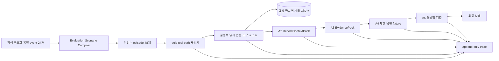

# DS-AGENT 결정적 도구 호스트·trace 파일럿

- 구현 버전: `v0.1.0`
- 계약: [`A1~A5 역할·도구 사용 규약 v0.1.0`](./agent_role_and_tool_contracts.md)
- 실행 모드: `oracle_tool_path_fixture_validation`
- 평가 상태: `evaluation_eligible=false`
- 의료 출시 판단: 불가

## 목차

1. [목적과 해석 경계](#1-목적과-해석-경계)
2. [구성과 데이터 흐름](#2-구성과-데이터-흐름)
3. [결정적 도구 호스트](#3-결정적-도구-호스트)
4. [trace 스키마와 무결성](#4-trace-스키마와-무결성)
5. [합성 파일럿 구성](#5-합성-파일럿-구성)
6. [재현 방법](#6-재현-방법)
7. [현재 실행 결과](#7-현재-실행-결과)
8. [남은 실험](#8-남은-실험)

## 1. 목적과 해석 경계

이번 파일럿은 모델 성능을 재는 실험이 아니다. Evaluation Scenario Compiler가 만든 정답 도구 호출을 결정적 호스트에서 재생해 다음 기반이 실제로 작동하는지 확인한다.

- A1~A5 역할별 도구 허용 목록과 인자 스키마
- 애플리케이션이 고정한 환자 범위와 교차 환자 차단
- 검색 결과에 포함된 ID만 상세 조회할 수 있는 순차 권한
- 승인 지식 스냅샷이 없을 때 의료 설명을 만들지 않는 보류
- A4 출력의 주장–기록·근거 ID 연결과 A5 결정적 hard gate
- 같은 `trace_id`로 연결된 요청, 도구 결과, 인계와 최종 판정
- 이벤트 순서와 SHA-256 해시 체인 무결성

따라서 이 결과로 A1의 도구 선택 정확도, Qwen3.5-4B의 답변 품질, 멀티에이전트의 우수성 또는 의료 출시 가능성을 주장할 수 없다. 출력 manifest는 이를 막기 위해 `model_performance_result=false`, `medical_release_gate_result=false`, `evaluation_eligible=false`를 고정한다.

## 2. 구성과 데이터 흐름



| 구성요소 | 구현 | 책임 |
|---|---|---|
| 합성 source | [`ds_agent_pilot_v1`](../experiments/agent_eval/scenario_sources/ds_agent_pilot_v1) | 식별정보·자유서술·실제 약 지식이 없는 24개 구조화 event |
| Scenario Compiler | [`compile_agent_evaluation_scenarios.py`](../scripts/compile_agent_evaluation_scenarios.py) | 환자 그룹 split, 기록·상태·episode와 gold 호출 생성 |
| 결정적 호스트 | [`ds_agent_tool_host.py`](../scripts/ds_agent_tool_host.py) | 역할·인자·범위·예산·스냅샷 검사 후 읽기 도구 실행 |
| 파일럿 실행기 | [`run_ds_agent_pilot.py`](../scripts/run_ds_agent_pilot.py) | gold 경로 재생, A2~A5 결정적 fixture와 trace 출력 |
| trace schema | [`ds_agent_trace.schema.json`](../experiments/agent_eval/schemas/ds_agent_trace.schema.json) | 이벤트 필드, 역할, 이벤트 유형과 해시 형식 고정 |

실제 제품 LLM 입력에는 `patient_id`를 넣지 않는다. 선택 환자는 호스트 생성 시 애플리케이션이 고정하며 저장소 어댑터에서만 사용한다. 평가 trace도 현재는 비식별 item ID만 기록한다.

## 3. 결정적 도구 호스트

### 3.1 역할과 도구

호스트는 규약의 여섯 읽기 도구만 구현한다.

| 역할 | 요청 가능한 도구 |
|---|---|
| A1 | `search_care_entries`, `get_active_clinician_instructions`, `lookup_approved_drug_info`, `search_approved_evidence` |
| A2 | `get_care_entry_details`, `get_active_clinician_instructions` |
| A3 | `lookup_approved_drug_info`, `search_approved_evidence`, `open_evidence_spans` |
| A4·A5 | 없음 |

도구는 모두 읽기 전용이다. 모델이 `patient_id`, 범위 핸들, 연락처, 병원 등록번호 또는 임의 URL을 인자로 넣으면 실행하지 않는다. 거부된 범위 값은 trace에도 원문 대신 마스킹 값을 남긴다.

### 3.2 호스트 강제 조건

- 환자 범위는 생성 시 고정하고 도구 인자로 받지 않는다.
- `confirmed`이며 현재 상태의 `visible_record_ids`에 포함된 기록만 검색한다.
- 상세 조회는 같은 trace의 기록 검색이 먼저 반환한 ID만 허용한다.
- 역할별 허용 목록과 전체 8회·도구별 호출 예산을 적용한다.
- 약물·근거 도구는 고정된 `knowledge_snapshot_id`가 없으면 `EVIDENCE_NOT_FOUND`로 거부한다.
- 근거 span 열기는 같은 trace의 승인 약 조회·검색이 먼저 반환한 ID만 허용한다.
- 인터넷이나 e약은요 최신 API를 호출하지 않는다.
- A5 결정적 검사가 금지 의료행동, 범위 위반, 무근거 의료 주장과 기록 ID 왜곡을 차단한다.

현재 in-memory 승인 지식 어댑터와 실제 `approved_products.jsonl`·`approved_evidence_spans.jsonl` 필드 변환은 계약 수준으로 구현했다. 이 문서의 oracle 파일럿 runner `v0.1.0`은 승인 snapshot 로딩과 citation 채점을 하지 않으므로 `knowledge.included=true` bundle을 명시적으로 거부한다. 별도의 [`A1~A5 로컬 모델 runner`](./ds_agent_model_runner.md)는 컴파일 시 고정된 승인 snapshot을 다시 검증해 로딩할 수 있지만, 실제 e약은요 `approved_snapshot`이 아직 없어 승인 근거 실행은 미완료다.

## 4. trace 스키마와 무결성

한 줄은 하나의 JSON 이벤트이며 다음 흐름을 사용한다.

```text
trace_started → safety_gate → role_input/output → tool_request/result
              → A2/A3/A4 handoff → verifier_decision → trace_completed
```

공통 필드는 다음과 같다.

| 필드 | 의미 |
|---|---|
| `trace_schema_version` | trace 계약 버전 `0.1.0` |
| `contract_version` | A1~A5 계약 버전 `0.1.0` |
| `trace_id`, `run_id`, `item_id`, `split` | 실행과 평가 item 연결 |
| `event_id`, `sequence`, `event_type`, `role_id` | 이벤트 순서·종류·책임 역할 |
| `payload` | 역할 입력·출력, 도구 envelope 또는 판정 |
| `previous_event_sha256` | 바로 앞 이벤트의 해시. 첫 이벤트는 `null` |
| `event_sha256` | 자신의 `event_sha256`을 제외한 canonical JSON의 SHA-256 |

`verify_trace_chain`은 필드 집합, 스키마·계약, trace identity, 연속 sequence, 이전 해시와 현재 해시를 모두 검사한다. 이 체인은 우발적 변경과 사후 위변조를 검출하지만 전자서명은 아니다. 장기 감사 증거로 사용할 때에는 manifest와 마지막 해시를 별도 서명·보관해야 한다.

출력 파일은 다음과 같다.

```text
<run-output>/
  manifest.json
  trace_events.jsonl
  trace_summaries.jsonl
  final_outputs.jsonl
```

입력 compiled bundle과 출력 파일은 byte 수, 레코드 수와 SHA-256으로 검증한다. 기존 출력 경로는 덮어쓰지 않는다.

## 5. 합성 파일럿 구성

| 항목 | 수량·상태 |
|---|---|
| 합성 환자 | 24 |
| 확정 복약 event | 24 |
| 기록 조회 episode | 24 |
| 기록 조회 후 승인 지식 없음 보류 episode | 24 |
| 전체 episode | 48 |
| split | development 28 / validation 14 / frozen-test 6 |
| 실제 환자 식별정보·자유서술 | 없음 |
| 실제 약 품목 연결·의료 근거 | 없음 |

컴파일러의 `--include-no-knowledge-abstention`은 승인 snapshot이 없을 때만 사용하는 opt-in 파일럿 옵션이다. 기본 동작은 이전과 같이 기록 조회 episode만 만든다. 옵션으로 추가되는 질문도 의료 지식을 만들지 않고 `APPROVED_KNOWLEDGE_UNAVAILABLE`을 gold 보류 사유로 가진다.

`frozen-test`라는 디렉터리 이름은 split 위치만 뜻한다. 현재 모든 episode가 `compiler_generated_unreviewed`, `evaluation_eligible=false`이므로 동결 출시시험 데이터가 아니다.

## 6. 재현 방법

### 6.1 48개 후보 생성

```powershell
python -X utf8 scripts/compile_agent_evaluation_scenarios.py `
  --source-dir experiments/agent_eval/scenario_sources/ds_agent_pilot_v1 `
  --output-dir data/agent-eval/scenario-candidates/ds-agent-pilot-v1 `
  --contract docs/agent_role_and_tool_contracts.md `
  --split-seed ds-agent-pilot-v1 `
  --include-no-knowledge-abstention
```

### 6.2 결정적 host·trace 실행

```powershell
python -X utf8 scripts/run_ds_agent_pilot.py `
  --compiled-bundle-dir data/agent-eval/scenario-candidates/ds-agent-pilot-v1 `
  --output-dir data/agent-eval/pilot-runs/ds-agent-host-v1 `
  --run-id DS-AGENT-HOST-PILOT-V1
```

명령은 기존 출력 경로를 덮어쓰지 않는다. 재실행 비교에는 새 run ID와 출력 경로를 사용한다. `data/` 산출물은 로컬 전용이며 Git에 포함하지 않는다.

### 6.3 회귀시험

```powershell
python -m unittest tests.test_compile_agent_evaluation_scenarios
python -m unittest tests.test_ds_agent_tool_host
```

시험에는 교차 환자 차단, 범위 덮어쓰기 거부, 역할 위반, 예산, 승인 지식 없음, A5 금지·무근거 주장 차단, trace 변조 탐지와 compiled bundle 전체 실행이 포함된다.

## 7. 현재 실행 결과

로컬 실행 `DS-AGENT-HOST-PILOT-V1`의 기반 검증 결과는 다음과 같다.

| 항목 | 결과 | 해석 |
|---|---:|---|
| 실행 episode | 48 | 40~60개 파일럿 범위 충족 |
| trace event | 816 | episode당 17개 |
| 기록 답변 | 24 | 기록 검색·상세 조회와 A5 기록 ID 검사 통과 |
| 기록 부분답변 후 보류 | 24 | 승인 지식 없음에서 `EVIDENCE_NOT_FOUND` 보류 |
| fixture 경로 일치 | 48/48 | compiler gold 호출이 호스트 계약에서 실행됨 |
| 기대 hard gate 동작 | 48/48 | 기록 답변 통과 또는 근거 없음 보류가 기대와 일치 |
| model performance | 측정 안 함 | gold 호출 재생이며 LLM 미호출 |
| medical release gate | 측정 안 함 | 미검수 합성 episode·승인 근거 없음 |

이 숫자는 소프트웨어 기반의 smoke/integration 결과다. 모델 정확도나 임상 안전률로 인용해서는 안 된다.

## 8. 남은 실험

1. 48개 질문·도구·인자·최종 상태를 사람이 검수하고 seal 형식과 승인자를 구현한다.
2. e약은요 품목을 임상 검수해 실제 `approved_snapshot`을 만든 뒤, 품목코드와 근거 span이 연결된 grounded·conflict·not-found episode를 추가한다.
3. 고위험 규칙, timeout, 잘못된 도구, 범위 공격과 prompt injection을 포함하는 negative episode를 확장한다.
4. 완료한 Qwen3.5-4B development 1건 연결 smoke의 model revision·lock·runtime profile hash·prompt 버전·VRAM을 보존하고, 이후 실행은 검수·봉인된 split과 별도 run ID를 사용한다.
5. 같은 48개 검수 episode에서 T0 결정적 기준선, T1 단일 제한형, T2/T3 역할 분리 구성을 비교한다.
6. 도구 선택·인자 exact match, 기록 사실 보존, retrieval, 보류와 A5 잘못된 승인율을 별도로 채점한다.
7. 확률적 설정은 반복 실행해 `pass^1`, `pass^k`, 신뢰구간과 최초 실패 원인을 보고한다.

승인 근거가 생기기 전까지 현재 파일럿은 “기록 조회와 안전한 보류 인프라가 작동한다”는 범위에서만 사용한다.
