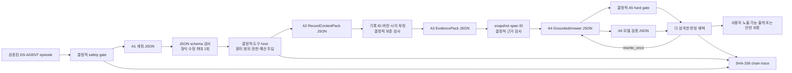

# DS-AGENT A1~A5 로컬 모델 runner

- 구현 버전: `v0.1.0`
- 역할·도구 계약: [`agent_role_and_tool_contracts.md`](./agent_role_and_tool_contracts.md) `v0.1.0`
- 선택 런타임: `RT-M1-HF-BNB-NF4-WIN-001`
- 용도: 로컬 평가 전용
- 현재 실제 모델 결과: 아직 없음

## 1. 목적과 현재 상태

[`ds_agent_model_runner.py`](../scripts/ds_agent_model_runner.py)는 한 로컬 모델의 실제 생성문을 A1~A5 JSON 계약으로 파싱·검증하고, [`ds_agent_tool_host.py`](../scripts/ds_agent_tool_host.py)의 읽기 전용 도구와 결정적 안전 게이트에 연결한다. [`run_ds_agent_model.py`](../scripts/run_ds_agent_model.py)는 이를 컴파일된 `DS-AGENT` 번들 전체에 적용하고 trace와 실행 manifest를 만든다.

코드 경로와 replay 통합시험은 구현됐다. 다만 현재 기본 Python 환경은 선택 프로필의 Python 3.12·고정 패키지 환경이 아니므로 Qwen3.5-4B NF4 추론은 아직 실행하지 않았다. 따라서 이 문서에는 모델 정확도나 에이전트 성능 수치가 없다.

## 2. 실행 구조



모델은 도구를 직접 실행하거나 환자를 선택하지 않는다. A1이 읽기 계획을 내면 host가 각 요청을 검사해 실행한다. 기록 검색이 성공하면 host가 A2용 상세 조회를, 근거 후보가 반환되면 A3용 원문 span 열기를 이어서 수행한다. 이 방식은 A2의 최종 `RecordContextPack`과 A3의 최종 `EvidencePack` 계약에 임시 도구 요청 필드를 추가하지 않는다.

## 3. 역할별 실제 연결

| 역할 | 모델 입력 | 모델 JSON 출력 | 모델 뒤의 결정적 검사 |
|---|---|---|---|
| A1 | 질문, 기준시각, 사용 가능한 도구, snapshot ID | 의도, 하위작업, 읽기 도구 요청 | episode 허용 도구, 역할 권한, 환자 범위 덮어쓰기, 인자 스키마, 호출 예산 |
| A2 | host가 반환한 확정 기록 상세 | `RecordContextPack` | source ID 집합, 버전·시각·유형·복약 상태 극성·약 이름 보존 |
| A3 | 승인 조회 결과와 host가 연 정확한 span | `EvidencePack` | snapshot ID 일치, host 반환 span만 선택, 근거 없음에서 `covered` 금지 |
| A4 | A2·A3 묶음과 활성 의료진 지시 | `GroundedAnswer` | 주장별 기록·근거·지시 ID, 금지 의료행동, 의료 근거 누락 검사 |
| A5 | A4 후보, 허용 ID, 결정적 검사 결과 | 통과·1회 재작성·보류·차단 | 모델 판정이 hard gate보다 느슨해질 수 없도록 심각도 병합 |

JSON 파싱 또는 스키마 오류에는 사실을 추가하지 않는 형식 수정만 한 번 허용한다. A4 내용 재작성도 한 번만 허용한다. 환자 범위 공격, 문맥 왜곡, 금지 의료행동은 재작성으로 우회하지 않고 차단한다.

## 4. 로컬 Qwen3.5-4B backend

`Qwen35Nf4Backend`는 [`runtime_profiles.json`](../experiments/agent_eval/manifests/runtime_profiles.json)의 `RT-M1-HF-BNB-NF4-WIN-001`만 fail-closed 방식으로 적용한다.

- Windows x86-64, Python 3.12와 고정된 패키지 버전을 요구한다.
- `models/qwen3.5_4b`를 `local_files_only=true`, `trust_remote_code=false`로 연다.
- 원본 모델 lock의 revision, manifest hash, 14개 파일의 byte 수와 SHA-256을 모두 다시 검사한다.
- bitsandbytes load-time NF4, BF16 compute, UINT8 storage, double quant 비활성 설정을 사용한다.
- 공식 `Qwen3_5ForConditionalGeneration` 클래스를 사용하고 linear-attention은 고정 프로필의 PyTorch reference 경로로 제한한다.
- 모든 parameter가 `cuda:0`에 있어야 하며 CPU·disk offload와 자동 정밀도 fallback을 거부한다.
- non-thinking JSON 생성을 사용하고 입력 token 한도, 출력 token 수와 peak VRAM을 기록한다.

이 프로필은 Windows 데스크톱 평가용이다. Android 배포 runtime이나 모바일 양자화 형식으로 채택된 것이 아니다.

## 5. 실행 방법

전용 Python 3.12 환경과 고정 패키지를 설치한 뒤, 먼저 development 한 건만 실행한다.

```powershell
python -X utf8 scripts/run_ds_agent_model.py `
  --compiled-bundle-dir data/agent-eval/scenario-candidates/ds-agent-pilot-v1 `
  --output-dir data/agent-eval/model-runs/qwen35-nf4-smoke-v1 `
  --run-id QWEN35-NF4-SMOKE-V1 `
  --split development `
  --limit 1 `
  --backend qwen35-nf4 `
  --runtime-profile experiments/agent_eval/manifests/runtime_profiles.json `
  --runtime-profile-id RT-M1-HF-BNB-NF4-WIN-001 `
  --generation-profile smoke
```

기존 실행의 역할별 원문 JSON을 파서·host·trace 회귀시험에 다시 넣을 때만 replay backend를 사용한다.

```powershell
python -X utf8 scripts/run_ds_agent_model.py `
  --compiled-bundle-dir data/agent-eval/scenario-candidates/ds-agent-pilot-v1 `
  --output-dir data/agent-eval/model-runs/replay-check-v1 `
  --run-id REPLAY-CHECK-V1 `
  --split development `
  --limit 1 `
  --backend replay `
  --replay-jsonl experiments/agent_eval/replay/example-role-outputs.jsonl
```

replay는 로컬 모델 추론 결과가 아니다. 실행 manifest의 `actual_local_model_invoked`도 `false`로 기록한다.

## 6. 출력과 개인정보 경계

```text
<run-output>/
  manifest.json
  trace_events.jsonl
  trace_summaries.jsonl
  final_outputs.jsonl
  model_calls.jsonl
```

- `trace_events.jsonl`: 검증된 역할 JSON, 마스킹된 도구 요청, 도구 결과와 결정의 해시 체인
- `trace_summaries.jsonl`: 역할 호출 수, 도구 순서, 최종 상태, 기대값 대조
- `final_outputs.jsonl`: 후보 답변, 결정적·모델 검증 결과, 실제 노출 가능한 안전 출력
- `model_calls.jsonl`: 역할, 호출 차수, 성공 여부, 원문 출력 SHA-256과 token·VRAM 사용량
- `manifest.json`: 입력·출력 hash, 모델 revision·runtime profile, 실행 한계

원시 프롬프트와 원시 모델 생성문은 산출물에 저장하지 않는다. 다만 검증을 통과한 구조화 역할 출력과 도구 결과는 평가 trace에 남는다. 이 runner에는 실제 환자 데이터를 넣지 않으며, 현재 합성 번들도 `evaluation_only`, `do_not_train`, `evaluation_eligible=false`다.

## 7. 해석 경계와 다음 단계

현재 구현 완료와 실험 완료를 구분한다.

| 항목 | 상태 |
|---|---|
| A1~A5 JSON 파싱·스키마 검사·1회 형식 수정 | 구현·단위시험 완료 |
| 환자 범위·역할·episode 도구 허용 목록 강제 | 구현·단위시험 완료 |
| A2/A3 의미 보존 검사와 A5 hard gate 우선 | 구현·단위시험 완료 |
| 컴파일 번들 실행·원자적 산출물·replay 통합시험 | 구현·시험 완료 |
| Qwen3.5-4B NF4 실제 1건 smoke | 미실행 |
| 48개 질문·gold 사람 검수와 split 봉인 | 미완료 |
| e약은요 임상 승인 snapshot과 citation episode | 미완료 |
| A1~A5 채점과 T0~T4 성능 비교 | 미실행 |

첫 Qwen smoke가 성공해도 현재 48건은 미검수 합성 후보이므로 모델 성능 또는 의료 출시 결과로 보고하지 않는다. smoke의 목적은 로더, VRAM, JSON 계약, 도구 host와 안전 보류 경로가 실제 모델 출력으로 끝까지 연결되는지를 확인하는 것이다.
