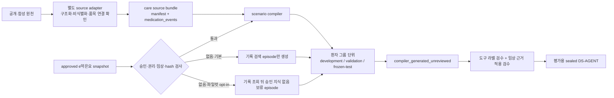

# Evaluation Scenario Compiler

- 구현 버전: `v0.1.0`
- 출력 상태: `compiler_generated_unreviewed`
- 적용 범위: 첫 텍스트 실험의 구조화된 복약 기록과 선택적 승인 약물 근거
- 비적용 범위: 자유서술 임상기록 자동 추출, OCR·이미지, 위험 규칙 episode, 임상 승인 자동화

## 목차

1. [목적](#1-목적)
2. [처리 구조](#2-처리-구조)
3. [입력 source bundle](#3-입력-source-bundle)
4. [약물 근거 연결 규칙](#4-약물-근거-연결-규칙)
5. [생성되는 episode](#5-생성되는-episode)
6. [분할과 오염 방지](#6-분할과-오염-방지)
7. [출력과 승인 상태](#7-출력과-승인-상태)
8. [실행 방법](#8-실행-방법)
9. [현재 한계와 다음 작업](#9-현재-한계와-다음-작업)

## 1. 목적

[`compile_agent_evaluation_scenarios.py`](../scripts/compile_agent_evaluation_scenarios.py)는 구조화·비식별 간병기록을 A1~A5 계약에 맞는 `DS-AGENT` 후보 episode로 결정적으로 변환한다.

컴파일러의 역할은 공개 데이터의 내용을 의료 정답으로 새로 해석하는 것이 아니라 다음 wrapper를 만드는 것이다.

- 합성 환자 ID와 확정 간병기록 fixture
- 질문 시점과 선택 환자를 고정한 초기 상태
- 허용·금지 도구와 허용 호출 순서
- 정답 기록 ID와 승인 근거 ID
- 보류 여부와 보류 사유
- 출력 필드와 hard gate 라벨
- source·계약·승인 snapshot의 SHA-256

컴파일된 episode는 자동 승인되지 않는다. 질문, 정답 도구·인자, 근거 적용 가능성을 사람이 검수하고 split을 봉인하기 전에는 점수 보고용 평가 데이터가 아니다.

## 2. 처리 구조



원천별 파서와 scenario compiler를 분리한다. 공개 벤치마크용 [`source adapter`](./evaluation_source_adapters.md)는 A1~A5 구성요소 평가 case를 만들며 그 출력을 이 compiler 입력으로 자동 사용하지 않는다. LongHealth처럼 사람 이름·생년월일을 포함한 자유서술 가상 임상문서에서 간병 event를 만들려면 별도의 event 추출·비식별화·사람 검수가 추가로 필요하다.

## 3. 입력 source bundle

입력 디렉터리는 다음 두 파일을 가진다.

```text
<source-dir>/
  manifest.json
  medication_events.jsonl
```

실행 가능한 형식 예제는 [`example_medication_v1`](../experiments/agent_eval/scenario_sources/example_medication_v1)에 있다.

### 3.1 `manifest.json`

필수 경계는 다음과 같다.

| 항목 | 허용 조건 |
|---|---|
| `source_kind` | `fictional`, `synthetic`, `deidentified_public` |
| `privacy.direct_identifiers_present` | 반드시 `false` |
| `privacy.patient_keys_pseudonymous` | 반드시 `true` |
| `privacy.free_text_excluded` | 반드시 `true` |
| `usage.evaluation_only` | 반드시 `true` |
| `usage.do_not_train` | 반드시 `true` |
| `usage.mobile_bundle` | 반드시 `false` |
| `license.status` | `reviewed_for_local_evaluation` 또는 `project_owned_synthetic` |
| `outputs` | 이벤트 파일의 정확한 byte 수·SHA-256·레코드 수 |

`patient_key`와 원천 event ID는 출력에 복사하지 않는다. source ID와 함께 해시해 합성 `patient_id`, `care_entry_id`, provenance hash를 만든다.

### 3.2 `medication_events.jsonl`

첫 버전은 다음 필드만 받는다.

| 필드 | 규칙 |
|---|---|
| `source_event_id` | source 안에서 고유하며 출력에는 노출하지 않음 |
| `patient_key` | 이미 합성·가명화된 그룹 키. 같은 키의 모든 변형은 같은 split으로 이동 |
| `occurred_at` | 시간대가 포함된 RFC 3339 시각 |
| `entry_type` | 현재는 `medication_intake`만 허용 |
| `medication_display_name` | 확인된 표시 이름. 자유서술 문단은 허용하지 않음 |
| `drug_link` | 선택적 품목코드 연결과 확인 상태 |
| `intake_status` | `taken`, `missed`, `refused`, `unknown` |
| `reason_code` | 승인 enum만 허용하고 자유서술 이유는 받지 않음 |
| `confirmation_status` | gold 기록에는 `confirmed`만 허용 |

허용하지 않은 필드가 있으면 컴파일을 중단한다. `patient_name`, 생년월일, 연락처 또는 임상 자유서술을 조용히 무시하지 않는다.

## 4. 약물 근거 연결 규칙

제품명이 같거나 유사하다는 이유로 e약은요 품목을 자동 연결하지 않는다.

```json
{
  "drug_link": {
    "item_seq": "195700020",
    "confirmation_status": "confirmed",
    "confirmation_method": "official_item_seq"
  }
}
```

근거 연결에 사용할 수 있는 방법은 다음 두 가지다.

- `official_item_seq`: 원천에 공식 품목코드가 구조화되어 있음
- `human_reviewed_mapping`: 사람이 원천 약물과 품목코드를 대조함

`string_candidate_only`처럼 확인되지 않은 연결은 `item_seq`를 출력·검색 gold에 사용하지 않는다. 제품명이 승인 snapshot의 제품명과 정확히 같아도 자동으로 연결하지 않고 `DRUG_IDENTITY_UNCONFIRMED` 보류 episode를 만든다.

의료 근거 디렉터리는 다음 조건을 모두 만족해야 한다.

- `approval_state=approved_snapshot`
- 이용권리 검수와 임상 검수 완료
- DS-AGENT 또는 의료 회귀평가 입력으로 사용 허용
- manifest의 파일 크기·SHA-256·레코드 수 일치
- 제품–섹션–근거 ID 연결 일치
- `clinician_approved` 상태와 필수 citation 메타데이터 존재
- `effectiveness` 조각의 허용 범위에 `general_drug_purpose_explanation` 포함

현재 `staged_unreviewed` e약은요 데이터는 이 입력으로 사용할 수 없다.

## 5. 생성되는 episode

각 확정 복약 event는 항상 기록 검색 episode 하나를 만든다.

| `scenario_kind` | 근거 snapshot | 기대 동작 |
|---|---|---|
| `medication_record_lookup` | 불필요 | 기록 검색 → 상세 조회 → 시각·부정·복약 상태를 보존한 기록 답변 |
| `record_and_drug_info` | 승인 근거 있음 | 기록 검색·상세 조회 → 품목코드 조회 → 정확한 근거 span 열기 → 주장별 근거 답변 |
| `record_and_drug_info` | 식별 미확정 | 기록 사실만 부분 답변하고 약 설명은 `DRUG_IDENTITY_UNCONFIRMED`로 보류 |
| `record_and_drug_info` | 승인 효능 근거 없음 | 품목 조회 결과를 임의 보충하지 않고 `EVIDENCE_NOT_FOUND`로 보류 |
| `record_and_drug_info` | 승인 snapshot 자체가 없음·파일럿 opt-in | 약물 도구를 호출하지 않고 기록 사실만 부분 답변한 뒤 `APPROVED_KNOWLEDGE_UNAVAILABLE`로 보류 |

승인 snapshot을 전달하지 않는 기본 동작은 `medication_record_lookup`만 생성한다. 결정적 호스트의 근거 없음 경로를 시험할 때에만 `--include-no-knowledge-abstention`을 명시하면 세 번째 유형을 추가한다. 이 episode에는 약물 조회나 근거 span gold 호출이 없고, 의료 내용을 생성하지 않는다. 따라서 이 옵션으로 A3 retrieval 또는 A4 의료 답변 성능을 실행했다고 보고할 수는 없다.

## 6. 분할과 오염 방지

- split은 `split_seed + source_id + patient_key`의 SHA-256을 사용해 결정한다.
- 기본 비율은 development 60%, validation 20%, frozen-test 20%다.
- 같은 환자의 모든 event와 파생 episode는 반드시 같은 split에 들어간다.
- episode 변형을 다른 split에 나누지 않는다.
- 모든 출력은 `do_not_train=true`이며 파인튜닝이나 모바일 번들에 사용할 수 없다.
- 컴파일은 결정적이다. 같은 입력·계약·승인 snapshot·seed이면 파일별 SHA-256까지 동일하다.

소규모 source에서는 어떤 split이 0건일 수 있다. 이것은 hash 기반 그룹 분할의 정상 결과이며, 파일럿 표본을 충분히 만든 뒤 분포를 확인해야 한다.

## 7. 출력과 승인 상태

```text
<output-dir>/
  manifest.json
  development/
    care_entries.jsonl
    states.jsonl
    episodes.jsonl
  validation/
    care_entries.jsonl
    states.jsonl
    episodes.jsonl
  frozen-test/
    care_entries.jsonl
    states.jsonl
    episodes.jsonl
```

`manifest.json`에는 source, A1~A5 계약, 승인 snapshot과 모든 출력 파일의 SHA-256을 기록한다.

초기 출력은 항상 다음 상태다.

```json
{
  "review_status": "compiler_generated_unreviewed",
  "evaluation_eligible": false
}
```

이 상태의 episode는 하네스 개발과 라벨 검토에는 사용할 수 있지만 모델 성능표나 frozen-test 결과로 보고할 수 없다.

## 8. 실행 방법

### 8.1 승인 근거 없이 기록 episode 생성

```powershell
python -X utf8 scripts/compile_agent_evaluation_scenarios.py `
  --source-dir experiments/agent_eval/scenario_sources/example_medication_v1 `
  --output-dir data/agent-eval/scenario-candidates/example-medication-v1
```

### 8.2 승인 snapshot과 결합

실제 약사·의사 검수를 거친 승인 snapshot이 생긴 뒤 다음과 같이 실행한다.

```powershell
python -X utf8 scripts/compile_agent_evaluation_scenarios.py `
  --source-dir experiments/agent_eval/scenario_sources/<source-id> `
  --approved-snapshot-dir data/easy-drug/approved/<approval-id> `
  --output-dir data/agent-eval/scenario-candidates/<candidate-id> `
  --split-seed ds-agent-v1
```

기존 출력은 덮어쓰지 않는다. source, 계약, 승인 snapshot 또는 split 설정을 바꾸면 새로운 출력 ID·경로를 사용한다.

### 8.3 승인 지식 없음 보류 host 파일럿

40~60개 결정적 host·trace 기반을 재현하는 명령과 결과 해석은 [`DS-AGENT 결정적 도구 호스트·trace 파일럿`](./ds_agent_deterministic_pilot.md)을 따른다. 이 경로는 `--include-no-knowledge-abstention`을 명시하며 모델 성능·의료 출시 결과가 아니다.

## 9. 현재 한계와 다음 작업

컴파일러 core, 48개 합성 파일럿, 가짜 read-only repository, 결정적 도구 host, A1~A5 fixture 인계와 해시 체인 trace 수집은 구현됐다. 현재 사람 검수 자원이 없으므로 출력은 계속 `compiler_generated_unreviewed`, `evaluation_eligible=false`이며 실제 모델 E2E 의료 성능이 아니다. 남은 자동화 작업은 다음과 같다.

1. 위험 기술 시험, 근거 없음, 도구 timeout, 환자 격리와 prompt injection용 scenario recipe 확장
2. 실제 로컬 모델 48건 반복 추론, `pass^k`, latency·memory와 최초 실패 원인을 묶는 자동 report
3. T0~T3 토폴로지 입력을 같은 compiler fixture와 manifest로 렌더링
4. 합성 비의료 evidence로 A3 retrieval·A4 주장–근거·A5 citation 코드 경로 검사

공개 기록의 자동 event 추출, 약물→MFDS mapping과 episode gold 승인은 사람 검수 없이는 정답 데이터가 될 수 없으므로 현재 작업 목록에서 제외한다. 이 기능의 스키마를 구현하더라도 산출물을 `reviewed` 또는 `approved`로 바꾸지 않는다.

LongHealth adapter는 A2용 질문·정답·원문 locator를 생성하고 이름·생년월일·원문 본문을 출력 case에서 제외한다. 이를 간병 gold record로 자동 변환하지 않으며, 현재 검수 자원 제약에서는 향후에도 공개 구성요소 원래 gold 평가로만 사용한다.
