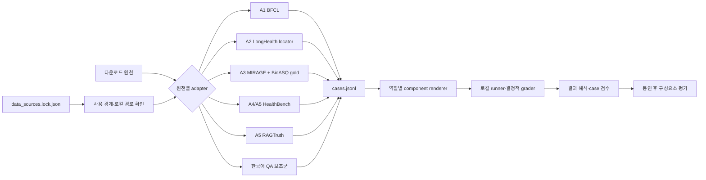

# 공개 평가 원천 Source Adapter

- 구현: [`adapt_evaluation_sources.py`](../scripts/adapt_evaluation_sources.py) `v0.1.0`
- 후속 실행·채점: [`role_component_evaluation_harness.md`](./role_component_evaluation_harness.md)
- 출력 상태: `adapter_generated_unreviewed`
- 용도: A1~A5 구성요소 평가와 한국어 보조평가 입력 정규화
- 금지: 파인튜닝, 모바일 번들, 운영 의료 RAG, DS-AGENT 자동 승격

## 목차

1. [목적과 경계](#1-목적과-경계)
2. [처리 구조](#2-처리-구조)
3. [공통 출력 계약](#3-공통-출력-계약)
4. [원천별 adapter](#4-원천별-adapter)
5. [실행 방법](#5-실행-방법)
6. [전체 변환 결과](#6-전체-변환-결과)
7. [하네스 연결 상태와 남은 일](#7-하네스-연결-상태와-남은-일)

## 1. 목적과 경계

원천마다 파일 형식, split, 정답 표현과 평가 가능한 능력이 다르다. source adapter는 다운로드한 원천을 하나의 `cases.jsonl` envelope로 바꾸되 원천 의미를 새로 해석하거나 간병 앱의 의료 정답으로 승격하지 않는다.

adapter 출력과 [`Evaluation Scenario Compiler`](./evaluation_scenario_compiler.md)의 입력은 서로 다르다.

| 구분 | Source adapter 출력 | Scenario Compiler 입력 |
|---|---|---|
| 목적 | 공개 벤치마크의 A1~A5 구성요소 능력 측정 | 프로젝트 도구 계약을 실행하는 간병 episode 생성 |
| 데이터 | 공개 벤치마크 문항·정답·원천 locator | 검수된 구조화·비식별 간병 event |
| 의료 근거 | 운영 RAG 근거가 아님 | 승인 snapshot만 연결 가능 |
| 자동 연결 | 금지 | 별도 사람 검수 mapping 필요 |
| 학습·배포 | `do_not_train=true`, 모바일 배포 금지 | 평가 전용, 모바일 배포 금지 |

MedAgentBench는 Docker/EHR 환경 문제로 현재 보류했으므로 이번 adapter 범위에 포함하지 않았다.

## 2. 처리 구조



변환은 네트워크를 사용하지 않으며 기존 출력 경로를 덮어쓰지 않는다. 각 manifest에는 source lock의 SHA-256, 사용한 입력 파일별 SHA-256, 출력 SHA-256과 레코드 수를 기록한다. MIRAGE 110GB retrieval payload 전체는 매 실행마다 다시 해시하지 않고 기존 tree lock을 참조하며, adapter가 직접 읽은 benchmark·BioASQ gold 파일만 별도로 해시한다.

## 3. 공통 출력 계약

각 출력 디렉터리는 두 파일을 가진다.

```text
<output-dir>/
  manifest.json
  cases.jsonl
```

case의 공통 골격은 다음과 같다.

```json
{
  "schema_version": "1.0",
  "case_id": "CASE-...",
  "source": {
    "dataset_id": "EVAL-...",
    "split": "upstream split",
    "record_id": "...",
    "record_sha256": "...",
    "locator": {}
  },
  "target": {
    "roles": ["A1"],
    "task_family": "...",
    "supported_metrics": [],
    "component_evaluation_only": true
  },
  "input": {},
  "gold": {},
  "policy": {
    "evaluation_only": true,
    "do_not_train": true,
    "finetuning_eligible": false,
    "mobile_bundle": false,
    "runtime_rag_eligible": false,
    "approved_medical_knowledge": false,
    "scenario_compiler_input": false,
    "external_transmission_allowed": false
  },
  "review_status": "adapter_generated_unreviewed",
  "project_evaluation_eligible": false
}
```

원천 split은 재분할하지 않는다. `train`이라는 원천 이름이 있어도 이 프로젝트에서는 모두 `do_not_train`이다. `--limit`은 smoke test용이며 실제로 일부만 생성되면 manifest에 `is_partial=true`와 `PARTIAL_ADAPTER_OUTPUT`을 남긴다.

## 4. 원천별 adapter

| 원천 | 역할 | 변환 내용 | 핵심 제한 |
|---|---|---|---|
| BFCL V4 | A1 | 대화, 함수 schema, function-call gold, category | `format_sensitivity.json`은 문항이 아니라 선택 메타데이터로 분리. 단일 턴 투영 3,625건만 현재 adapter grader로 점수화 가능하며, 직접 gold가 없는 16건과 공식 상태형 runtime이 필요한 1,055건은 분리. 로컬 export 라이선스 검토 필요 |
| LongHealth | A2 | 질문, 선택지, 정답, 정규화 위치, 로컬 문서 locator | 가상 환자 이름·생년월일·canary·문서 본문을 case에 복사하지 않음. 현재 하네스가 원문을 열 때 이름·생년월일을 마스킹하고 누출 여부를 검사함 |
| MIRAGE + BioASQ | A3 | question-only 검색 문항, QA 정답, retrieval artifact locator | 110GB score/snippet payload를 복사하지 않음. BioASQ 618건만 PMID·snippet locator gold가 있으나, 현재 PubMed cache의 chunk ID를 PMID로 연결하는 추적 mapping이 없어 실제 Recall@k/MRR 점수화는 보류. 나머지는 relevance gold가 없어 RAG 정답률·검색기 대조실험만 가능 |
| HealthBench | A4 | prompt, rubric, 선택적 ideal completion | 간병 앱의 승인 근거 기반 답변 시험을 대체하지 않음 |
| HealthBench Meta | A5 | prompt, 후보 답변, rubric, 의사 binary label | 익명 의사 ID와 canary는 case에서 제외 |
| RAGTruth | A5 | source context, 후보 답변, hallucination span·종류 | 모든 span offset과 라벨 text를 원문 후보 답변에 대조. upstream source corpus 권리 검토 필요 |
| KoMedQA | KO | 한국어 질문·정답·분야·문항 유형 | 한국어 의료 표현 보조평가이며 간병 안전성이나 근거 충실도 정답이 아님 |
| KorMedMCQA | KO | dentist/doctor/nurse/pharm, 원천 split, 5지선다·해설 | CC-BY-NC-2.0. 제품 asset과 상업 배포 금지. 모든 split을 평가 전용으로 보존 |

MIRAGE에서 `document_recall_at_k`와 `mean_reciprocal_rank`는 BioASQ gold 문서가 연결되고 검색 결과 ID를 같은 PMID namespace로 추적할 수 있는 case에만 계산한다. 현재 다운로드된 PubMed cache의 `pubmed23n..._<chunk>` ID를 `PMID:<id>`로 바꾸는 공식 mapping이 없으므로 `RETRIEVAL_ID_MAPPING_MISSING`으로 보류한다. relevance label이 없는 다른 subset에 Recall@k를 계산하거나 정답 선택지를 검색 query에 섞지 않는다.

## 5. 실행 방법

지원 source 이름은 다음과 같다.

```text
bfcl, longhealth, mirage, healthbench, ragtruth, komedqa, kormedmcqa
```

일반 원천은 기본 Python 환경에서 실행할 수 있다.

```powershell
python -X utf8 scripts/adapt_evaluation_sources.py `
  --source longhealth `
  --output-dir data/agent-eval/source-adapters/longhealth-v0.1
```

일부만 형식 검증할 때는 `--limit`을 사용한다. 이 출력은 부분 출력으로 표시되어 점수화할 수 없다.

```powershell
python -X utf8 scripts/adapt_evaluation_sources.py `
  --source mirage `
  --output-dir data/agent-eval/source-adapter-smoke/mirage-v0.1 `
  --limit 2
```

KorMedMCQA는 Hugging Face Arrow를 읽기 위해 `datasets`가 설치된 `care_app` conda 환경에서 실행한다.

```powershell
conda run -n care_app python -X utf8 scripts/adapt_evaluation_sources.py `
  --source kormedmcqa `
  --output-dir data/agent-eval/source-adapters/kormedmcqa-v0.1
```

출력 경로가 이미 있으면 중단한다. 입력 lock이나 adapter 버전이 달라졌다면 기존 디렉터리를 덮어쓰지 말고 새 버전 경로를 사용한다.

## 6. 전체 변환 결과

2026-09-01에 현재 lock과 adapter `v0.1.0`으로 모든 레코드를 끝까지 변환하고 파일 hash와 레코드 수를 다시 확인했다.

| Source | 레코드 | 역할별 수 | 로컬 출력 |
|---|---:|---|---|
| BFCL | 4,696 | A1 4,696 | `data/agent-eval/source-adapters/bfcl-v0.1` |
| LongHealth | 400 | A2 400 | `data/agent-eval/source-adapters/longhealth-v0.1` |
| MIRAGE | 7,663 | A3 7,663 | `data/agent-eval/source-adapters/mirage-v0.1` |
| HealthBench | 39,182 | A4 9,671 / A5 29,511 | `data/agent-eval/source-adapters/healthbench-v0.1` |
| RAGTruth | 17,790 | A5 17,790 | `data/agent-eval/source-adapters/ragtruth-v0.1` |
| KoMedQA | 33,379 | KO 33,379 | `data/agent-eval/source-adapters/komedqa-v0.1` |
| KorMedMCQA | 7,489 | KO 7,489 | `data/agent-eval/source-adapters/kormedmcqa-v0.1` |

이 표는 **변환 성공 건수**이지 모델 성능 결과가 아니다. 모든 manifest는 계속 `evaluation_eligible=false`다. 생성 데이터는 `.gitignore`의 `/data/*`에 따라 저장소에 커밋되지 않는다.

## 7. 하네스 연결 상태와 남은 일

1. **구현 완료:** 공통 case를 A1~A5/KO 구성요소 요청으로 렌더링하고 로컬 실행·채점하는 core. 상세 경계는 [`역할별 구성요소 평가 하네스`](./role_component_evaluation_harness.md)를 따른다.
2. BFCL 공식 채점기·상태형 runtime과 `live_relevance` 실행 의미를 연결하고 라이선스를 검토한다. 현재 공식 runtime이 필요한 1,055건은 `BFCL_OFFICIAL_RUNTIME_REQUIRED`, 직접 gold가 없는 16건은 `BFCL_GOLD_UNAVAILABLE`로 분리한다.
3. **구현 완료:** LongHealth runtime loader의 이름·생년월일 마스킹과 원문 locator 검증. 모델별 실제 문맥 길이·지연 측정은 남아 있다.
4. **일부 구현:** MIRAGE profile별 score·snippet ID 지연 로딩. BioASQ 618건을 실제 채점하려면 PubMed chunk ID→PMID mapping을 추가해야 한다.
5. HealthBench A4 독립 rubric 판정 절차와 판정자 일치도를 고정한다. HealthBench·RAGTruth 구성요소 지표는 계속 프로젝트 의료 hard gate와 별도로 보고한다.
6. adapter 출력 샘플·locator·정답을 사람이 검수한 뒤 평가 bundle을 봉인하는 review·seal 도구를 만든다.
7. 별도로 `DS-AGENT` candidate의 도구 label·승인 근거 적용 범위를 검수하고 seal한다.

공개 benchmark 점수와 프로젝트 간병 도메인 E2E 결과는 같은 표에서 평균내지 않는다.
