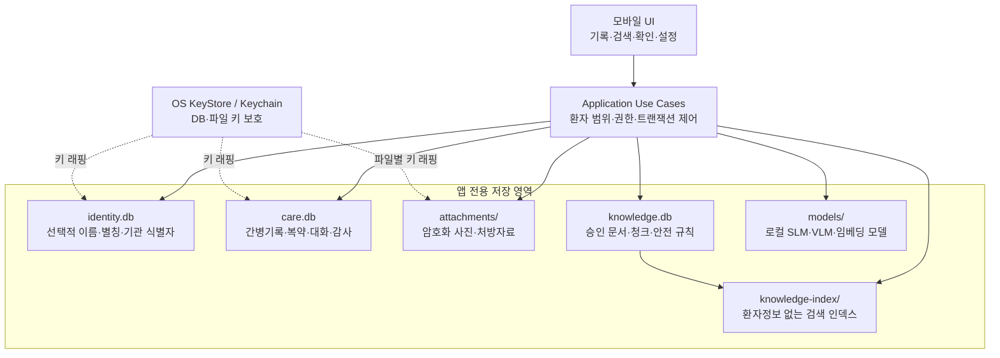
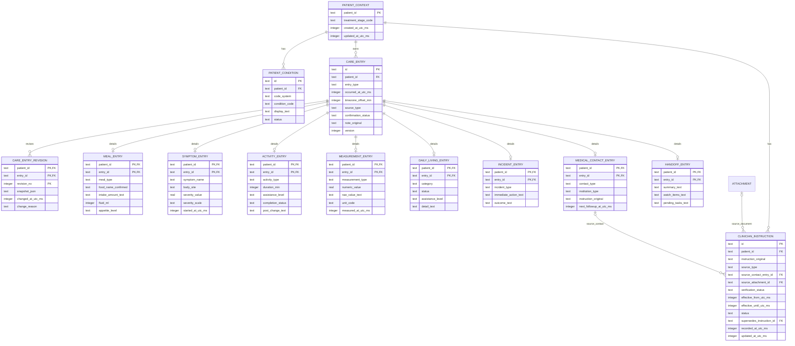
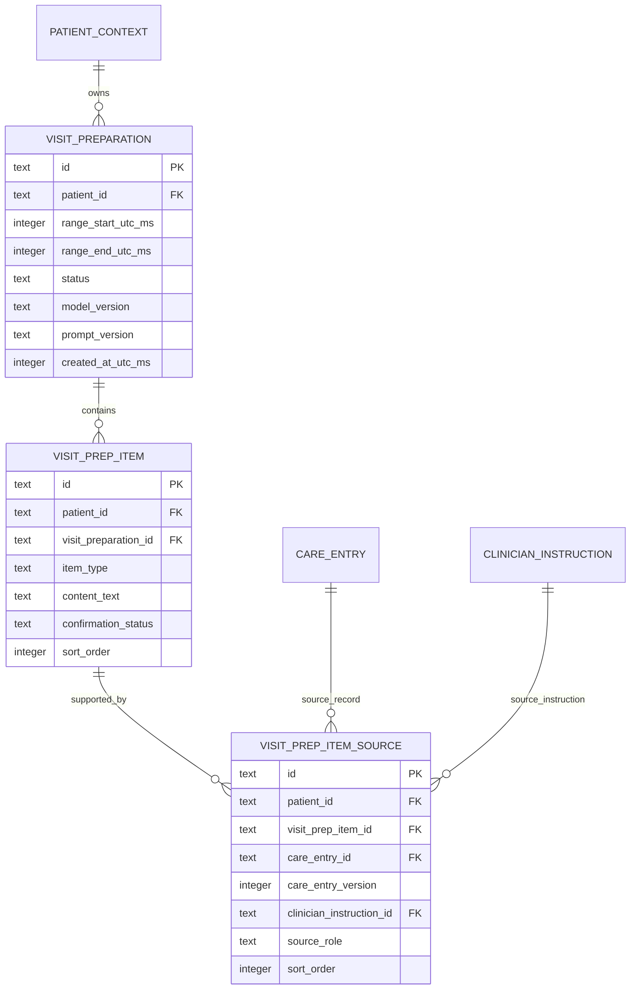
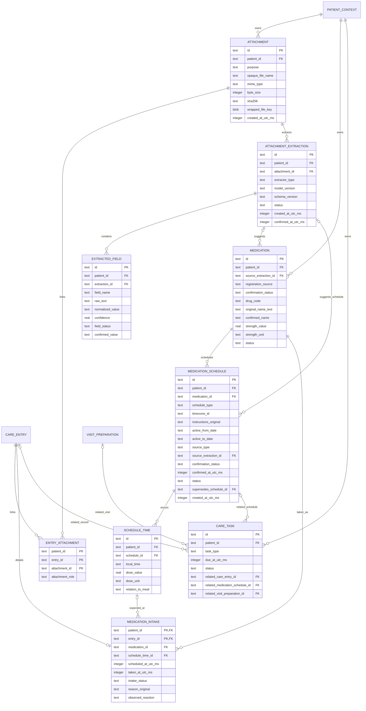
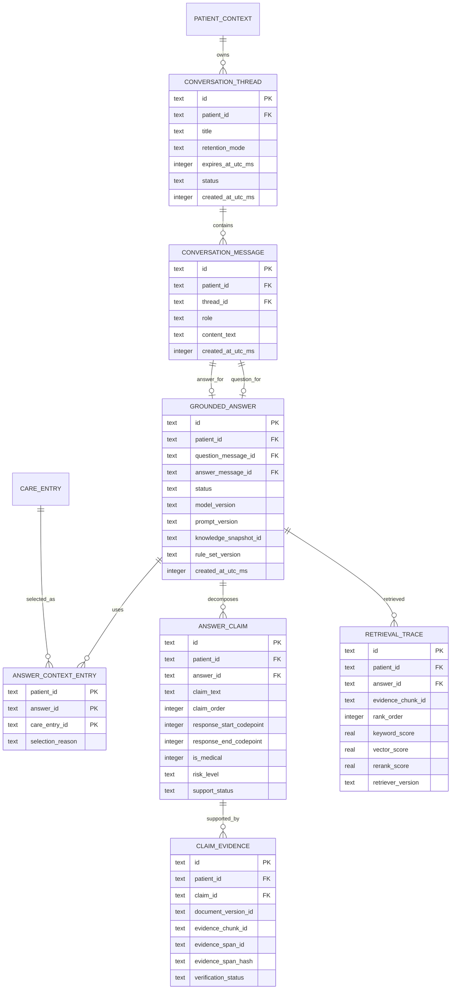
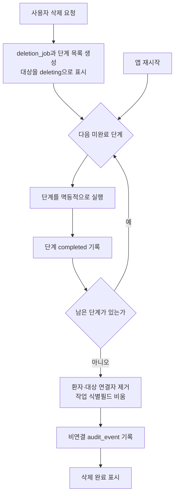
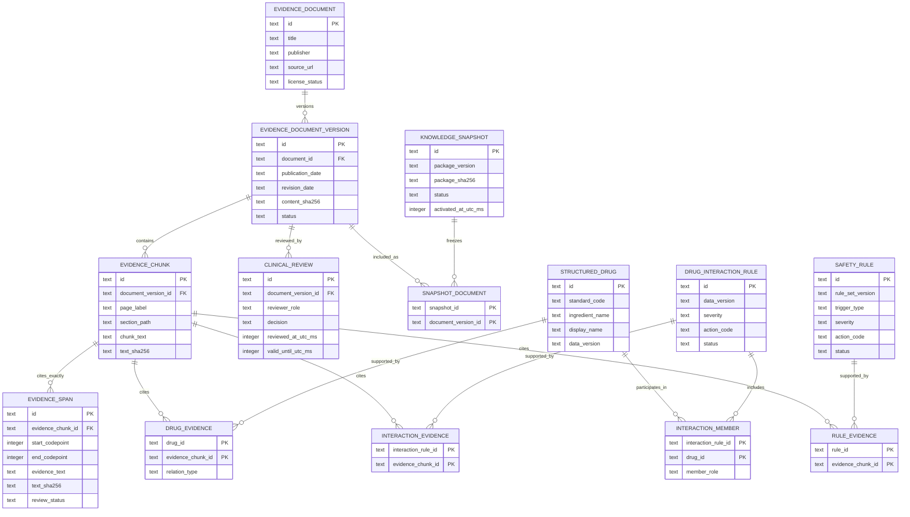
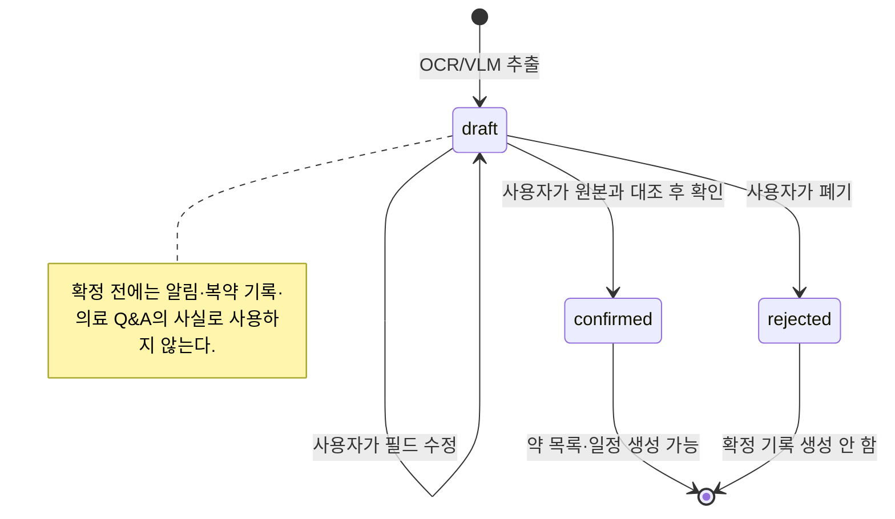
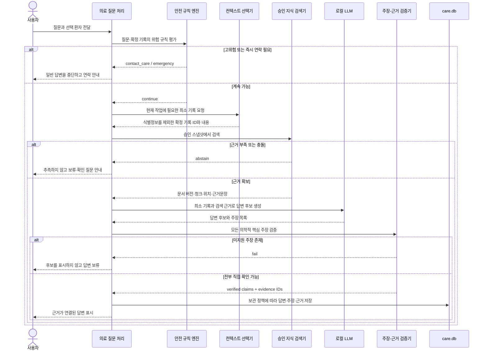
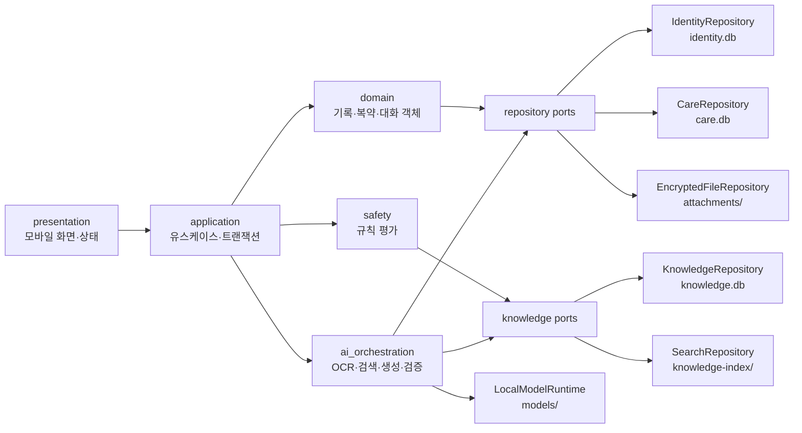

# 모바일 우선 간병수첩 데이터 스키마 및 도식 설계

- 문서 상태: 초기 MVP 구현 기준 스키마 제안
- 기준 문서: [`caregiving_notebook_requirements.md`](./caregiving_notebook_requirements.md)
- 관련 설계: [`caregiving_notebook_use_case_design.md`](./caregiving_notebook_use_case_design.md)
- 적용 범위: 로컬 우선 모바일 앱의 저장 구조, 도메인 스키마와 데이터 흐름

이 문서는 특정 모바일 프레임워크나 ORM을 확정하지 않고, SQLite 호환 관계형 저장소를 기준으로 초기 MVP의 데이터 경계와 스키마를 정의한다. 요구사항 원본과 충돌할 경우 요구사항 원본을 우선한다.

## 목차

1. [핵심 결정](#1-핵심-결정)
2. [모바일 저장 구조](#2-모바일-저장-구조)
3. [스키마 공통 규칙](#3-스키마-공통-규칙)
4. [식별정보 스키마](#4-식별정보-스키마)
5. [간병기록 스키마](#5-간병기록-스키마)
6. [첨부파일·OCR·복약 스키마](#6-첨부파일ocr복약-스키마)
7. [의료 Q&A·RAG 스키마](#7-의료-qarag-스키마)
8. [안전·감사·삭제 스키마](#8-안전감사삭제-스키마)
9. [승인 지식베이스 스키마](#9-승인-지식베이스-스키마)
10. [상태와 처리 흐름](#10-상태와-처리-흐름)
11. [무결성·인덱스·보안 규칙](#11-무결성인덱스보안-규칙)
12. [코드 모듈과 저장소의 대응](#12-코드-모듈과-저장소의-대응)
13. [구현 순서](#13-구현-순서)
14. [구현 전에 확정할 사항](#14-구현-전에-확정할-사항)

## 1. 핵심 결정

| 항목 | 결정 | 이유 |
|---|---|---|
| 우선 플랫폼 | 모바일 앱 우선, 오프라인에서 기록·조회 가능 | 간병 현장에서 즉시 기록해야 하며 네트워크를 전제로 할 수 없음 |
| 주 데이터베이스 | 암호화된 SQLite 호환 관계형 DB | 모바일 트랜잭션, 마이그레이션, 구조화 조회와 무결성 제약에 적합 |
| 식별정보 | 의료·간병기록과 별도 DB 및 별도 키로 분리 | 이름 없이도 기록을 사용할 수 있고 LLM 입력에서 식별정보를 차단하기 쉬움 |
| 간병기록 | 공통 `care_entry`와 유형별 상세 테이블 | 시간순 조회는 단순하게 유지하면서 식사·증상·복약의 필드를 검증할 수 있음 |
| 사진·문서 | DB 밖의 앱 전용 암호화 파일로 저장 | 큰 BLOB으로 인한 DB 팽창과 백업·삭제 복잡도를 줄임 |
| OCR·VLM 결과 | 항상 `draft`로 저장한 뒤 사용자 확인 | 확인되지 않은 약 이름·용량·일정을 확정 기록으로 사용하지 않음 |
| 의료 지식 | 환자 DB와 분리된 서명·버전 관리 읽기 전용 DB | 승인 문서만 검색하고 지식 스냅샷별 답변을 재현하기 위함 |
| 개인 기록 검색 | 초기에는 구조화 필터와 암호화 DB 내부 전문검색 우선 | 환자 텍스트의 별도 임베딩 복제와 삭제 누락 위험을 줄임 |
| 동기화 | 초기 MVP에는 클라우드·가족 공유·병원 전송 없음 | 별도 동의·권한·보안·규제 설계가 필요한 최후순위 기능 |

`identity.db`, `care.db`, `knowledge.db`는 논리적 경계이자 권장 물리적 경계다. 선택한 라이브러리가 다중 암호화 DB를 안정적으로 지원하지 않으면 동일 파일 안의 분리된 스키마로 임시 구현할 수 있으나, 저장소 인터페이스와 암호화 키 경계는 유지해야 한다.

## 2. 모바일 저장 구조

### 2.1 기기 내부 구성

### 2.2 저장 경계

| 저장소 | 포함 데이터 | 포함하지 않는 데이터 | 접근 주체 |
|---|---|---|---|
| `identity.db` | 선택적 표시 이름, 별칭, 기관 내부 식별자 | 주민등록번호, 간병일기, 대화 원문 | 프로필 화면과 식별정보 저장소만 |
| `care.db` | 환자 맥락, 간병기록, 복약, OCR 상태, Q&A 보관 기록, 안전·감사 메타데이터 | 원본 사진, 승인 문서 원문, 모델 파일 | 애플리케이션 유스케이스를 통한 도메인 저장소 |
| `attachments/` | 음식 사진, 처방전·약 봉투·약 상자 사진과 문서 | 평문 파일명, DB 레코드 외 임상 메타데이터 | 암호화 파일 저장소 |
| `knowledge.db` | 승인 문서·버전·근거 청크, 구조화 약물·안전 규칙 | 환자 기록과 질문 원문 | 승인 지식 저장소와 안전 엔진 |
| `knowledge-index/` | 승인 지식의 전문·벡터 인덱스 | 환자별 임베딩과 대화 원문 | 검색기만 |
| `models/` | 검증된 모델 파일, 해시와 버전 | 학습용 환자 데이터와 실행 로그 | 로컬 모델 런타임만 |

식별정보와 간병기록은 같은 `patient_id`를 사용하지만 DB 간 외래 키를 만들지 않는다. 화면에 이름이 필요할 때만 애플리케이션 계층이 `identity.db`에서 별도로 조회하며, AI 오케스트레이션에는 `identity.db` 저장소 자체를 주입하지 않는다.

## 3. 스키마 공통 규칙

| 규칙 | 정의 |
|---|---|
| ID | 앱에서 생성한 UUIDv7을 SQLite `TEXT`로 저장한다. 서버 발급 ID를 전제로 하지 않는다. |
| 시간 | 절대 시각은 UTC epoch millisecond `INTEGER`, 현지 의미가 있는 발생 시각은 `timezone_offset_min`도 함께 저장한다. 일정의 반복 시각은 현지 시간과 IANA 시간대를 별도로 저장한다. |
| Boolean | `INTEGER`의 `0/1`과 `CHECK` 제약을 사용한다. |
| 상태값 | 자유 문자열 대신 문서에 정의된 `TEXT` enum과 `CHECK` 제약을 사용한다. |
| 환자 격리 | 환자 범위 레코드는 모두 `patient_id`를 가지며 조회·수정·삭제 명령은 항상 `patient_id`와 레코드 ID를 함께 받는다. |
| 출처 | `manual`, `voice`, `ocr`, `vlm`, `llm`, `import`를 구분하고 자동 추출은 확인 상태를 별도로 가진다. |
| 확정 상태 | 자동 추출 또는 자동 생성 기록은 `draft`, `confirmed`, `rejected` 중 하나다. 임상 기록·알림·질문 컨텍스트에는 `confirmed`만 사용한다. |
| 수정 이력 | 확정 기록을 바꾸기 전에 이전 값을 `care_entry_revision`에 남긴다. 삭제 시 이력도 함께 삭제한다. |
| 확장 필드 | 핵심 검색·검증 필드는 정규 열로 두고, `extra_json`은 버전이 있는 비핵심 확장에만 사용한다. |
| 텍스트 구분 | 사용자가 입력한 원문과 정규화·요약·AI 생성문을 다른 열에 저장한다. 원문을 AI 출력으로 덮어쓰지 않는다. |
| 로그 | 환자 원문, 질문, 답변, 사진 경로를 크래시·분석 로그에 기록하지 않는다. 감사 로그는 ID·버전·결과 코드만 저장한다. |

## 4. 식별정보 스키마

### 4.1 `identity.db`

| 테이블 | 핵심 열 | 설명 |
|---|---|---|
| `patient_identity` | `patient_id PK`, `display_name?`, `alias?`, `institution_identifier?`, `created_at_utc_ms`, `updated_at_utc_ms` | 모든 식별값은 선택 사항이다. 핵심 기능에 불필요한 고위험 식별정보 필드는 만들지 않는다. |
| `identity_schema_migration` | `version PK`, `checksum`, `applied_at_utc_ms` | 식별정보 DB의 독립 마이그레이션 이력 |

`patient_identity`를 삭제해도 `care.db`의 비식별 간병기록을 유지할 수 있어야 하고, 반대로 환자 기록 전체 삭제를 선택하면 두 DB와 첨부파일에서 같은 `patient_id` 범위를 함께 제거해야 한다.

## 5. 간병기록 스키마

### 5.1 핵심 ERD

### 5.2 공통 레코드

| 테이블 | 필수·주요 열 | 제약과 용도 |
|---|---|---|
| `patient_context` | `patient_id`, `treatment_stage_code?`, 생성·수정 시각 | 식별정보가 아닌 선택 환자의 간병 맥락. 의료진 지시는 이 테이블의 단일 텍스트로 저장하지 않는다. |
| `patient_condition` | `id`, `patient_id`, `code_system?`, `condition_code?`, `display_text`, `status` | 첫 질환 범위를 확장할 수 있는 목록. 진단을 앱이 생성하지 않는다. |
| `clinician_instruction` | `id`, `patient_id`, 지시 원문, 출처, 검증 수준, 유효기간, 상태, 대체한 지시 ID, 기록·수정 시각 | 환자별 의료진 지시와 주의조건을 출처·이력과 함께 보존한다. 현재 유효한 지시만 안전 규칙과 Q&A에 제공한다. |
| `care_entry` | `id`, `patient_id`, `entry_type`, `occurred_at_utc_ms`, `timezone_offset_min`, `source_type`, `confirmation_status`, `note_original?`, `created_at_utc_ms`, `updated_at_utc_ms`, `version` | 모든 간병일기의 시간축이 되는 공통 헤더 |
| `care_entry_revision` | `patient_id`, `entry_id`, `revision_no`, `snapshot_json`, `changed_at_utc_ms`, `change_reason?` | 수정 전 값의 암호화된 스냅샷. `(patient_id, entry_id, revision_no)`가 고유하다. |

`care_entry.entry_type`은 MVP에서 `meal`, `symptom`, `medication_intake`, `activity`, `measurement`, `daily_living`, `incident`, `medical_contact`, `handoff`, `general_note`를 허용한다. `general_note`를 제외한 레코드는 같은 유형의 상세 행을 정확히 하나 가져야 한다. 도메인 저장소가 헤더와 상세를 한 트랜잭션으로 저장하고 무결성 시험으로 이를 검증한다.

`clinician_instruction.source_type`은 `caregiver_reported`, `medical_contact`, `attachment`를 허용한다. `verification_status`는 `caregiver_confirmed`, `source_attached`, `clinician_verified`를 구분하며, 간병인이 옮겨 적었다는 사실만으로 `clinician_verified`를 부여하지 않는다. 상태는 `active`, `superseded`, `expired`, `revoked`, `entered_in_error`를 사용한다. 지시 내용이 바뀌면 기존 행의 임상 내용은 덮어쓰지 않고 새 행을 추가해 `supersedes_instruction_id`로 연결하며, 기존 행은 `superseded`로 전환한다. `revoked`는 철회가 기록된 출처가 있을 때만 사용한다.

### 5.3 유형별 상세

| 테이블 | 주요 열 | 기록 범위 |
|---|---|---|
| `meal_entry` | 식사 구분, 확인된 음식명, 섭취량, 수분량, 식욕, 씹기·삼키기 상태, 식전·식후 상태 | 음식 사진만으로 섭취 가능 여부를 확정하지 않는다. |
| `symptom_entry` | 증상명, 부위, 강도 값·척도, 시작 시각, 지속·반복, 악화·완화 요인, 생활 영향, 조치와 결과 | 고위험 신호 평가는 별도 규칙 엔진 결과에 연결한다. |
| `activity_entry` | 활동·재활 유형, 시간, 횟수, 보조 수준, 완료 여부, 중단 이유, 활동 후 변화 | 금기·낙상 위험은 승인 규칙과 사용자 맥락을 함께 확인한다. |
| `measurement_entry` | 측정 유형, 숫자 값 또는 원문, 단위, 측정 시각, 입력 출처 | 단위를 필수 검증하고 표시 단위 변환과 원본 값을 함께 보존한다. |
| `daily_living_entry` | 배설·수면·위생·체위·피부·행동·기분 등 범주, 상태, 보조 수준, 상세 | 구조화 항목과 자유 메모를 분리한다. |
| `incident_entry` | 낙상·오류·급격한 변화 등 사건 유형, 즉시 조치, 결과 | 안전 규칙 평가를 반드시 실행하는 기록 유형이다. |
| `medical_contact_entry` | 진료·전화 등 접촉 유형, 기관 유형, 의료진 지시 원문, 후속 일정 | 앱 해석이 아니라 사용자가 기록한 지시 원문을 보존한다. |
| `handoff_entry` | 인계 요약, 관찰할 항목, 미완료 작업 | MVP에서는 복사 가능한 초안이며 특정 가족 계정으로 전송하지 않는다. |
| `caregiver_checkin` | `id`, `patient_id?`, 피로·수면·스트레스, 교대 필요, 요청문 초안, 시각 | 환자의 임상 기록과 별도 유형·저장소 인터페이스로 다루고 의료 Q&A 컨텍스트에서 기본 제외한다. |

### 5.4 진료 준비 요약

`visit_preparation`은 사용자가 선택한 기간과 확정 기록으로 만든 진료 준비 초안이다. `visit_prep_item.item_type`은 `change_summary`, `medication_adherence`, `symptom_to_report`, `question_to_ask`, `clinician_instruction`을 허용한다. 하나의 변화 요약이 여러 기록에서 만들어질 수 있으므로 `visit_prep_item_source`가 N:M 원본 연결과 사용한 기록 버전을 보존한다. 한 출처 행에는 `care_entry_id`와 `clinician_instruction_id` 중 정확히 하나만 설정하고, `source_role`은 `primary`, `supporting`, `contradicting`을 사용한다.

기록에서 생성한 요약 항목은 원본을 하나 이상 가져야 하며, 사용자가 직접 입력한 `question_to_ask`만 원본 없이 저장할 수 있다. 연결된 원본이 수정되면 진료 준비를 `stale`로 표시하고 다시 검토한다. 원본 삭제 시 내용을 별도 스냅샷으로 숨겨 유지하지 않고 연결을 삭제하며, 근거가 사라진 생성 항목은 함께 삭제하거나 `stale` 상태에서 사용자에게 재확인을 요구한다. 모델은 환자 기록에 없는 진단·원인·치료 제안을 추가할 수 없고, 사용자가 확인한 초안만 내보내기 대상으로 사용한다.

## 6. 첨부파일·OCR·복약 스키마

### 6.1 ERD

### 6.2 파일·추출 테이블

| 테이블 | 핵심 규칙 |
|---|---|
| `attachment` | 원래 파일명을 저장하지 않고 불투명 ID 파일명을 사용한다. 파일마다 임의 키로 암호화하고 `wrapped_file_key`만 DB에 저장한다. EXIF 위치정보는 저장 전 제거한다. |
| `entry_attachment` | 한 사진을 식사·사건 등 여러 기록에 연결할 수 있는 N:M 연결이다. 환자 ID가 양쪽 레코드와 같아야 한다. |
| `attachment_extraction` | 추출기 종류, 모델·프롬프트/스키마 버전, 상태와 확인 시각을 보관한다. 원본 첨부파일 없이는 확정 출처로 취급하지 않는다. |
| `extracted_field` | 원문, 정규화 후보, 신뢰도, 위치 좌표 JSON, 사용자 확정값을 분리한다. 신뢰도만으로 자동 확정하지 않는다. |

### 6.3 복약·일정 테이블

| 테이블 | 핵심 규칙 |
|---|---|
| `medication` | 약 이름 원문과 사용자 확정명을 모두 보존한다. `source_extraction_id`는 선택 사항이므로 직접 입력 약은 추출 정보 없이 등록할 수 있다. `registration_source`와 별도 확인 상태로 입력 경로를 명시한다. OCR/VLM은 후보를 제안할 뿐이고 사용자가 확정한다. 약물 코드 연결 실패는 보류할 수 있으며 LLM이 코드를 추정하지 않는다. |
| `medication_schedule` | 처방 지시 원문과 앱의 구조화 일정을 분리한다. 활성화된 임상 내용은 덮어쓰지 않고 새 일정을 추가해 이전 일정과 대체 관계를 남긴다. |
| `schedule_time` | 한 일정의 여러 현지 복용 시각과 1회량을 정규화한다. |
| `medication_intake` | `taken`, `missed`, `refused`, `unknown` 상태, 예정·실제 시각, 거부·누락 이유와 관찰 반응을 기록한다. |
| `care_task` | 복약·측정·식사·진료 등 로컬 할 일이다. 다형 `type/id` 문자열 대신 간병기록·복약 일정·진료 준비에 대한 선택적 명시 FK를 사용한다. 가족 계정 배정이나 외부 전송 필드는 MVP에 두지 않는다. |

`medication_schedule.status`는 `draft`, `active`, `superseded`, `cancelled`, `entered_in_error`를 허용한다. 확정된 용량·빈도·시각이 바뀌면 기존 임상 필드를 수정하지 않고 새 일정을 삽입해 `supersedes_schedule_id`로 연결한다. 같은 트랜잭션에서 기존 일정의 상태와 종료일만 갱신하며, 과거 `medication_intake`는 당시의 `schedule_time_id`를 계속 참조한다. `source_type`, 선택적 `source_extraction_id`, `confirmation_status`, 확인 시각을 보존해 앱이 임의로 처방을 변경했다는 의미가 되지 않도록 한다.

`care_task`의 세 연결 FK는 모두 `NULL`일 수 있지만 동시에 둘 이상 설정할 수 없도록 `CHECK` 제약을 둔다. 각 참조는 `(patient_id, target_id)` 복합 FK로 환자 범위를 강제한다.

## 7. 의료 Q&A·RAG 스키마

### 7.1 ERD

### 7.2 대화와 근거 객체

| 테이블 | 핵심 규칙 |
|---|---|
| `conversation_thread` | `retention_mode`은 `session`, `days`, `keep`, `journal_only` 중 하나이며, `days`는 `expires_at_utc_ms`가 필수다. 기본값과 선택지는 제품 결정 후 확정한다. |
| `conversation_message` | `user`, `assistant` 역할의 로컬 원문을 모두 시간순으로 저장한다. 외부 로그나 학습 데이터에 복제하지 않고 사용자가 선택한 보관 정책에 따라 삭제한다. |
| `grounded_answer` | 한 사용자 질문 메시지와 사용자에게 실제 표시한 assistant 메시지를 `question_message_id`, `answer_message_id`로 연결한다. `answered`, `abstained`, `escalated`만 저장하며 검증 전 후보 답변은 메모리에만 둔다. |
| `answer_context_entry` | 사용자가 선택한 환자의 질문에 실제로 사용한 최소 간병기록을 추적한다. 식별정보는 연결 대상이 아니다. |
| `answer_claim` | 답변을 주장 단위로 나누고 표시 순서, assistant 메시지 안의 위치, 의학적 핵심 주장 여부, 위험도와 근거 상태를 기록한다. |
| `claim_evidence` | 앱이 검색 결과에서 결정한 문서 버전·청크·검수된 근거 span ID와 해시를 연결한다. 출처 ID를 LLM이 직접 만들 수 없다. |
| `retrieval_trace` | 모델 평가와 검색기 평가를 분리할 수 있도록 검색 순위와 점수·버전을 저장한다. 운영 UI에는 환자 원문 없는 진단 정보만 노출한다. |

`grounded_answer`의 두 메시지는 같은 `patient_id`와 `thread_id`에 속해야 한다. `question_message_id`는 `role=user`, `answer_message_id`는 `role=assistant`여야 하며 둘은 같을 수 없다. assistant 메시지의 `content_text`가 화면에 표시된 답변의 단일 원본이고 `grounded_answer`에는 이를 중복 저장하지 않는다. `abstained`와 `escalated`도 사용자에게 표시한 안전 안내 메시지와 연결한다.

`answer_claim.claim_order`는 답변 안에서 고유해야 한다. 위치 값은 NFC로 정규화된 불변 assistant 메시지를 기준으로 한 Unicode code point의 반개방 구간 `[start, end)`이며, 위치 계산이 확실하지 않으면 `NULL`로 두고 순서만 사용한다. 표시 답변을 바꿔야 하면 기존 메시지를 수정하지 않고 새로운 답변 결과를 생성한다.

`claim_evidence`의 지식 ID는 다른 DB에 있으므로 SQLite 외래 키로 강제할 수 없다. 답변 저장 트랜잭션 전에 애플리케이션 계층이 현재 승인 스냅샷에서 문서 버전·청크·span ID, 해시와 활성 상태를 확인하고, 답변과 함께 `knowledge_snapshot_id`를 고정한다.

사용자가 대화 일부를 간병일기에 반영하면 선택·확인한 내용만 새로운 `care_entry`로 복사하고 `source_type=llm`, `confirmation_status=confirmed`로 기록한다. 이후 보관 정책에 따라 대화 원문을 삭제해도 간병일기 레코드는 유지되며, 삭제된 원문을 수정 이력이나 감사 로그에 복제하지 않는다.

대화 스레드를 삭제하거나 보유기간이 만료되면 메시지뿐 아니라 연결된 `grounded_answer`, 주장, 근거 연결, 검색 추적과 답변 컨텍스트를 같은 삭제 작업에서 제거한다. 별도로 확인해 간병일기에 반영한 `care_entry`만 독립 기록으로 유지한다.

## 8. 안전·감사·삭제 스키마

| 테이블 | 주요 열 | 역할 |
|---|---|---|
| `risk_evaluation` | `id`, `patient_id`, `source_type`, `source_id`, `rule_set_version`, `risk_level`, `outcome`, `evaluated_at_utc_ms` | LLM 호출 전 규칙 평가 결과. `outcome`은 `continue`, `clarify`, `contact_care`, `emergency` 등 승인 값만 사용한다. |
| `risk_match` | `patient_id`, `evaluation_id`, `rule_id`, `matched_value_hash?`, `required_action` | 어떤 승인 규칙이 작동했는지 추적한다. 민감 원문은 복제하지 않는다. |
| `audit_event` | `id`, `patient_id?`, `action`, `target_type`, `target_id?`, 버전 해시, `result_code`, `occurred_at_utc_ms` | 생성·수정·내보내기·삭제·모델/지식 변경 이력의 메타데이터. 환자 원문은 저장하지 않는다. 전체 환자 삭제 후 남기는 성공 이벤트에는 환자·대상 ID를 넣지 않는다. |
| `deletion_job` | `id`, `scope`, `patient_id?`, `target_type`, `target_id?`, `status`, 요청·완료 시각, `failure_code?` | 여러 로컬 저장소에 걸친 삭제를 재개하기 위한 작업 헤더. 상태는 `pending`, `running`, `failed`, `completed`를 사용한다. |
| `deletion_job_step` | `job_id`, `step_code`, `step_order`, `status`, `attempt_count`, 시작·완료 시각, `failure_code?` | 각 삭제 단계를 멱등적으로 실행하고 앱 재시작 후 완료되지 않은 단계부터 재개한다. `(job_id, step_code)`가 고유하다. |
| `app_setting` | `key`, `value_json`, `updated_at_utc_ms` | 잠금, 보관기간, 내보내기 등의 비민감 설정. 환자 원문을 넣지 않는다. |
| `schema_migration` | `version`, `checksum`, `applied_at_utc_ms` | `care.db` 스키마 버전과 무결성 확인 |

삭제 완료 후에는 내용이 남은 소프트 삭제 행을 유지하지 않는다. 삭제 요청이 시작되면 대상을 `deleting`으로 표시해 일반 화면·검색·LLM 컨텍스트에서 즉시 숨기고, 고정된 단계 목록을 생성한다.

전체 환자 삭제의 단계 순서는 다음과 같이 고정한다.

1. 대상 환자의 조회·수정·AI 사용을 차단한다.
2. 첨부파일의 래핑 키를 폐기하고 암호문 파일을 삭제한다. 파일 메타데이터 행은 이 단계가 끝날 때까지 유지해 재시도 대상을 잃지 않는다.
3. 환자 범위 전문검색 항목, Q&A, 진료 준비, 수정 이력과 간병·복약 행을 삭제한다.
4. `identity.db`의 환자 식별정보를 삭제한다.
5. DB 체크포인트와 선택한 암호화 엔진의 보안 삭제·무결성 검사를 수행한다.
6. 해당 환자를 가리키는 기존 감사 이벤트를 삭제하거나 연결 필드를 비우고, `deletion_job`의 `patient_id`, `target_id`와 오류 상세를 제거한다.
7. `patient_id=NULL`, `target_id=NULL`, `action=patient_data_deleted`, `result_code=success`인 비연결 감사 이벤트만 남긴다.

각 단계는 이미 대상이 없으면 성공으로 처리할 수 있어야 한다. 실행 중이던 단계에서 앱이 종료되면 다음 실행 시 해당 단계를 다시 실행한다. 공유 첨부파일이 있는 개별 기록 삭제에서는 연결만 먼저 제거하고 다른 기록의 참조가 없는 파일에만 키 폐기와 파일 삭제를 적용한다.

플래시 저장장치에서는 파일 덮어쓰기를 완전 삭제의 근거로 삼을 수 없다. DB 암호화, 파일별 키 폐기, 앱 전용 영역, 보안 삭제 설정을 결합하고, 각 삭제 단계 직후 강제 종료하는 복구 시험과 앱 제거·기기 백업 동작을 실제 대상 OS에서 시험한다.

## 9. 승인 지식베이스 스키마

`knowledge.db`는 환자정보가 없는 읽기 전용 버전 패키지다. 의료·임상 검수자가 승인한 스냅샷만 앱에서 활성화하며 서명 또는 패키지 해시를 검증한다.

| 테이블 | 설계 요점 |
|---|---|
| `evidence_document` | 자료명, 발행기관, 원문 링크와 권리 상태를 보존한다. |
| `evidence_document_version` | 발행일·개정일, 문서 해시, 활성·철회 상태를 버전별로 보존한다. |
| `evidence_chunk` | 검색용 문서 조각과 페이지 또는 장·절, 정규화된 본문과 해시를 가진다. |
| `evidence_span` | 청크 안에서 의학적 주장을 직접 뒷받침하는 검수된 근거문장 구간·원문·해시를 가진다. 답변 citation은 span을 기준으로 조합한다. |
| `clinical_review` | 검수자 역할, 승인·반려, 앱 내부 검수일과 유효기간을 기록한다. |
| `knowledge_snapshot` | 특정 앱 버전이 사용한 승인 문서 집합을 고정한다. 과거 답변 재현을 위해 참조 중인 스냅샷을 임의 삭제하지 않는다. |
| `structured_drug`·`drug_evidence` | 약물 코드는 구조화 DB에서 조회하며 설명 근거를 문서 청크와 연결한다. |
| `drug_interaction_rule`·`interaction_member`·`interaction_evidence` | 약물 조합, 위험도와 승인 근거를 구조화한다. 상호작용과 조치 문구를 LLM이 추정하지 않는다. |
| `safety_rule`·`rule_evidence` | 위험 임계값과 조치 코드는 LLM 문장이 아니라 승인된 규칙으로 실행하고 근거를 연결한다. |

`evidence_span`의 위치는 NFC로 정규화된 불변 `chunk_text`에 대한 Unicode code point 반개방 구간 `[start, end)`으로 정의한다. 청크 전체가 하나의 검수된 근거 단위라면 전체 구간을 가리키는 span 하나를 만든다. 문서를 다시 파싱하거나 정규화 규칙을 바꾸면 기존 offset을 수정하지 않고 새 문서 버전·청크·span을 생성한다.

## 10. 상태와 처리 흐름

### 10.1 OCR 확인 상태

### 10.2 의료 질문 처리 순서

후보 답변의 일부만 근거가 없더라도 전체 의료 답변을 그대로 저장·표시하지 않는다. 안전한 비의료 안내와 보류 메시지를 새 결과로 구성하며, 근거 밖 의학적 핵심 주장 생성 `0건`이 출시 차단 조건이다.

## 11. 무결성·인덱스·보안 규칙

### 11.1 필수 무결성 제약

- 모든 환자 범위 부모 테이블은 전역 기본 키와 함께 `(patient_id, id)` 고유 제약을 두고, 자식 참조는 가능한 경우 `(patient_id, target_id)`를 사용해 다른 환자의 행을 연결하지 못하게 한다.
- `care_entry.entry_type`과 상세 테이블 유형이 일치해야 하고 `general_note` 외에는 상세 행이 정확히 하나여야 한다.
- 활성 의료진 지시는 유효기간 안에 있어야 하고 출처 유형과 출처 FK가 일치해야 한다. `clinician_verified`는 승인된 확인 절차 없이는 설정할 수 없다.
- 기록에서 생성된 `visit_prep_item`은 하나 이상의 원본 연결을 가져야 한다. 출처 행에는 간병기록과 의료진 지시 중 정확히 하나만 설정하고, 저장된 `care_entry_version`이 현재 버전과 다르면 진료 준비를 `stale`로 표시한다.
- `draft`·`rejected` 추출에서 약 목록·일정·알림 또는 의료 답변 컨텍스트를 생성할 수 없다. 약·일정의 추출 ID는 선택 사항이지만 값이 있다면 같은 환자의 `confirmed` 추출이어야 하며 입력 경로·확인 상태와 모순될 수 없다.
- 활성화된 복약 일정의 임상 내용과 `schedule_time`은 직접 수정하지 않는다. 변경은 새 일정 삽입과 이전 일정의 `superseded` 전환으로 처리한다.
- `care_task`의 간병기록·복약 일정·진료 준비 FK는 최대 하나만 값이 있을 수 있다.
- 숫자 측정값에는 허용 단위가 필요하고 원본 값과 변환 값을 구분한다.
- `grounded_answer`의 질문과 답변 메시지는 같은 환자·대화에 속하고 각각 `user`, `assistant` 역할이어야 한다. 두 메시지 ID에는 각각 `(patient_id, id)` 복합 FK와 고유 제약을 둔다.
- `answer_claim.claim_order`는 답변 안에서 고유하며 위치가 있으면 assistant 메시지의 유효한 code point 범위여야 한다.
- `claim_evidence`는 활성 승인 스냅샷에 존재하는 문서 버전·청크·검수된 span·해시만 참조할 수 있다.
- 의료 답변의 모든 `is_medical=1` 주장은 하나 이상의 `verified` 근거 연결이 있어야 한다. 없으면 답변 상태를 `answered`로 커밋할 수 없다.
- `escalated` 결과 뒤에는 일반 의료 생성 답변을 같은 요청의 결과로 저장하지 않는다.
- 환자 삭제 완료 전에는 모든 `deletion_job_step`과 수정 이력, 전문검색 항목, 대화 컨텍스트, 첨부파일 키·파일 및 식별정보의 삭제 성공을 확인한다. 완료 후 환자 연결자도 남기지 않는다.

### 11.2 권장 인덱스

| 테이블 | 인덱스 |
|---|---|
| `care_entry` | `(patient_id, occurred_at_utc_ms DESC)`, `(patient_id, entry_type, occurred_at_utc_ms DESC)` |
| `clinician_instruction` | `(patient_id, status, effective_from_utc_ms DESC)`, `(patient_id, source_contact_entry_id)`, `(patient_id, source_attachment_id)` |
| `visit_prep_item_source` | 고유 `(patient_id, visit_prep_item_id, sort_order)`, 간병기록·의료진 지시별 부분 고유 인덱스 |
| `medication` | `(patient_id, status)`, `(patient_id, drug_code)` |
| `medication_schedule` | `(patient_id, medication_id, status, active_from_date DESC)`, `(patient_id, supersedes_schedule_id)` |
| `medication_intake` | `(patient_id, medication_id, scheduled_at_utc_ms DESC)`, `(patient_id, intake_status, scheduled_at_utc_ms)` |
| `care_task` | `(patient_id, status, due_at_utc_ms)` |
| `attachment` | `(patient_id, created_at_utc_ms DESC)`, `sha256` |
| `attachment_extraction` | `(patient_id, status, created_at_utc_ms DESC)` |
| `conversation_thread` | `(patient_id, updated_at_utc_ms DESC)`, `(retention_mode, expires_at_utc_ms)` |
| `conversation_message` | `(patient_id, thread_id, created_at_utc_ms)`, `(patient_id, id, role)` |
| `grounded_answer` | 고유 `(patient_id, question_message_id)`, 고유 `(patient_id, answer_message_id)` |
| `answer_claim` | 고유 `(patient_id, answer_id, claim_order)`, `(patient_id, answer_id, is_medical, support_status)` |
| `risk_evaluation` | `(patient_id, evaluated_at_utc_ms DESC)`, `(outcome, evaluated_at_utc_ms)` |
| `deletion_job_step` | `(job_id, step_order)`, `(status, started_at_utc_ms)` |
| `evidence_chunk` | `(document_version_id, page_label, section_path)`, 전문검색 인덱스 |
| `evidence_span` | `(evidence_chunk_id, start_codepoint, end_codepoint)`, `text_sha256` |

간병기록 전문검색이 필요하면 암호화된 `care.db` 안의 FTS 인덱스로 한정하고 원본 행과 같은 삭제 트랜잭션에서 제거한다. 환자 기록의 벡터 임베딩은 초기 MVP 기본 스키마에 넣지 않는다. 도입할 경우 암호화, 환자별 격리, 완전 삭제와 재생성 시험을 별도 통과해야 한다.

### 11.3 모바일 보안 설정

- DB·파일 마스터 키는 앱 코드나 설정 파일에 넣지 않고 OS KeyStore/Keychain의 하드웨어 보호 가능 키로 래핑한다.
- DB 본문뿐 아니라 WAL, journal, 임시 파일과 전문검색 데이터가 평문으로 남지 않는 암호화 방식을 선택한다.
- 앱 전용 디렉터리를 사용하고 운영체제의 비암호화 자동 백업 대상에서 제외한다.
- 백업·내보내기는 사용자 명시 동의 후 암호화 패키지로만 수행하고, 목적·범위·복구 키 주의사항을 표시한다.
- 화면 잠금·최근 앱 미리보기 마스킹·클립보드 만료·스크린 리더 노출 범위를 대상 OS에서 시험한다.
- 사진은 불투명 파일명으로 저장하고 원래 파일명·EXIF·썸네일 캐시에 식별정보가 남지 않게 한다.
- 크래시 보고와 분석 SDK에는 환자 ID, 기록 원문, 대화, 파일 경로를 보내지 않는다. 승인되지 않은 네트워크 전송 `0건`을 자동 시험한다.

## 12. 코드 모듈과 저장소의 대응

권장 모듈 경계는 다음과 같다.

| 모듈 | 책임 | 금지 |
|---|---|---|
| `presentation` | 모바일 화면, 입력 검증 메시지, 사용자 확인 UI | DB·모델 직접 호출 |
| `application` | 환자 범위 확인, 유스케이스 순서, 트랜잭션, 보관·삭제 정책 | 의료 규칙 임의 생성 |
| `domain` | 기록·복약·일정·대화 상태와 불변조건 | 프레임워크·SQLite 타입 의존 |
| `safety` | 구조화 위험 규칙 실행과 연락 라우팅 | LLM 답변으로 임계값 대체 |
| `ai_orchestration` | 최소 컨텍스트, OCR 초안, 검색, 생성, 주장 검증 | 식별정보 저장소 접근, 미검증 답변 확정 |
| `infrastructure/persistence` | 암호화 DB, 마이그레이션, 저장소 구현 | UI 정책 결정 |
| `infrastructure/encrypted_files` | 사진 암호화, 키 래핑, EXIF 제거와 삭제 | 평문 임시파일 방치 |
| `knowledge` | 승인 스냅샷 검증, 검색·citation 조립 | 인터넷 검색 결과 자동 등록 |
| `local_models` | 모델 로딩, 해시·버전 확인, 자원 제한 | 환자 원문 로깅·학습 |

## 13. 구현 순서

요구사항에 따라 각 단계의 안전 실패 시나리오와 시험을 구현 코드보다 먼저 작성한다.

1. 환자 교차 조회, 의료진 지시 출처 오인, 과거 복약 일정 변조, 미확정 OCR 사용, 무근거 의료 주장, 고위험 누락, 삭제 단계별 중단·재개, 삭제 연결자 잔존과 평문 파일 생성 시험을 정의한다.
2. 앱 잠금, 키 관리, `identity.db`·`care.db` 마이그레이션과 저장소 인터페이스의 빈 틀을 만든다.
3. `patient_context`, 출처·대체 이력이 있는 `clinician_instruction`, `care_entry`, 상세 기록, 수정 이력과 재개 가능한 완전 삭제를 구현한다.
4. 암호화 첨부파일 저장과 식사 사진 기록을 연결한다.
5. OCR `draft → confirmed/rejected` 흐름과 확인 후 약 목록 생성을 구현한다.
6. 불변·대체 방식의 약 일정, 실제 복약, 명시적 원본 FK를 가진 로컬 할 일과 시간대 처리를 구현한다.
7. 대화 보관기간, 간병일기 반영, 대화 원문 삭제를 구현한다.
8. LLM보다 먼저 실행하는 안전 규칙과 고위험 연락 흐름을 구현한다.
9. 승인 `knowledge.db`, 검수된 근거 span, 검색기, 주장 순서·위치별 근거 검증과 보류 답변을 연결한다.
10. 모델·검색 인덱스·프롬프트 변경 시 의료 회귀시험과 오프라인·마이그레이션 시험을 자동화한다.

이 순서라면 AI 기능이 늦어져도 간병일기·사진·복약이라는 모바일 앱의 기본 기능은 독립적으로 사용할 수 있다.

## 14. 구현 전에 확정할 사항

스키마의 논리 경계는 유지할 수 있지만 다음 선택은 첫 코드 골격과 라이브러리 구성을 바꾼다.

| 결정 사항 | 결정이 필요한 이유 |
|---|---|
| Android 우선 네이티브인지, iOS 동시 지원 크로스플랫폼인지 | UI·백그라운드 작업·키 저장소·DB 라이브러리 선택에 직접 영향 |
| 최소 OS 버전과 최소·권장 기기 사양 | 로컬 SLM/VLM 런타임, 메모리와 저장공간 한계를 결정 |
| SQLite 암호화 엔진과 ORM/쿼리 계층 | WAL·FTS 암호화, 마이그레이션과 복합 제약 지원 수준이 다름 |
| 앱 잠금과 암호화 키 복구 정책 | 생체인증 실패·기기 변경·암호 분실 시 데이터 접근과 복구 범위를 결정 |
| 암호화 백업·복원 형식 | 로컬 지속 저장과 사용자 삭제·기기 교체 요구를 함께 만족해야 함 |
| 대화기록 기본 보관값과 선택 기간 | `retention_mode`, 만료 작업과 초기 설정 UX를 확정해야 함 |
| 첫 OCR 대상 | 처방전·약 봉투·약 상자의 필드와 사용자 확인 화면이 서로 다름 |
| 첫 질환·치료 단계와 승인 안전 규칙 | `patient_condition`, 구조화 규칙과 지식 패키지의 첫 데이터 범위를 결정 |

첫 구현 스택을 정할 때는 기능 수보다 **암호화 DB의 WAL·백업 검증 가능성, OS 키 저장소 연동, 오프라인 마이그레이션 안정성, 로컬 모델 런타임 지원**을 우선 비교한다.
