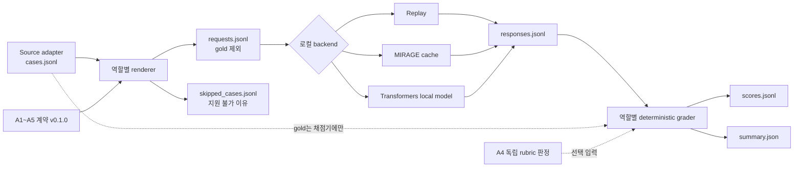

# A1~A5 역할별 구성요소 평가 하네스

- 구현: [`role_evaluation_harness.py`](../scripts/role_evaluation_harness.py) `v0.1.0`
- 계약 기준: [`A1~A5 역할·도구 사용 규약`](./agent_role_and_tool_contracts.md) `v0.1.0`
- 범위: 공개 평가 case의 역할별 렌더링, 로컬 실행, 결정적 채점
- 제외: 프로젝트 `DS-AGENT` E2E 결과, 의료 출시 hard gate, 파인튜닝, 모바일 번들

## 목차

1. [목적과 해석 경계](#1-목적과-해석-경계)
2. [처리 구조](#2-처리-구조)
3. [역할별 렌더링과 채점](#3-역할별-렌더링과-채점)
4. [산출물과 무결성](#4-산출물과-무결성)
5. [실행 방법](#5-실행-방법)
6. [현재 확인 결과와 차단 사항](#6-현재-확인-결과와-차단-사항)
7. [다음 실험 순서](#7-다음-실험-순서)

## 1. 목적과 해석 경계

source adapter가 만든 `cases.jsonl`을 모델에 그대로 넣으면 정답 누출, 역할별 출력 형식 불일치와 데이터별 실행 차이가 생긴다. 이 하네스는 각 case를 다음 공통 요청으로 바꾼다.

- `contract_version=0.1.0`, `role_id`, prompt 버전과 투영 이름
- 역할별 시스템 지시와 공개 문항에서 필요한 입력만 담은 메시지
- 추가 필드를 금지하는 JSON 응답 스키마
- `network_access=false`, `do_not_train=true`, `gold_in_prompt=false`
- 원본 case SHA-256과 bundle 간 manifest SHA-256 연결

공개 데이터는 앱의 실제 환자 범위, 승인 지식 스냅샷과 프로젝트 도구 호스트를 포함하지 않는다. 따라서 A1~A5 책임에 대응하는 능력만 측정하는 `component_projection`이다. 결과에는 항상 다음이 기록된다.

```json
{
  "evaluation_mode": "component_projection",
  "project_end_to_end_result": false,
  "medical_release_gate_result": false,
  "official_benchmark_result": false
}
```

공개 문항을 A1~A5의 운영 출력 스키마로 억지 변환하지 않는다. 예를 들어 LongHealth의 선택형 정답을 A2의 `RecordContextPack`이라고 부르거나 HealthBench의 일반 의료 응답을 승인 근거가 연결된 A4 `GroundedAnswer`라고 부르면 평가 의미가 달라진다. 실제 계약 E2E 평가는 검수·봉인된 `DS-AGENT`와 결정적 도구 호스트에서 별도로 수행한다.

## 2. 처리 구조



모델에는 `gold`가 전달되지 않는다. 채점기는 case, request와 response manifest의 해시 연결 및 전체 request에 대응하는 response가 정확히 하나씩 있는지 확인한 뒤 점수를 만든다.

## 3. 역할별 렌더링과 채점

| 역할·원천 | 모델에 제공하는 입력 | 응답 | 채점 | 현재 제한 |
|---|---|---|---|---|
| A1 · BFCL V4 | 단일 턴 대화와 제공된 함수 schema | `tool_calls[{name, arguments}]` | 도구명 일치, 인자 exact match | adapter 자체 점수이며 공식 BFCL 점수가 아님 |
| A2 · LongHealth | 런타임에 연 가상 환자 문서, 질문, 선택지 | `answer_label` | 허용 정답 label accuracy | 문서의 정확한 이름·생년월일을 마스킹하고 시간·부정 보존만 진단 |
| A3 · MIRAGE | 선택지를 제외한 question-only query | 순위화된 문서 ID와 선택적 점수 | gold가 있을 때 Recall@k, MRR | 현재 PubMed cache chunk ID와 BioASQ PMID mapping 부재 |
| A4 · HealthBench | 공개 prompt만 제공하고 rubric은 숨김 | `answer` | 별도 사람이 만든 rubric 판정으로 로컬 가중 비율 | 공식 HealthBench 채점이 아니며 승인 근거 RAG 시험도 아님 |
| A5 · HealthBench Meta | 대화, 후보 답변, rubric 하나 | `criterion_met`, rationale | verifier accuracy, false approval, false block | 결정적 프로젝트 hard gate를 대체하지 않음 |
| A5 · RAGTruth | source context, 후보 답변 | hallucination 여부와 문자 span | 탐지 accuracy, false approval/block, span P/R/F1 | 공개 RAG 충실도 진단이며 의료 핵심 주장 hard gate가 아님 |
| KO · KoMedQA/KorMedMCQA | 한국어 문항과 선택지 | 정답 또는 label | exact match/accuracy | A1~A5 바깥의 한국어 보조지표 |

### BFCL 지원 경계

현재 러너는 원천 case에 함수 schema가 포함되고 대화 turn이 하나인 3,641건만 실행한다. 이 중 직접 gold가 없는 `live_relevance` 16건은 점수화하지 않으므로 현재 adapter grader로 점수화 가능한 범위는 3,625건이다. `multi_turn_*`, memory와 web-search/agentic 1,055건은 상태 변화, turn별 도구 응답과 공식 checker가 필요하다. 평면 JSON 한 번으로 실행하면 다른 과제가 되므로 `BFCL_OFFICIAL_RUNTIME_REQUIRED`로 `skipped_cases.jsonl`에 남긴다. 스킵은 점수 0으로 바꾸거나 성공 건수에서 숨기지 않는다.

### A3 ID 경계

BioASQ case에는 `PMID:<id>` gold가 있으나 다운로드된 MIRAGE PubMed cache의 반환 ID는 `pubmed23n..._<chunk>` 형식이다. chunk→PMID mapping 없이 문자열을 임의로 연결하지 않는다. 이 경우 채점기는 `RETRIEVAL_ID_MAPPING_MISSING`으로 점수화를 보류한다.

### A4 판정 경계

A4는 생성 답변을 만든 뒤 별도 `judgments.jsonl`을 받아야 점수화한다. 판정자는 case의 rubric을 보고 각 항목을 다음처럼 기록한다.

```json
{"case_id":"CASE-...","judge_type":"human","rubric_results":[{"rubric_index":0,"met":true}]}
```

판정이 없거나 rubric 수가 맞지 않으면 점수를 추정하지 않는다. 계산되는 `local_weighted_rubric_fraction`은 하네스 내부 비교 지표이며 공식 HealthBench 점수가 아니다.

## 4. 산출물과 무결성

각 단계는 기존 디렉터리를 덮어쓰지 않고 새 bundle을 원자적으로 만든다.

```text
request-bundle/
  manifest.json
  requests.jsonl
  skipped_cases.jsonl

response-bundle/
  manifest.json
  responses.jsonl

score-bundle/
  manifest.json
  scores.jsonl
  summary.json
```

manifest는 입력 manifest와 데이터 파일 SHA-256, 스크립트·계약·prompt 버전, backend 설정, 레코드 수와 결과 파일 SHA-256을 기록한다. `--limit` 사용 여부와 source bundle의 부분 변환 상태는 `is_partial`로 전파한다. 역할 투영이 지원하지 않는 case 수와 이유는 `projection_supported_case_count`, `skipped_case_count`, `skip_reason_counts`로 별도 집계한다.

응답 JSON이 파싱되지 않으면 `RESPONSE_JSON_INVALID`, 선언한 스키마를 통과하지 못하면 `RESPONSE_SCHEMA_INVALID`로 기록한다. backend 예외는 해당 case의 `backend_error`로 남기며 성공 응답으로 간주하지 않는다.

## 5. 실행 방법

### 5.1 요청 렌더링

```powershell
python -X utf8 scripts/render_role_evaluation.py `
  --case-bundle data/agent-eval/source-adapters/longhealth-v0.1 `
  --output-dir data/agent-eval/role-runs/a2-longhealth-requests-v0.1 `
  --role A2
```

형식 확인만 할 때는 새 출력 경로와 `--limit 2`를 사용한다. 부분 실행 결과를 전체 성능으로 보고하지 않는다.

### 5.2 MIRAGE 캐시 실행

```powershell
python -X utf8 scripts/run_role_evaluation.py `
  --request-bundle data/agent-eval/role-runs/a3-mirage-requests-v0.1 `
  --output-dir data/agent-eval/role-runs/a3-mirage-pubmed-bm25-responses-v0.1 `
  mirage-cache `
  --source-root data/MIRAGE `
  --corpus pubmed `
  --retriever bm25 `
  --top-k 10
```

### 5.3 로컬 모델 실행

```powershell
python -X utf8 scripts/run_role_evaluation.py `
  --request-bundle data/agent-eval/role-runs/a2-longhealth-requests-v0.1 `
  --output-dir data/agent-eval/role-runs/a2-qwen35-responses-v0.1 `
  transformers `
  --model-path models/qwen3.5_4b `
  --max-new-tokens 512 `
  --temperature 0
```

이 backend는 모델 파일을 네트워크 없이 `local_files_only`로 연다. 실행 전에 해당 모델을 지원하는 `torch`, `transformers`, `accelerate`와 목표 양자화 방식을 별도 환경에 고정해야 한다. 의존성이 없거나 장비 메모리에 맞지 않으면 자동 다운로드·fallback하지 않고 중단한다.

이미 다른 로컬 엔진으로 생성한 원문 JSON은 `replay` backend로 manifest와 채점 흐름에 연결할 수 있다.

### 5.4 채점

```powershell
python -X utf8 scripts/grade_role_evaluation.py `
  --case-bundle data/agent-eval/source-adapters/ragtruth-v0.1 `
  --request-bundle data/agent-eval/role-runs/a5-ragtruth-requests-v0.1 `
  --response-bundle data/agent-eval/role-runs/a5-ragtruth-responses-v0.1 `
  --output-dir data/agent-eval/role-runs/a5-ragtruth-scores-v0.1
```

## 6. 현재 확인 결과와 차단 사항

2026-09-02 기준 다음을 확인했다.

- 전체 source adapter 110,599건의 manifest 레코드 수와 `cases.jsonl` SHA-256을 확인했다.
- 전체 case를 파일 생성 없이 렌더링한 결과 109,544건이 정상 처리됐고, BFCL 공식 상태형 runtime이 필요한 1,055건만 `BFCL_OFFICIAL_RUNTIME_REQUIRED`로 제외됐다. 예상하지 못한 렌더링 오류는 0건이었다.
- A1, A2, A3, A4, A5 두 원천과 KO 요청을 각각 2건씩 실제 bundle로 렌더링했다.
- MIRAGE BioASQ 2건을 로컬 `pubmed/bm25` cache로 실행해 2건 모두 JSON 응답을 만들었다.
- A3 점수화는 두 건 모두 `RETRIEVAL_ID_MAPPING_MISSING`으로 보류됐다. 이는 모델 성능 실패가 아니라 cache chunk ID와 PMID 사이의 추적 mapping이 없기 때문이다.
- Qwen3.5-4B 원본 파일은 약 9.3GB이고 목표 GPU는 RTX 3060 Ti 8GB다. 현재 기본·`care_app` 환경에는 실행에 필요한 `torch/transformers/accelerate` 조합도 없다. 따라서 모델 성능 수치는 아직 없으며, 호환 런타임과 추적 가능한 양자화 산출물을 준비하기 전에는 실행했다고 기록하지 않는다.
- 저장소 전체 단위시험 63개가 통과했다. 하네스 시험은 역할별 누출 방지, 마스킹, JSON Schema, 해시 연결, 캐시 지연 로딩과 각 채점 경계를 검사한다.

## 7. 다음 실험 순서

1. source adapter 샘플과 gold를 사람이 검수하고 평가 bundle 버전을 봉인한다.
2. MIRAGE PubMed chunk→PMID mapping의 공식 생성 경로 또는 corpus metadata를 확보해 A3 채점을 활성화한다.
3. BFCL 단일 턴 투영을 먼저 실행하고, 다중 턴은 upstream 공식 runtime·checker를 별도 backend로 연결한다.
4. Qwen3.5-4B 원본 revision을 기준으로 로컬 런타임과 4비트 변환 설정·해시를 고정한 뒤 작은 smoke set을 실행한다.
5. A4 독립 rubric 판정 절차와 판정자 일치도를 정한 뒤 생성 지표를 계산한다.
6. 공개 구성요소 결과로 실행 경로를 검증한 후, 검수·봉인된 `DS-AGENT`와 결정적 도구 호스트로 A1~A5 실제 계약 E2E·T0~T4 실험을 수행한다.
